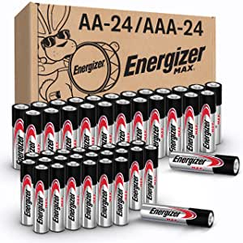
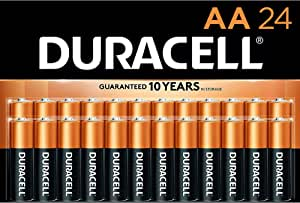

###Amazon Basics 48 Pack AA High-Performance Alkaline Batteries, 10-Year Shelf Life, Easy to Open Value Pack

- AA 1.5-volt performance alkaline batteries for reliable performance across a wide range of devices
- 10-year leak-free shelf life; air- and liquid-tight seal locks in the power until it’s needed thanks to the improved design, which includes dual crimps, a new zinc composition, and anti-corrosion components
- Delivers the amount of power needed for a specific device; ideal for game controllers, toys, flashlights, digital cameras, clocks, and more
- Ships in Certified Frustration-Free Packaging; backed by an AmazonBasics 1-year limited warranty
- Note: These batteries are not rechargeable
- To learn more about recycling single-use batteries, simply copy/paste this link into your browser: call2recycle.org/what-can-i-recycle

[<button class="button">$15.49 on Amazon</button>](https://www.amazon.com/gp/slredirect/picassoRedirect.html/ref=pa_sp_atf_aps_sr_pg1_1?ie=UTF8&adId=A007744133L0637WH2RNY&url=%2FAmazonBasics-Performance-Alkaline-Batteries-Count%2Fdp%2FB00MNV8E0C%2Fref%3Dsr_1_1_sspa%3Fdchild%3D1%26keywords%3Daa%2Bbatteries%26qid%3D1614634522%26sr%3D8-1-spons%26psc%3D1&qualifier=1614634522&id=7950155665916541&widgetName=sp_atf)
###Energizer MAX AA Batteries & AAA Batteries Combo Pack, 24 Double AA Batteries and 24 Triple AAA Batteries (48 Count)

- 24 pack of Energizer MAX alkaline double AA batteries and 24 Pack of Energizer MAX alkaline triple AAA batteries
- Our No.1 longest lasting MAX battery powers everyday devices, powerful batteries, AA size and batteries AAA size', "Leak resistant construction protects your devices from leakage of fully used batteries for up to 2 yea

[<button class="button">$29.49 on Amazon</button>](https://www.amazon.com/gp/slredirect/picassoRedirect.html/ref=pa_sp_atf_aps_sr_pg1_1?ie=UTF8&adId=A050736434JNYJHEUO6GP&url=%2FEnergizer-Batteries-Combo-Pack-Count%2Fdp%2FB087GMJXMC%2Fref%3Dsr_1_2_sspa%3Fdchild%3D1%26keywords%3Daa%2Bbatteries%26qid%3D1614634522%26sr%3D8-2-spons%26psc%3D1&qualifier=1614634522&id=7950155665916541&widgetName=sp_atf)
###Duracell - CopperTop AA Alkaline Batteries - long lasting, all-purpose Double A battery for household and business - 24 Count

- Duracell AA Batteries: The Duracell CopperTop Double A alkaline battery is designed for use in household items like remotes, toys, and more.
- Duracell guarantees these batteries against defects in material and workmanship
- Long Lasting Power: Duracell alkaline batteries are designed and developed for long lasting performance.
- Guaranteed for 10 years in Storage: Duracell AA alkaline batteries are guaranteed for 10 years in storage.
- #1 Trusted Battery Brand: Duracell CopperTop batteries are available in Double A (AA), Triple A (AAA), C, D and 9V sizes.

[<button class="button">$16.24 on Amazon</button>](https://www.amazon.com/gp/slredirect/picassoRedirect.html/ref=pa_sp_atf_aps_sr_pg1_1?ie=UTF8&adId=A00040091L0YVC4SJX9YX&url=%2FDuracell-CopperTop-Batteries-all-purpose-household%2Fdp%2FB0035LCFNQ%2Fref%3Dsr_1_4_sspa%3Fdchild%3D1%26keywords%3Daa%2Bbatteries%26qid%3D1614634522%26sr%3D8-4-spons%26psc%3D1&qualifier=1614634522&id=7950155665916541&widgetName=sp_atf)
