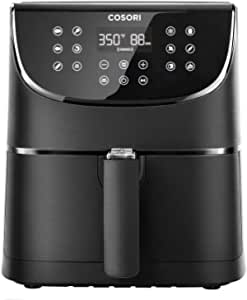
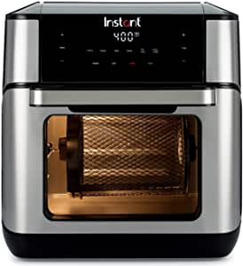

###KUPPET Air Fryer 5.8 QT, 1700W Stainless Steel Electric Hot Air Fryers Oven, Oilless Cooker for Roasting/Baking/Grilling, 7 Cooking Presets, Nonstick Basket

- 🌭 Healthy Choice: Food cooked in a KUPPET air fryer contains up to 85% less fat than traditionally fried foods without losing the delicious tastes and crispy textures
- 🍟 Multi-function Air Fryers: 7 presets menu- French Fries, Steak, Shrimp, Bread, Chicken, Bacon and Seafood
- 🥩 Holiday Gift - Provide healthier fried food which makes it a great choice for Thanksgiving Day and Christmas D

[<button class="button">$113.99 on Amazon</button>](https://www.amazon.com/gp/slredirect/picassoRedirect.html/ref=pa_sp_atf_aps_sr_pg1_1?ie=UTF8&adId=A017260510105F9R964EJ&url=%2FKUPPET-Stainless-Electric-Roasting-Grilling%2Fdp%2FB08QF9XD6D%2Fref%3Dsr_1_1_sspa%3Fdchild%3D1%26keywords%3Dair%2Bfryers%26qid%3D1614630744%26sr%3D8-1-spons%26psc%3D1&qualifier=1614630744&id=370387312553824&widgetName=sp_atf)
###7.4 QT XL Air Fryer, MOOSOO 10-in-1 Electric Air Fryer Oven with Digital LED Screen, 1700W Stainless Steel Air Fryers, Nonstick Basket, Temp/Time Control, Auto Shutoff & Overheat Protection

- 🍖🥩10 Menus & Digital Touch Screen: MOOSOO air fryer can cook a variety of food
- 🍤🍟Household Capacity & Safety: Electric air fryers capacity is 7.4QT, suitable for a family of 7-10 people
- 🍰🍞1700W High Power & 80% Less Oil: This air fryer uses a vortex hot air system, through the 1700W heater and fan, rapidly heating air, and circulating hot air 360 °
- 🍕🌭Double Pot & Non-Stick Basket: Multi-function air fryer adopts a unique double-pot design
- 🔧📧What you can get: The shell of the air fryer oven is sturdy stainless steel, safe, heat-resistant, durable, and has no peculiar smell during cooki

[<button class="button">$129.96 on Amazon</button>](https://www.amazon.com/gp/slredirect/picassoRedirect.html/ref=pa_sp_atf_aps_sr_pg1_1?ie=UTF8&adId=A00828182G3W1L39HKC78&url=%2FMOOSOO-Electric-Stainless-Nonstick-Protection%2Fdp%2FB08PP5C2KX%2Fref%3Dsr_1_2_sspa%3Fdchild%3D1%26keywords%3Dair%2Bfryers%26qid%3D1614630744%26sr%3D8-2-spons%26psc%3D1%26smid%3DA36SBCQQG9Z41M&qualifier=1614630744&id=370387312553824&widgetName=sp_atf)
###COSORI Air Fryer Max XL(100 Recipes) Electric Hot Oven Oilless Cooker LED Touch Digital Screen with 13 Cooking Functions, Preheat and Shake Reminder, Nonstick Basket, 5.8 QT-Black

- Award-Winning Design: Winner of the Red Dot Award for best design, the CP158-AF was designed in California and features an angled display with easy-to-use presets
- Comes with 100 original, delicious & easy recipes for every meal
- Cooking time is faster than a conventional oven, but with crispier and tastier results
- Helpful Service: Your purchase comes with assistance from our helpful Southern California based Customer Support Te

[<button class="button">$119.99 on Amazon</button>](https://www.amazon.com/COSORI-Electric-Reminder-Touchscreen-Certified/dp/B07GJBBGHG/ref=sr_1_3?dchild=1&keywords=air+fryers&qid=1614630744&sr=8-3)
###Instant Vortex Plus Air Fryer Oven 7 in 1 with Rotisserie, 10 Qt, EvenCrisp Technology

- Air fryers give you all the flavor of deep-fried cooking, without the oil and mess
- Air fryer with 7 built-in smart programs, including: bake, roast, toast, broil, dehydrate and rotisserie
- 1-step EvenCrisp TechnologyTM allows you to achieve a crispy outside and tender inside
- Get a deep-fried flavor with little to no oil for healthy and tasty versions of your favorites
- The Instant Vortex Plus air fryer oven circulates super-hot air around your food so it cooks evenly and locks in moisture — giving you the crispy, golden texture and delicious taste of deep-fried, without the guilt (ETL certified)
- With little to no preheating time, you can whip up dinner in half the time of a conventional oven, without heating up the whole kitchen
- Minimal grease means minimal me

[<button class="button">$119.00 on Amazon</button>](https://www.amazon.com/Instant-Vortex-Plus-Rotisserie-10/dp/B07VM28XTR/ref=sr_1_4?dchild=1&keywords=air+fryers&qid=1614630744&sr=8-4)
###Ninja Air Fryer that Cooks, Crisps and Dehydrates, with 4 Quart Capacity, and a High Gloss Finish

- Now enjoy guilt free food; Air fry with up to 75 percent less fat than traditional frying methods; Tested against hand cut, deep fried French fries
- Wide temperature range: 105 degree Fahrenheit to 400 degrees Fahrenheit allows you to gently remove moisture from foods or quickly cook and crisp foods with convection heat
- 4 quart ceramic coated nonstick basket and crisper plate fit 2 pounds of french fries
- The unit will need time to preheat before coming up to temperature
- Dehydrate: Create flat, chip like dehydrated foods for fun, homemade snacks pounds; The combination of low fan speed and low temperature enables thorough dehydration
- Dishwasher safe parts: Easy to clean basket, crisper plate, and multi-layer rack

[<button class="button">$99.99 on Amazon</button>](https://www.amazon.com/1550-Watt-Programmable-Reheating-Dehydrating-AF101/dp/B07FDJMC9Q/ref=sr_1_5?dchild=1&keywords=air+fryers&qid=1614630744&sr=8-5)
