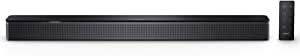

###All-new Echo Show 10 (3rd Gen) | Glacier White with Blink Mini Indoor Smart Security Camera, 1080 HD with Motion Detection

- This bundle contains the Echo Show 10 and Blink Mini.
- Alexa can show you even more - With a 10.1" HD screen that’s designed to move with you, video calls, recipes, and shows are always in view
- Smart home made simple - Ask Alexa to show you security cameras, control lights, and adjust thermostats.
- Blink Mini is a 1080P HD indoor, plug-in security camera that lets you monitor the inside of your home day and night.
- With Blink Mini, you can get alerts on your smartphone whenever motion is detected or customize motion detection zones so you can see what matters most.
- Stay in frame - Video call friends and family or take a picture while the 13 MP camera with auto-framing and motion keeps you front and center.
- Designed to protect your privacy - Electronically disconnect the microphones and camera with one press of a butt

[<button class="button">$254.99 on Amazon</button>](https://www.amazon.com/All-new-Glacier-Indoor-Security-Detection/dp/B08SPZB4LZ/ref=sr_1_1?dchild=1&keywords=alexa&qid=1614631772&sr=8-1)
###Amazfit GTS 2 Smartwatch with Alexa Built-in, 1.65" AMOLED Display, Built-in GPS, 3GB Music Storage, 7-Day Battery Life, Bluetooth Phone Calls, 12 Sports Modes, Health Tracking, Water Resistant, desert gold, Medium, W1969OV5N

- "3d curved design & hd amoled screen: the amazfit gts 2 is a curved 1.65" hd amoled screen, covered in 3d glass, boasts a crystal-clear 341ppi pixel density, the bezel-less design naturally transitions to the aluminum alloy watch body for an enhanced visual aesthetic."
- long 7-day battery life & gps built-in: the gts 2 is equipped with a powerful 246mah battery that can last 7 days, and is always ready to escort you wherever your exercise takes you, and can go for 25 hours with continuous gps to map your workouts.
- 3gb music storage: control mobile music playback via bluetooth, and transfer your favorite songs to the watch through your mobile phone with a massive 3gb local music storage
- 12 sports modes & 5 atm: amazfit gtr 2 includes 12 built-in sports modes and is waterproof to a depth of up to 50 meters
- all-round health tracking: equipped with the biotracker 2, the second-generation ppg bio-tracking optical sensor, the amazfit gtr 2 can provide 24-hour heart rate monitoring, blood-oxygen saturation measurement, sleep quality monitoring, and stress level monitoring
- Compatible phone models: Android 5.0 and Above

[<button class="button">$179.99 on Amazon</button>](https://www.amazon.com/Amazfit-Smartwatch-Bluetooth-Resistant-W1969OV5N/dp/B08HR8CKXC/ref=sr_1_2?dchild=1&keywords=alexa&qid=1614631772&sr=8-2)
###Bose Smart Soundbar 300 Bluetooth Connectivity with Alexa Voice Control Built-In, Black

- Like no other — This elegant sound bar for TV, movies, music, and games delivers spacious sound, exceptional clarity, and rich bass, while finished in matte-Black with seamless metal grille.
- Acoustic performance — 5 full-range drivers deliver wide, clear sound, which makes it the perfect soundbar for TV, movies, games, and more.
- Built-in Alexa — Amazon Alexa and Google Assistant are built into this smart soundbar for hands-free voice control
- TV voice control — Exclusive Bose Voice for Video technology expands your Alexa capabilities, allowing you to control this smart soundbar, your TV, and your cable/satellite box with 1 voice command.
- Connectivity — Pair your device to this wireless soundbar to stream your favorite music and more via a Bluetooth connection, your home Wi-Fi network, Apple AirPlay 2, or Spotify Connect.
- Simple setup — Connect this smart soundbar to your TV via an optical audio cable (included) or an HDMI cable (sold separately) and download the Bose Music app for step-by-step setup.
- Sleek design — This wireless soundbar is just over 2" tall for low placement in front of your TV or wall mounting (wall brackets sold separately)
- Build and expand — This Bluetooth soundbar is compatible with other Bose products for multiroom listening or add the Bose Bass Module 500 or 700 or the Bose Surround Speakers 700.

[<button class="button">$399.00 on Amazon</button>](https://www.amazon.com/Bose-Soundbar-Bluetooth-Connectivity-Control/dp/B08D68QLW3/ref=sr_1_4?dchild=1&keywords=alexa&qid=1614631772&sr=8-4)
###WiFi Range Extender, 1200Mbps Wireless Signal Repeater Booster, Dual Band 2.4G and 5G Expander, 4 Antennas 360° Full Coverage, Extend WiFi Signal to Smart Home & Alexa Devices（KW1200N03） (White)

- 【Dual Band AC1200 High Speed】This WiFi extender come with dual band technology, provide up to 300Mbps for 2.4GHz, up to 867Mbps for 5Ghz, which minimizes data loss
- 【Full Signal Coverage】This WiFi repeater equipped with 4 high gain external antenna, covering up to 360 degrees, up to 1292 square feet, higher penetration, no loss signal when passing through the wall , enhance the WiFi network and eliminate dead zones, up to bedroom, floors, restroom, garage, basement and garden, allow you enjoy wifi throughout whole home.
- 【Repeater / AP Mode / 2 Ethernet Ports】Repeater Mode is for extending WiFi coverage of an existing wireless network
- 【Universal Compatibility & Easy set up】This WiFi extender can be used with any 802.11b/g/n/a/ac wireless Internet router, what means it works with any standard router or gateway
- 【Safe Network Access】This wifi extender can maximize the network security, ensure your network safety, prevent others stealing your net, protect your important data and avoid the interference and privacy problems of Wi-

[<button class="button">$49.99 on Amazon</button>](https://www.amazon.com/Extender-1200Mbps-Wireless-Repeater-Devices%EF%BC%88KW1200N03%EF%BC%89/dp/B08THDNBD7/ref=sr_1_6?dchild=1&keywords=alexa&qid=1614631772&sr=8-6)
###TP-Link WiFi 6 Router AX1800 Smart WiFi Router (Archer AX21) – Dual Band Gigabit Router, Works with Alexa - A Certified for Humans Device

- JD Power Award ---Highest in customer satisfaction for wireless routers 2017 and 2019
- Certified for Humans – Smart home made easy for non-experts
- Dual-Band WiFi 6 Internet Router: Wi-Fi 6(802
- Next-Gen 1.8 Gbps Speeds: Enjoy smoother and more stable streaming, gaming, downloading and more with WiFi speeds up to 1
- Connect more devices: Wi-Fi 6 technology communicates more data to more devices simultaneously using revolutionary OFDMA technology
- Extensive Coverage: Achieve the strong, reliable WiFi coverage with Archer AX1800 as it focuses signal strength to your devices far away using Beamforming technology, 4 high-gain antennas and an advanced front-end module (FEM) chipset
- Powerful Quad-Core Processing For Minimal Latency: The powerful

[<button class="button">$99.99 on Amazon</button>](https://www.amazon.com/TP-Link-Router-AX1800-Archer-AX21/dp/B08H8ZLKKK/ref=sr_1_7?dchild=1&keywords=alexa&qid=1614631772&sr=8-7)
