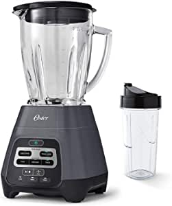
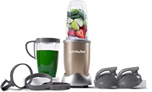
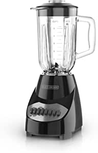
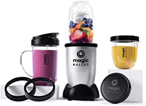

###Oster Master Series Blender with Texture Select Settings, Blend-N-Go Cup and Glass Jar, Grey

- PERFECT CONSISTENCY, NO GUESSWORK: This easy-to-use Oster blender takes the guesswork out of blending smoothies, soups, drinks, and salsas to the perfect consistency
- TEXTURE SELECT TECHNOLOGY: Innovative Texture Select technology gives you more consistency control than traditional blenders—you can choose 3 automatic food modes (Smoothie, Shake, and Food Chop), and 3 automatic texture settings (Thin, Medium, and Thick)
- EXTRA-LARGE BLADE: Blender offers 800 peak watts and an extra-large 3-inch, 6-point stainless steel blade to slice through the toughest ingredients
- TAKE IT ON THE GO: Makes a great smoothie blender or personal blender and includes one 24-oz
- SHATTER-RESISTANT GLASS JAR: 6-cup glass jar is dishwasher-safe, BPA-free, and shatter resistant
- DURABLE: 3-year satisfaction guarantee

[<button class="button">$59.00 on Amazon</button>](https://www.amazon.com/gp/slredirect/picassoRedirect.html/ref=pa_sp_atf_aps_sr_pg1_1?ie=UTF8&adId=A0669542PWQ51FA1IRPL&url=%2FOster-Blender-Texture-Settings-Blend-N-Go%2Fdp%2FB08CPHBP6D%2Fref%3Dsr_1_1_sspa%3Fdchild%3D1%26keywords%3Dblender%26qid%3D1614637040%26sr%3D8-1-spons%26psc%3D1&qualifier=1614637039&id=8221870476984911&widgetName=sp_atf)
###NutriBullet Pro - 13-Piece High-Speed Blender/Mixer System with Hardcover Recipe Book Included (900 Watts)

- With 900 watts of power, the Pro is faster and stronger than the original, but just as simple to use
- Optimized 900-watt motor and refined nutrient extraction blades blend The toughest whole foods into nutritious shakes, smoothies, and nut butters.
- Included: (1) 900W motor base, (1) Extractor blade, (2) 32 oz
- Powerful stainless steel Extractor blades use Cyclonic action to break down tough ingredients
- Hassle-free cleaning - simply twist off the blade, rinse with soap and water, and put the cups in the top rack of the dishwasher
- Limited time only: customize the color of your nutribullet to perfectly complement your kitchen!
- CAUTION : They are not to be used for more than 60 seconds at a time.

[<button class="button">$89.00 on Amazon</button>](https://www.amazon.com/gp/slredirect/picassoRedirect.html/ref=pa_sp_atf_aps_sr_pg1_1?ie=UTF8&adId=A0957385D9PN4L1K52NY&url=%2FNutriBullet-Pro-13-Piece-High-Speed-Hardcover%2Fdp%2FB0163K1Z3G%2Fref%3Dsr_1_2_sspa%3Fdchild%3D1%26keywords%3Dblender%26qid%3D1614637040%26sr%3D8-2-spons%26psc%3D1&qualifier=1614637039&id=8221870476984911&widgetName=sp_atf)
###Hamilton Beach Power Elite Blender with 12 Functions for Puree, Ice Crush, Shakes and Smoothies and 40 Oz BPA Free Glass Jar, Black and Stainless Steel (58148A)

- 700 watts: Peak blending power for powerful ice crushing.
- Wave action system: 700 watt power blender continuously pulls mixture down into the blades for consistently smooth results.
- 12 blending functions: Multi-function blender with only 5 simple buttons on the easy to read control panel
- Easy to clean: Blades remove for easy cleaning
- Clean, easy pour: Multi-function blender with unique, no mess pouring spout.

[<button class="button">$29.99 on Amazon</button>](https://www.amazon.com/Hamilton-Beach-Functions-Dishwasher-58148A/dp/B00EI7DPI0/ref=sr_1_3?dchild=1&keywords=blender&qid=1614637040&sr=8-3)
###BLACK+DECKER Countertop Blender with 5-Cup Glass Jar, 10-Speed Settings, Black, BL2010BG

- 4-Tip Stainless Steel Blade - The multi-level stainless steel blade blends at multiple levels to improve efficiency and blending power
- 10 Speed Settings with Pulse - Find the right consistency for everything you make with a range of blending speeds
- 6-Cup Glass Jar - Easy to handle with a PerfectPour spout that eliminates drips and spills
- Dishwasher-Safe Parts - Every removable part is safe to clean in the dishwasher, further simplifying the juice-making process
- 550 Watts of Blending Power! - The blender reaches 550 watts of power at peak performance*, and 350 watts of power for continuous use

[<button class="button">$22.44 on Amazon</button>](https://www.amazon.com/BLACK-DECKER-Countertop-10-Speed-BL2010BG/dp/B00OW16ZR0/ref=sr_1_5?dchild=1&keywords=blender&qid=1614637040&sr=8-5)
###Magic Bullet Blender, Small, Silver, 11 Piece Set

- 11 piece blender set: Includes blender, additional blender cups, blades, recipe book & more
- The magic bullet chops, mixes, blends, whips, grinds and more
- Effortlessly create your favorite meals and snacks like smoothies, omelets, sauces and dips
- Included recipe book gets you started making quick, easy, and delicious dishes from appetizers to desser

[<button class="button">$38.69 on Amazon</button>](https://www.amazon.com/Magic-Bullet-Blender-Small-Silver/dp/B012T634SM/ref=sxin_9_ac_d_pm?ac_md=3-0-VW5kZXIgJDUw-ac_d_pm&cv_ct_cx=blender&dchild=1&keywords=blender&pd_rd_i=B012T634SM&pd_rd_r=c4ca472d-f293-4311-bbec-293f10775760&pd_rd_w=BkSBZ&pd_rd_wg=zzTBe&pf_rd_p=8fdf5a02-eaef-4529-b481-7cb94a51ba04&pf_rd_r=B6WZ8F5X48SRRW6T1XPK&psc=1&qid=1614637040&sr=1-1-22d05c05-1231-4126-b7c4-3e7a9c0027d0)
