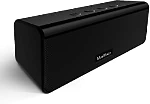
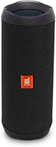

###Bluetooth Speaker,MusiBaby M71 Speaker,Outdoor,Portable,Waterproof,Wireless Speaker,Bluetooth 5.0,Dual Pairing,Loud Stereo Booming Bass, 24H Playtime for Home,Party(Black)

- ♩♪♫【True 360°Stereo Sound&Amazing Bass Sound Stereo sound】with full bass.The speaker delivers immersive sound with rich bass,mids and highs,dynamic sound.Even at maximum volume,without any breaking sound,in the same way as at the live concert performance.You will like MusiBaby’s true 360°stereo sound ♩♪♫【IPX5 waterproof】MusiBaby Bluetooth speaker is resistant to splash,rain,gentle spray,therefore it is applicable in shower room,by the pool or beach.Do not drop it directly into water.', "♩♪♫【Portable and Long Battery Life】Portable speakers, Size only 7.1*2.2*2.4in, with strong bass beyond it's size, and 24H super long playtime

[<button class="button">$29.99 on Amazon</button>](https://www.amazon.com/gp/slredirect/picassoRedirect.html/ref=pa_sp_atf_aps_sr_pg1_1?ie=UTF8&adId=A01161611ITQJ8BUD82W1&url=%2FBluetooth-MusiBaby-Portable-Waterproof-Wireless%2Fdp%2FB08HMMB7J5%2Fref%3Dsr_1_1_sspa%3Fdchild%3D1%26keywords%3Dbluetooth%2Bspeakers%26qid%3D1614634214%26sr%3D8-1-spons%26psc%3D1&qualifier=1614634214&id=2961803082480543&widgetName=sp_atf)
###JBL FLIP 4 - Waterproof Portable Bluetooth Speaker - Black

- Wirelessly connect up to 2 smartphones or tablets to the speaker and take turns playing impressive stereo sound
- Built-in 3000mAh rechargeable li-ion battery Supports up to 12 hours of playtime
- Ipx7 waterproof means no more worrying about rain or spills; you can even submerge flip 4 in water
- JBL connect+ allows you to Link more than 100 JBL connect+ enabled speakers together to amplify the party
- Dual external passive radiators demonstrate just how powerful your speaker is

[<button class="button">$78.94 on Amazon</button>](https://www.amazon.com/JBL-Bluetooth-Portable-Stereo-Speaker/dp/B01MSYQWNY/ref=sr_1_3?dchild=1&keywords=bluetooth+speakers&qid=1614634214&sr=8-3)
###DOSS SoundBox Touch Portable Wireless Bluetooth Speakers with 12W HD Sound and Bass, 20H Playtime, Handsfree, Speakers for Home, Outdoor, Travel-Black

- Capacitive Touch Control: Easy-to-use touch controls allow you to amplify the mood and energy of the party
- Superior Sound Quality: Enjoy your music in 12W full-bodied stereo realized through dual high-performance drivers and unique enhanced bass.
- Extended Playtime: Built-in Li-Ion rechargeable battery powers up to 20 hours playtime at 50% volu

[<button class="button">$27.99 on Amazon</button>](https://www.amazon.com/DOSS-Wireless-Bluetooth-Portable-Speaker/dp/B01CQOV3YO/ref=sr_1_5?dchild=1&keywords=bluetooth+speakers&qid=1614634214&sr=8-5)
###Bose SoundLink Color II: Portable Bluetooth, Wireless Speaker with Microphone- Soft Black

- Innovative Bose technology packs bold sound into a small, water resistant speaker
- Built-in mic for speakerphone to take clear conference or personal calls out loud with a wireless range of approximately 30 feet.
- Rugged, with a soft touch silicone exterior that makes it easy to pick up and go
- Voice prompts talk you through the Bluetooth pairing so it’s easier than ever or even quick-pair with NFC devices
- The lithium-ion battery lets you enjoy up to 8 hours of play time, rechargeable with USB power sources
- Wireless Bluetooth pairing with voice prompts allows you to easily take calls and access your phone’s virtual assistant — hands free
- Pair 2 SoundLink speakers together for party mode or stereo mode or use Bose SimpleSync technology to pair with a member of the Bose Smart Home Family to play in sync

[<button class="button">$129.00 on Amazon</button>](https://www.amazon.com/Bose-SoundLink-Color-Bluetooth-speaker/dp/B01HETFQKS/ref=sxin_9?ascsubtag=amzn1.osa.00470919-4a61-4ef4-919b-cced2bf23b01.ATVPDKIKX0DER.en_US&creativeASIN=B01HETFQKS&cv_ct_cx=bluetooth+speakers&cv_ct_id=amzn1.osa.00470919-4a61-4ef4-919b-cced2bf23b01.ATVPDKIKX0DER.en_US&cv_ct_pg=search&cv_ct_we=asin&cv_ct_wn=osp-single-source-earns-comm&dchild=1&keywords=bluetooth+speakers&linkCode=oas&pd_rd_i=B01HETFQKS&pd_rd_r=b4319636-de9e-4af3-886b-066eeeafeb56&pd_rd_w=GjF0y&pd_rd_wg=McCuP&pf_rd_p=35b32c02-1b41-4e49-9b89-0297af2446e1&pf_rd_r=4S76Y6ZRBE0W4EY6F2NN&qid=1614634214&sr=1-1-64f3a41a-73ca-403a-923c-8152c45485fe&tag=tgl0a3-20)
###Ultimate Ears WONDERBOOM Portable Waterproof Bluetooth Speaker - Stone Grey

- Super-portable Bluetooth speaker with surprisingly big, clear, crisp 360-degree sound and big bass
- 10 hours of musical happiness on a single battery charge
- waterproof, floats and serenades you in the shower, pool or rain\xa0 (IPX7-rated waterproof up to 30 minutes and a depth of 1 meter)
- Wirelessly connect two UE WONDERBOOMS to party louder
- Works with Bluetooth and Bluetooth Smart enabled smartphones, tablets and other devices
- These are FCC regulated products: FCC ID JNZS00163

[<button class="button">$69.95 on Amazon</button>](https://www.amazon.com/Ultimate-Ears-WONDERBOOM-Waterproof-Bluetooth/dp/B06XT3BS3Q/ref=sxin_10_ac_d_pm?ac_md=3-1-QmV0d2VlbiAkNTAgYW5kICQxMDA%3D-ac_d_pm&cv_ct_cx=bluetooth+speakers&dchild=1&keywords=bluetooth+speakers&pd_rd_i=B06XT3BS3Q&pd_rd_r=b4319636-de9e-4af3-886b-066eeeafeb56&pd_rd_w=i8YPj&pd_rd_wg=McCuP&pf_rd_p=8fdf5a02-eaef-4529-b481-7cb94a51ba04&pf_rd_r=4S76Y6ZRBE0W4EY6F2NN&psc=1&qid=1614634214&sr=1-1-22d05c05-1231-4126-b7c4-3e7a9c0027d0)
