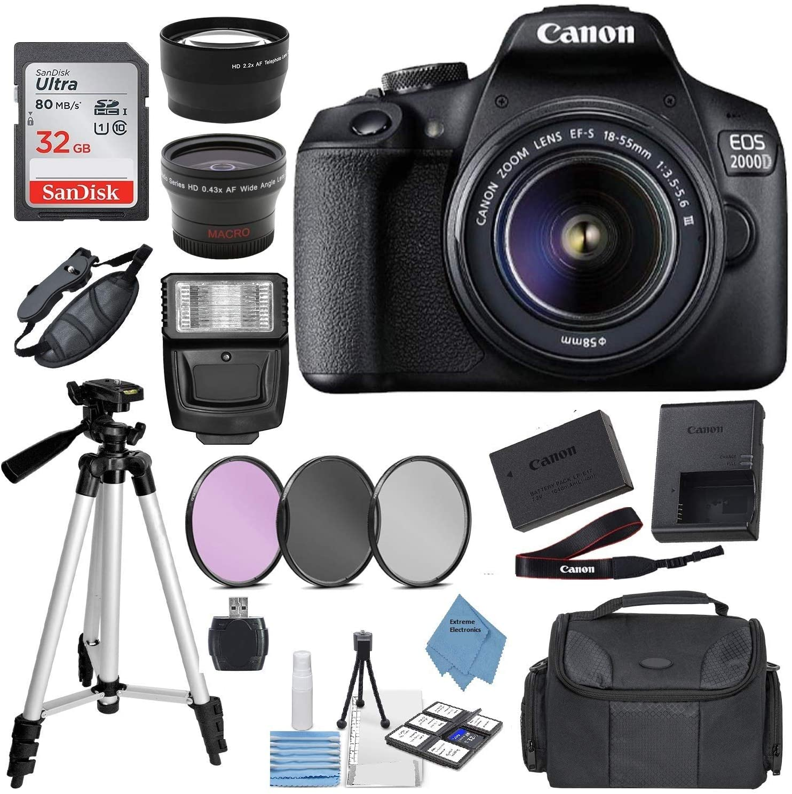
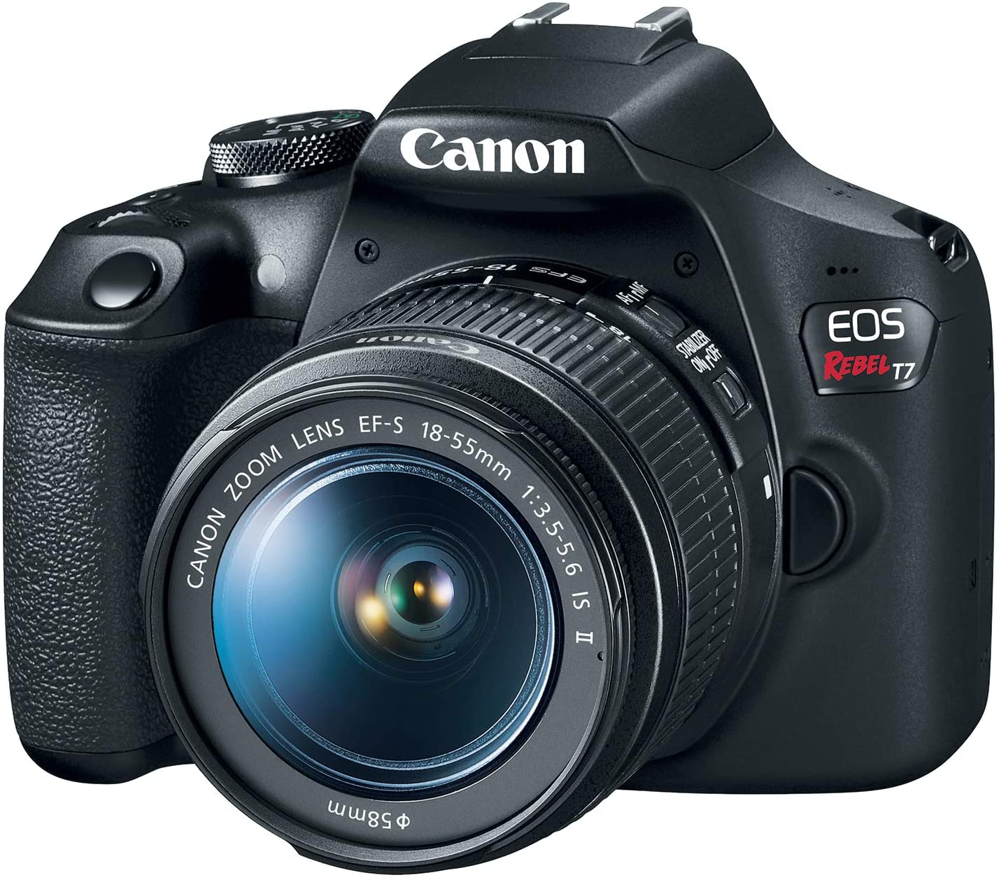

Never miss a moment again! We scoured the internet for the top DSLR cameras. From well-known brands to newcomers, this industry has never been more competitive. And that means one thing for you, the consumer: better deals!

Camera technology has come a long way since the days of polaroids and disposables. Whether you're a professional, enthusiast, or just someone who wants to capture moments, these DSLR cameras will wow you!

##Our Picks

###Canon EOS 2000D

####Product Info:
- this is a very good camera
- some might even say the best
- buy it today!
######Check Price

 

###Canon EOS Rebel

####Product Info:
- more expensive
- shoots better pictures
- video capability
######Check Price