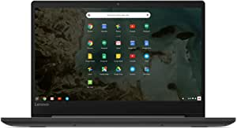

###Lenovo Chromebook S330 Laptop, 14-Inch FHD (1920 x 1080) Display, MediaTek MT8173C Processor, 4GB LPDDR3, 64GB eMMC, Chrome OS, 81JW0000US, Business Black

- High performance laptop: The Chromebook S330 is equipped with a MediaTek MTK8173C Processor, Chrome OS, 4 GB LPDDR3, 64 GB emmC 5.1 and so much more
- Sleek & stylish design: Sleek, stylish and secure, the Lenovo Chromebook S330 is less than one inch thin and 3.3 pounds light with a 14-inch FHD display
- Powerful processing: Perfect for all your daily computing needs, The Lenovo Chromebook S330 delivers a host of performance features
- Built to connect us: Full I/O support comes standard on the laptop computer with USB-C, micro SD and USB 3
- Easy to use: The Lenovo Chromebook S330 is easy to use, Offers built-in virus protection and keeps going with long battery li

[<button class="button">$279.99 on Amazon</button>](https://www.amazon.com/gp/slredirect/picassoRedirect.html/ref=pa_sp_atf_aps_sr_pg1_1?ie=UTF8&adId=A00568342QN4P1JLOMQ2J&url=%2FLenovo-Chromebook-MediaTek-Processor-81JW0000US%2Fdp%2FB07GLV1VC7%2Fref%3Dsr_1_1_sspa%3Fdchild%3D1%26keywords%3Dchromebooks%26qid%3D1614632821%26sr%3D8-1-spons%26psc%3D1&qualifier=1614632821&id=3965965504918563&widgetName=sp_atf)
###HP Chromebook 14-inch HD Laptop, Intel Celeron N4000, 4 GB RAM, 32 GB eMMC, Chrome (14a-na0020nr, Ceramic White)

- Google play store: The millions of Android apps you know and love on your phone and tablet can now run on your Chrome device without compromising their speed, simplicity or security
- Sleek, responsive design: Keep going comfortably with the backlit keyboard and multi-touch touchpad that supports four finger gestures set in a sleek design for moving from room to room or on the road
- Binge watch while you work: Equipped with an Intel(R) processor, 14" display, stereo speakers tuned by audio experts at B&O and a long battery life to get more done while having fun
- Environmentally conscious: Low halogen, mercury-free display backlights, arsenic-free display glass in this Energy Star(R) certified, EPEAT(R) Silver registered Chromebook
- Dual-core Intel(R) processor: Intel(R) Celeron(R) N4000, Dual-Core, 1.1 GHz base frequency, up to 2.6 GHz burst frequency
- Display: 14.0-inch diagonal HD SVA anti-glare micro-edge WLED-backlit display (1366 x 768); 82% screen to body ratio
- Memory & storage: 4 GB LPDDR4-2400 SDRAM (not upgradable) and 32 GB eMMC

[<button class="button">$211.18 on Amazon</button>](https://www.amazon.com/HP-Chromebook-14-Inch-Celeron-14a-na0020nr/dp/B08529BZSQ/ref=sr_1_3?dchild=1&keywords=chromebooks&qid=1614632821&sr=8-3)
###Samsung Chromebook 4 Chrome OS 11.6" HD Intel Celeron Processor N4000 6GB RAM 64GB eMMC Gigabit Wi-Fi - XE310XBA-K03US

- Compact, light design with 13.3” display
- Military-grade durability
- Ultra-fast connectivity with Gigabit Wi-Fi
- Advanced security with multiple layers of built-in virus protection
- 12.5 hours of battery life
- Google Assistant enabled

[<button class="button">$279.99 on Amazon</button>](https://www.amazon.com/Samsung-Chromebook-Celeron-Processor-Gigabit/dp/B07XQQS439/ref=sr_1_4?dchild=1&keywords=chromebooks&qid=1614632821&sr=8-4)
###Acer Chromebook Spin 311 Convertible Laptop, Intel Celeron N4020, 11.6" HD Touch, 4GB LPDDR4, 32GB eMMC, Gigabit Wi-Fi 5, Bluetooth 5.0, Google Chrome, CP311-2H-C679

- Chromebook runs on Chrome OS - An operating system by Google that is built for the way we live today
- All the Google apps you know and love come standard on every Chromebook, which means you can edit, download, and convert Microsoft Office files in Google Docs, Sheets and Slides.
- Get access to more than 2 million Android apps from Google Play to learn and do more.
- Chromebooks come with built-in storage for offline access to your most important files and an additional 100GB of Google Drive space to ensure that all of your files are backed up automatically.
- Acer CP311-2H-C679 convertible Chromebook comes with 11.6” HD Touch IPS Display, Intel Celeron N4020, 4GB LPDDR4 Memory, 32GB eMMC, Google Chrome and up to 10-hours battery life.

[<button class="button">$269.99 on Amazon</button>](https://www.amazon.com/Acer-Chromebook-Convertible-Bluetooth-CP311-2H-C679/dp/B086MBQKH2/ref=sr_1_5?dchild=1&keywords=chromebooks&qid=1614632821&sr=8-5)
###Google Pixelbook Go - Lightweight Chromebook Laptop - Up to 12 Hours Battery Life[1] - Touch Screen Chromebook - Just Black
![Google Pixelbook Go - Lightweight Chromebook Laptop - Up to 12 Hours Battery Life[1] - Touch Screen Chromebook - Just Black](https://images-na.ssl-images-amazon.com/images/I/81sDDc7rKqL.__AC_SX300_SY300_QL70_ML2_.jpg)
- Pixelbook Go lets you stay unplugged for up to 12 hours, [1] so you don’t need to carry a charger; when you do need a charge, get up to 2 hours of battery use in just 20 minutes so you can keep going [2]
- Lightweight Chromebook laptop that’s barely 2 pounds and 13 millimeter thin with a grippable design, making it easier to carry[3]
- Protects your data, passwords, and information with the Titan C security chip and built-in antivirus software; Chrome OS updates automatically to give you the latest features and security [4]
- Starts up in seconds so it’s always ready when you are; the 8th Gen Intel Core Processor is quick and responsive, powering everything you do[5]
- Pixelbook Go is a quiet and comfortable laptop with a backlit keyboard, ultra quiet keys, and and a spacious touchpad that only needs a light touch
- Get amazing picture and sound with the brilliant HD touchscreen display and dual stereo speakers so you can watch movies, edit photos, or video chat with the 1080p webcam
- With Instant Tethering, get online easily on Pixelbook Go using the LTE connection on your Google Pixel[8]
- Please refer to the product description section below for all applicable legal disclaimers denoted by the bracketed numbers in the preceding bullet points (e.g., [1], [2], etc.)

[<button class="button">$849.00 on Amazon</button>](https://www.amazon.com/Google-Pixelbook-Chromebook-128GB-Black/dp/B07YMM4YC1/ref=sxin_9?ascsubtag=amzn1.osa.63f2becf-f754-4074-9db8-a4c2266faa1e.ATVPDKIKX0DER.en_US&creativeASIN=B07YMM4YC1&cv_ct_cx=chromebooks&cv_ct_id=amzn1.osa.63f2becf-f754-4074-9db8-a4c2266faa1e.ATVPDKIKX0DER.en_US&cv_ct_pg=search&cv_ct_we=asin&cv_ct_wn=osp-single-source-earns-comm&dchild=1&keywords=chromebooks&linkCode=oas&pd_rd_i=B07YMM4YC1&pd_rd_r=aa7187d0-6a21-4f94-bed8-64f292356f3b&pd_rd_w=1N4nx&pd_rd_wg=1vkGI&pf_rd_p=35b32c02-1b41-4e49-9b89-0297af2446e1&pf_rd_r=EQ6VQ33ZR651KPDZEZ3J&qid=1614632821&sr=1-2-64f3a41a-73ca-403a-923c-8152c45485fe&tag=reviewedoap-20)
