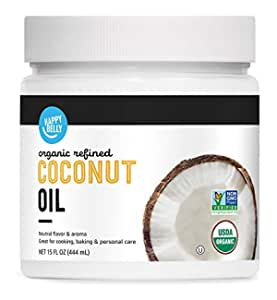
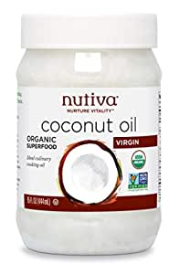

##Our Picks
###Amazon Brand - Happy Belly Organic Refined Coconut Oil, 15 Fl Oz
######Sold by Happy Belly

###Product Info:
- This product was previously a Solimo product
- Our certified organic coconut oil is made from fresh coconuts sourced directly from farmers in the coconut regions of the Philippines
- Each jar is certified organic, Non-GMO Project Verified, and paleo-friendly coconut oil that is expeller-pressed and solvent free
- With a neutral taste and aroma, our coconut oil is ideal for sautéing, stir-frying or baking without a heavy coconut flavor
- The oil will melt at temperatures above 75 F (24 C) and solidify again under cooler temperatures
- A dairy-free alternative for smoothies, shakes, and coffee or as a topping on toast, popcorn and salads
- 0g trans fat with no artificial colors, flavors or preservatives
######[Check Price](https://www.amazon.comhttps://www.amazon.com/gp/slredirect/picassoRedirect.html/ref=pa_sp_atf_aps_sr_pg1_1?ie=UTF8&adId=A0606681Y96HPDOND3H2&url=%2FAmazon-Brand-Organic-Refined-Coconut%2Fdp%2FB07PLZH4QD%2Fref%3Dsr_1_1_sspa%3Fdchild%3D1%26keywords%3Dcoconut%2Boil%26qid%3D1614386339%26sr%3D8-1-spons%26psc%3D1&qualifier=1614386339&id=1188389297258896&widgetName=sp_atf)
###Nutiva Organic Cold-Pressed Virgin Coconut Oil, 15 Fluid Ounce | USDA Organic, Non-GMO, Fair Trade | Vegan, Keto, Paleo | Fresh Coconut Flavor and Aroma for Cooking & Healthy Skin and Hair
######Sold by Nutiva

###Product Info:
- Nutiva partners with organic farmers to source the world’s finest fresh, organic virgin coconuts and stringently adheres to USDA certified organic and non-GMO guidelines
- Ideal addition to vegetarian, vegan, raw, whole food, paleo, ketogenic, and gluten-free diets and a great alternative to margarine or cooking oil
- Ideal as a medium heat cooking oil with a high smoke point (350°F/177°C) and perfect for baking, frying and sautéing
- Provides nutrient-rich hydration as a natural moisturizer for radiant skin and hair and great for massages
- All-natural cold press extraction process yields a pure, light-tasting oil containing 63% medium chain triglycerides and 50% lauric acid without the use of dangerous and harmful chemicals, hexane, or heat
######[Check Price](https://www.amazon.comhttps://www.amazon.com/gp/slredirect/picassoRedirect.html/ref=pa_sp_atf_aps_sr_pg1_1?ie=UTF8&adId=A0553665C4DYF7VSGJMZ&url=%2FNutiva-Cold-Pressed-Unrefined-Sustainably-Coconuts%2Fdp%2FB004NTCE1M%2Fref%3Dsr_1_2_sspa%3Fdchild%3D1%26keywords%3Dcoconut%2Boil%26qid%3D1614386339%26sr%3D8-2-spons%26psc%3D1&qualifier=1614386339&id=1188389297258896&widgetName=sp_atf)
###Viva Naturals Organic Extra Virgin Coconut Oil, 16 Ounce
######Sold by Viva Naturals

###Product Info:
- MADE FROM FRESH, ORGANIC COCONUTS – Cold-pressed from fresh, organic coconuts, Viva Naturals Extra-Virgin Coconut Oil delivers rich flavor and aroma that’s nutrient rich and naturally delicious.
- PERFECT FOR COOKING, FRYING & SPREADING - With a naturally high smoke point (350°F/177°C), coconut oil is perfect for baking, frying and sautéing
- NUTRIENT-RICH SKIN & HAIR-CARE TREATMENT – Super useful outside the kitchen, coconut oil makes a luscious lotion or hair conditioner that provides deep, nutrient-rich hydration without feeling sticky or greasy.
- EASILY FITS YOUR LIFESTYLE – Whether you’re following a keto, paleo or gluten-free lifestyle, or just looking for a tastier alternative to margarine or cooking oil, our Organic Coconut Oil is easy to use, and fits seamlessly into your day-to-day
- USDA-CERTIFIED ORGANIC & NON-GMO - Using only the world’s highest-quality organic coconuts, our Coconut Oil is USDA-Certified Organic, non-GMO, and gluten free, grown and harvested sustainably without the use of harmful chemicals, pesticides or other nastiness.
######[Check Price](https://www.amazon.comhttps://www.amazon.com/gp/slredirect/picassoRedirect.html/ref=pa_sp_atf_aps_sr_pg1_1?ie=UTF8&adId=A0690805U9CYU6ENJ7FR&url=%2FViva-Naturals-Organic-Virgin-Coconut%2Fdp%2FB00DS842HS%2Fref%3Dsr_1_3_sspa%3Fdchild%3D1%26keywords%3Dcoconut%2Boil%26qid%3D1614386339%26sr%3D8-3-spons%26psc%3D1&qualifier=1614386339&id=1188389297258896&widgetName=sp_atf)
###Viva Naturals Organic Extra Virgin Coconut Oil (54 Oz) - Non-Gmo Cold Pressed
######Sold by Viva Labs

###Product Info:
- Made from fresh, organic coconuts – Cold-pressed from fresh, organic coconuts, Viva Naturals Extra-Virgin Coconut Oil delivers rich flavor and aroma that’s nutrient rich and naturally delicious.
- Perfect for cooking, frying & spreading - With a naturally high smoke point (350°F/177°C), coconut oil is perfect for baking, frying and sautéing
- Nutrient-rich skin & hair-care treatment – Super useful outside the kitchen, coconut oil makes a luscious lotion or hair conditioner that provides deep, nutrient-rich hydration without feeling sticky or greasy
- Easily fits your lifestyle – Whether you’re following a keto, paleo or gluten-free lifestyle, or just looking for a tastier alternative to margarine or cooking oil, our Organic Coconut Oil is easy to use, and fits seamlessly into your day-to-day
- USDA-Certified Organic & Non-GMO - Using only the world’s highest-quality organic coconuts, our Coconut Oil is USDA-Certified Organic, non-GMO, and gluten free, grown and harvested sustainably without the use of unnecessary additives or nastiness
######[Check Price](https://www.amazon.comhttps://www.amazon.com/gp/slredirect/picassoRedirect.html/ref=pa_sp_atf_aps_sr_pg1_1?ie=UTF8&adId=A06972051MHQN8DZZNPCF&url=%2FViva-Naturals-Organic-Virgin-Coconut%2Fdp%2FB00HNTPF7E%2Fref%3Dsr_1_4_sspa%3Fdchild%3D1%26keywords%3Dcoconut%2Boil%26qid%3D1614386339%26sr%3D8-4-spons%26psc%3D1&qualifier=1614386339&id=1188389297258896&widgetName=sp_atf)
###NOW Solutions, Liquid Coconut Oil, Light and Nourishing, Promotes Healthy-Looking Skin and Hair, 16 Fl Oz (Pack of 1)
######Sold by now solutions

###Product Info:
- Light & Nourishing ,Promotes Healthy-Looking Skin
- Condition: Dry skin or hair in need of comprehensive moisturization and nourishment.', "NOW Solutions Liquid Coconut Oil is a versatile cosmetic oil that's pleasingly light and easily absorbed for comprehensive moisturization without clogged pores", "Our fractionated Liquid Coconut Oil is colorless and odorless with a smooth, non-greasy texture that's ideal for a variety of personal care uses", 'Use it for dry skin, as a carrier oil for essential oils, for massage therapy, or as a base for handmade skin care produc
######[Check Price](https://www.amazon.comhttps://www.amazon.com/NOW-Solutions-Liquid-Coconut-16-Ounce/dp/B017DT4HM2/ref=sr_1_6?dchild=1&keywords=coconut+oil&qid=1614386339&sr=8-6)
