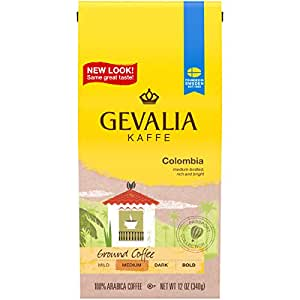
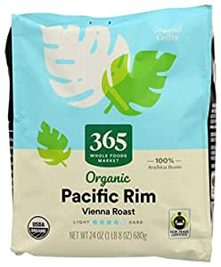
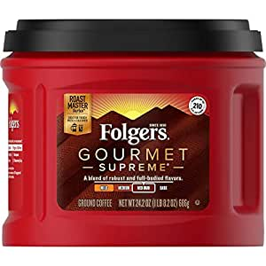

##Our Picks
###Gevalia Medium Roast Ground Coffee, Colombian, 72 Ounce (Pack of 6)

###Product Info:
- Six 12 oz. bags of Gevalia Medium Roast Columbia Arabica Ground Coffee
- Gevalia Colombian Ground Coffee is rich and never bitter
- Caffeinated medium body coffee delivers balanced, bright taste and a touch of acidity
- Colombian ground coffee made from single-origin beans Gevalia has sourced for decades', "Ground coffee made from 100% Arabica beans sourced from the slopes of Colombia's mountains", 'Resealable bag of ground coffee retains fresh flavor
- Certified Kosher ground coffee
######Check Price
###365 by Whole Foods Market, Organic Ground Coffee, Vienna Roast - Pacific Rim (Bag), 24 Ounce

###Product Info:
- Brought to you by Whole Foods Market.\xa0 The packaging for this product has a fresh new look. During this transition, you may get the original packaging or the new packaging in your order, but the product and quality is staying exactly the same. Enjoy!
- A rotating blend of coffee beans from small-holder farmers in the Pacific Rim Islands and in Latin America. The beans are roasted to a deep, chocolaty brown for a heavy-bodied cup with rich notes of chocolate and caramel.
- Vienna roast.
- Ground coffee beans.
- Certified Organic, Certified Kosher.
######Check Price
###Folgers Gourmet Supreme Ground Coffee, 24.2oz

###Product Info:
- Contains 1 - 24.2 Ounce Canister of Ground Coffee
- Re-categorized roast meter from Dark to Medium Dark based on valued consumer feedback
- Pre-ground for easy brewing
- Bold, medium dark roast coffee with a deep and full-bodied flavor
- 100% pure coffee. Roasted in New Orleans, Louisiana
######Check Price
