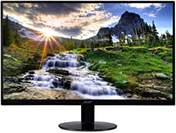
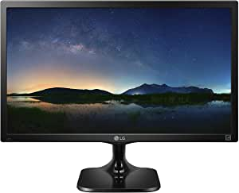
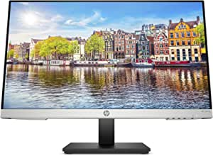

###Computer Monitor - AUZAI 24 inch 1080p FHD LED Computer Monitor for Business - 75Hz with HDMI and VGA Port, Tilt Adjustment, 178° Wide View Angle, 3-Sided Micro Edge Design

- 【24" LED 1080p FHD Resolution】: With a maximum resolution of 1920 x 1080, this FHD monitor delivers a solid video and an optimized image performance like mobile devices, giving you an outstanding and brilliant visual experience.', "【VGA & HDMI Easy Connectivity】: With broad range inputs of HDMI and VGA, the computer monitor could be easily connected to a PC, laptop, or portable monitor, helping with multi-screens you've been looking for, and ensures images to be clear.", '【75Hz Refresh Rate & Backlit Panel】: 75 Hz refresh rate overdrives a smoother picture that looks crisp and fluid without motion blur
- 【Tilted Adjustment -25° to 35°】: The LED computer monitor with a 16:9 aspect ratio
- 【178° Panoramic & Micro-Edge】: The monitor provides a seamless set-up with 3-sided narrow bezels, and the 178⁰ wide viewing angle for consistent color and image clarity maintained, you can enjoy an optimal viewing experience from any position.

[<button class="button">$139.99 on Amazon</button>](https://www.amazon.com/gp/slredirect/picassoRedirect.html/ref=pa_sp_atf_aps_sr_pg1_1?ie=UTF8&adId=A04737692ESMVKND6IVF4&url=%2FComputer-Monitor-Business-Mounting-Adjustment%2Fdp%2FB08R72PMNQ%2Fref%3Dsr_1_1_sspa%3Fdchild%3D1%26keywords%3Dcomputer%2Bmonitors%26qid%3D1614636959%26sr%3D8-1-spons%26psc%3D1&qualifier=1614636959&id=458364245061918&widgetName=sp_atf)
###Sceptre 20" 1600x900 75Hz Ultra Thin LED Monitor 2x HDMI VGA Built-in Speakers, Machine Black Wide Viewing Angle 170° (Horizontal) / 160° (Vertical)

- 20" Led HD+ monitor high resolution 1600 x 900
- 2 x HDMI ports ( convertible to DVI )
- Fast response time 5ms
- Vesa wall mount ready
- Built in speakers
- Mounting Type: VESA wall mount hole pattern 75mm x 75mm

[<button class="button">$79.97 on Amazon</button>](https://www.amazon.com/Sceptre-E205W-16003R-Frameless-Speakers-Metallic/dp/B07743412C/ref=sr_1_3?dchild=1&keywords=computer+monitors&qid=1614636959&sr=8-3)
###Acer SB220Q bi 21.5 Inches Full HD (1920 x 1080) IPS Ultra-Thin Zero Frame Monitor (HDMI & VGA Port), Black

- 21.5 inches Full HD (1920 x 1080) widescreen IPS display
- And Radeon free sync technology
- Refresh rate: 75 hertz - Using HDMI port
- Zero-frame design; Ultra-thin; 4ms response time; IPS panel
- Ports: 1 x HDMI & 1 x VGA
- Aspect ratio - 16:9
- Tilt angle -5 degree to 15 degree
- 75 hertz

[<button class="button">$93.99 on Amazon</button>](https://www.amazon.com/Acer-SB220Q-Ultra-Thin-Frame-Monitor/dp/B07CVL2D2S/ref=sr_1_4?dchild=1&keywords=computer+monitors&qid=1614636959&sr=8-4)
###LG 24M47VQ 24-Inch LED-lit Monitor, Black

- 2 MS response time
- 1920 x 1080 Full HD Resolution
- HDMI, D-Sub, DVI-D
- Reader Mode
- Screen spl

[<button class="button">$99.99 on Amazon</button>](https://www.amazon.com/LG-24M47VQ-24-Inch-LED-lit-Monitor/dp/B00W95RR32/ref=sr_1_5?dchild=1&keywords=computer+monitors&qid=1614636959&sr=8-5)
###HP 24mh FHD Monitor - Computer Monitor with 23.8-Inch IPS Display (1080p) - Built-In Speakers and VESA Mounting - Height/Tilt Adjustment for Ergonomic Viewing - HDMI and DisplayPort - (1D0J9AA#ABA)

- OUTSTANDING VISUALS – This FHD display with IPS technology gives you brilliant visuals and unforgettable quality; with a maximum resolution of 1920 x 1080 at 75 Hz, you’ll experience the image accuracy and wide-viewing spectrums of premium tablets and mobile devices
- MORE SCREEN, LESS SPACE – Enjoy more desk space than you thought possible with an attractive and ultra-slim design
- PANORAMIC VIEWING – Vibrant detail from practically any position with consistent color and image clarity maintained across an ultra-wide 178° horizontal and vertical viewing angles
- MICRO-EDGE DISPLAY – With virtually no bezel encircling the display on three sides, an ultra-wide viewing experience provides for seamless multi-monitor setups
- EASY CONNECTIVITY – Get the picture quality you’ve been looking for without the additional dongles; easily connect to your PC, gaming console, and peripherals for big-screen entertainment with a broad range of ports, including HDMI, DisplayPort, and VGA ports
- BUILT-IN SPEAKERS – Experience incredible sound and more immersive entertainment with two built-in 2W speakers
- LOW BLUE LIGHT – Put less strain on your eyes as a Low Blue Light mode shifts colors to a warmer spectrum and makes whites more natural

[<button class="button">$109.99 on Amazon</button>](https://www.amazon.com/HP-24mh-FHD-Monitor-Built/dp/B08BF4CZSV/ref=sxin_9_ac_d_rm?ac_md=0-0-Y29tcHV0ZXIgbW9uaXRvcnM%3D-ac_d_rm&cv_ct_cx=computer+monitors&dchild=1&keywords=computer+monitors&pd_rd_i=B08BF4CZSV&pd_rd_r=86ac376e-1a31-4d52-b895-0f6eccb8bedf&pd_rd_w=PzYMQ&pd_rd_wg=bAoUH&pf_rd_p=5ceb2a76-ceaa-45a9-982b-6fa61a20d67b&pf_rd_r=ZZH36FK4CE1JDXCJMC78&psc=1&qid=1614636959&sr=1-1-12d4272d-8adb-4121-8624-135149aa9081)
