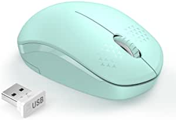

###VicTsing MM057 2.4G Wireless Portable Mobile Mouse Optical Mice with USB Receiver, 5 Adjustable DPI Levels, 6 Buttons for Notebook, PC, Laptop, Computer, Macbook - Black

- Comfortable Ergonomic DesignAfter thousands of samples of palm data we designed this ergonomic mouse
- Multi-function Wireless Mouse5 levels DPI: 800/1200/1600/2000/2400 easily change the cursor sensitivity depending on your activity
- Wide CompatibilityWell compatible with Windows7/8/10/XP Vista7/8 and Linux etc
- Operating system: Windows 7

[<button class="button">$9.99 on Amazon</button>](https://www.amazon.com/VicTsing-Wireless-Portable-Receiver-Adjustable/dp/B013WC0P2A/ref=sr_1_1?dchild=1&keywords=computer+mouse&qid=1614634821&sr=8-1)
###Jelly Comb USB Wired Mouse,RGB Optical Silent Computer Mouse,1600 DPI Office and Home Mice,for Windows PC, Laptop, Desktop, Notebook-MS059 (Black)

- 【4 LIGHTING MODE】Jelly Comb Wired LED mouse adops interesting rainbow lighting design,which can one button to adjust 4 RGB color effects, stylish and beautiful, creating a relaxed atmosphere, perfect for daily office and leisure entertainment.
- 【Quiet Clicking and Ergonomic Design】The USB Computer Mouse make you enjoy every silent clicking moment, also avoid disturbing colleagues and family
- 【High-precision and durability】1600 DPI movement resolution enables responsive cursor control for precise tracking, works on most surfaces
- 【Easy to Use】The simple USB corded mouse, just plug and play, very easy to use Eliminates the trouble of replacing batteries, can save your time and improve your work efficiency.
- 【Universal Compatibility】The computer mice has a wide range of compatibility, Compatible with computer, laptop, desktop, PC, laptop, Windows XP/Vista/7/8/10.And Jelly Comb offers you Free Replacement Refund and lifetime timely customer service,any problems pls feel free to contact us.

[<button class="button">$9.99 on Amazon</button>](https://www.amazon.com/Jelly-Comb-Optical-Computer-Notebook-MS059/dp/B08GWQCWM9/ref=sr_1_2?dchild=1&keywords=computer+mouse&qid=1614634821&sr=8-2)
###Logitech B100 Corded Mouse – Wired USB Mouse for Computers and laptops, for Right or Left Hand Use, Black

- FULL-SIZE COMFORT - A comfortable, ambidextrous shape feels good in either hand, so you feel more comfortable as you work - even at the end of the day
- CONVENIENT CONTROLS - Side-to-side scrolling plus zoom lets you instantly zoom in or out and scroll horizontally and vertically
- ZERO SETUP REQUIRED - Flexible wired connectivity means you just plug the cable into your USB or PS/2 port - it works right out of the box.', "PRECISE CURSOR CONTROL - With 800 dpi sensitivity, you'll get precise cursor control so you can edit documents and navigate the Web more efficiently.", 'BUILT BY LOGITECH - This mouse comes with the quality and design we’ve built into more than a billion mice, more than any other manufacturer

[<button class="button">$6.99 on Amazon</button>](https://www.amazon.com/Logitech-800dpi-Optical-3-button-Ambidextrous/dp/B003L62T7W/ref=sxin_9_lp-trr-2-na_d8ed4fc8e40b893a40b19547cc6a2915d3d1e363?cv_ct_cx=computer+mouse&dchild=1&keywords=computer+mouse&pd_rd_i=B003L62T7W&pd_rd_r=5abbc0fb-0383-42ab-8cdd-0ae9db58319f&pd_rd_w=qO2Z5&pd_rd_wg=XEX2j&pf_rd_p=79c6e13e-fbdb-4ab1-8d83-9d1dbd2f11f4&pf_rd_r=4KBGQRKA68VACCK4RHJ8&qid=1614634821&sr=1-1-5519553e-2baa-451e-af83-b0156e5c6669)
###seenda Wireless Mouse, 2.4G Noiseless Mouse with USB Receiver - Portable Computer Mice for PC, Tablet, Laptop with Windows System - Mint Green

- 💕 Wireless Mouse with More Color -- If you want a cute, colorful mouse, this should be the one
- 💕 Plug & Play Super Easy to Use -- Really plug & play design, no drivers need to be installed
- 💕 Portable Size & Noiseless Click -- Portable design make it easy to store in bag for traveling, responsive buttons provides very soft click with less noise, no more disturbing for others with the loud clicking sound
- 💕 Only 1 AA Battery is Required -- It takes only 1 AA Battery(NOT Included) to operate this mouse, and the wireless mouse will turn to sleep mode in 10mins of inactivity for energy saving, can be easily activated by clicking any buttons
- 💕 Universal Compatibility -- Work perfectly for Windows XP, Windows Vista, Windows 7, Mac OS X 10.4 e

[<button class="button">$9.98 on Amazon</button>](https://www.amazon.com/seenda-Wireless-Noiseless-Receiver-Portable/dp/B07H8TJMX7/ref=sxin_9_lp-trr-2-na_d8ed4fc8e40b893a40b19547cc6a2915d3d1e363?cv_ct_cx=computer+mouse&dchild=1&keywords=computer+mouse&pd_rd_i=B07H8TJMX7&pd_rd_r=5abbc0fb-0383-42ab-8cdd-0ae9db58319f&pd_rd_w=qO2Z5&pd_rd_wg=XEX2j&pf_rd_p=79c6e13e-fbdb-4ab1-8d83-9d1dbd2f11f4&pf_rd_r=4KBGQRKA68VACCK4RHJ8&qid=1614634821&sr=1-4-5519553e-2baa-451e-af83-b0156e5c6669)
