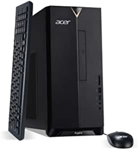

##Our Picks
###Acer Aspire TC-895-UA91 Desktop, 10th Gen Intel Core i3-10100 4-Core Processor, 8GB 2666MHz DDR4, 512GB NVMe M.2 SSD, 8X DVD, 802.11ax Wi-Fi 6, USB 3.2 Type C, Windows 10 Home
#####Seller: Acer

###Product Info:
- 10th Generation Intel Core i3-10100 4-Core Processor (Up to 4.3GHz)
- 8GB 2666MHz DDR4 Memory | 512GB NVMe M.2 SSD | 8X DVD-Writer Double-Layer Drive (DVD-RW)
- Intel Wireless Wi-Fi 6 AX200 802.11ax Dual-Band 2.4GHz and 5GHz featuring 2x2 MU-MIMO technology | Bluetooth 5.1 | 10/100/1000 Gigabit Ethernet LAN
- 1 - USB 3.2 Type C Gen 1 port (up to 5 Gbps) (Front) | 5 - USB 3.2 Gen 1 Ports (1 Front and 4 Rear) | 2 - USB 2.0 Ports (Rear) | 2 - HDMI Ports
- Windows 10 Home (USB Keyboard and Mouse Included)
######[Check Price](https://www.amazon.com/gp/slredirect/picassoRedirect.html/ref=pa_sp_atf_aps_sr_pg1_1?ie=UTF8&adId=A03531081OD9LWAQ2Q5CW&url=%2FAcer-TC-895-UA91-i3-10100-Processor-802-11ax%2Fdp%2FB088X29HF6%2Fref%3Dsr_1_1_sspa%3Fdchild%3D1%26keywords%3Dcomputers%26qid%3D1613505545%26sr%3D8-1-spons%26psc%3D1&qualifier=1613505544&id=8678410424977290&widgetName=sp_atf)
