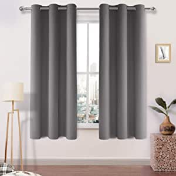
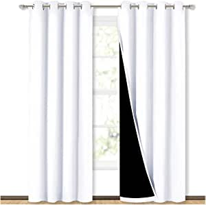

###BGment Blackout Curtains for Bedroom - Grommet Thermal Insulated Room Darkening Curtains for Living Room, Set of 2 Panels (42 x 63 Inch, Navy Blue)

- Package Includes: Set of 2 navy blue blackout curtains and 2 tiebacks; Each panel measures 42 Inch wide by 63 Inch long.
- Grommet Construction: Each curtain panel has 6 silver metal grommets on top
- Blackout Curtains: Our bedroom curtains can block out 85%-99% sunlight and UV ray ( Darker colors work better), perfect for late sleepers and afternoon naps.
- Thermal Insulated: Our energy saving curtains insulate against summer heat and winter chill to balance your room temperature, cut down energy bills
- Easy to care: Machine washable in gentle cycle and cold water, do not blea

[<button class="button">$19.89 on Amazon</button>](https://www.amazon.com/gp/slredirect/picassoRedirect.html/ref=pa_sp_atf_aps_sr_pg1_1?ie=UTF8&adId=A02891863STQ2SBA6L77E&url=%2FBGment-Blackout-Curtains-Bedroom-Insulated%2Fdp%2FB07D6HCZTY%2Fref%3Dsr_1_1_sspa%3Fdchild%3D1%26keywords%3Dcurtains%26qid%3D1614445827%26sr%3D8-1-spons%26psc%3D1&qualifier=1614445826&id=6440383127442552&widgetName=sp_atf)
###DWCN Room Darkening Blackout Curtains Thermal Insulated Curtain for Bedroom Grommet Window Curtain Panel 42 x 63 Inch, Set of 2 Panels,Thick Light Grey Curtains

- 100% Polyester
- Thick blackout curtains fabric made of high quality imported 100% Polyester 
- Quality workmanship, bottom hem is 0.6 inch
- Our Blackout curtains are woven with a triple layer and heavy duty fabric to provide an unmatched blackout and sleeping experience
- Thermal insulated and Energy Saving curtains great for reducing energy loses during summer and winter and reducing energy costs
- Machine washable in cold water, tumble dry, single wash cycle, no bleachi

[<button class="button">$23.39 on Amazon</button>](https://www.amazon.com/gp/slredirect/picassoRedirect.html/ref=pa_sp_atf_aps_sr_pg1_1?ie=UTF8&adId=A00663481BNITUQHOJN1A&url=%2FDWCN-Darkening-Blackout-Curtains-Insulated%2Fdp%2FB07C2QNWJT%2Fref%3Dsr_1_2_sspa%3Fdchild%3D1%26keywords%3Dcurtains%26qid%3D1614445827%26sr%3D8-2-spons%26psc%3D1&qualifier=1614445826&id=6440383127442552&widgetName=sp_atf)
###Easy-Going Blackout Curtains for Bedroom, Solid Thermal Insulated Grommet and Noise Reduction Window Drapes, Room Darkening Curtains for Living Room, 2 Panels(52x84 in,Gray)

- Fabric and Workmanship: Quality fabric feels soft, heavy and comfortable
- Selection and Packaging: Our blackout curtains have 16 colors and 5 sizes
- Multiple Functions: Our curtains can block out sunlight and UV ray ( Darker colors work better), insulate against summer heat and winter chill to balance your room temperature, cut down energy bills
- Easy to Install: Each curtain panel has 8 silver metal grommets on top.Each grommet inner diameter is 1.6 inch, fits easily with standard curtain rods.Easy to hang, and slide smoothly
- Easy to Care: These blackout curtains are machine washable with cold water, please do not bleach, tumble dry on low, iron at low temperature if ne

[<button class="button">$26.99 on Amazon</button>](https://www.amazon.com/gp/slredirect/picassoRedirect.html/ref=pa_sp_atf_aps_sr_pg1_1?ie=UTF8&adId=A00185292F5XX21XAKUXW&url=%2FEasy-Going-Insulated-Blackout-Curtains-Darkening%2Fdp%2FB08F9KHBJX%2Fref%3Dsr_1_4_sspa%3Fdchild%3D1%26keywords%3Dcurtains%26qid%3D1614445827%26sr%3D8-4-spons%26psc%3D1&qualifier=1614445826&id=6440383127442552&widgetName=sp_atf)
###NICETOWN 100% Blackout Window Curtain Panels, Heat and Full Light Blocking Drapes with Black Liner for Nursery, 84 inches Drop Thermal Insulated Draperies (White, 2 Pieces, 52 inches Wide Each Panel)

- 100% Polyester
- Imported
- READY MADE: 2 panels per package
- UNIQUE DESIGN: Draperies constructed with 2 layers are all triple weave blackout fabric, balancing room temperature by insulating against summer HEAT and winter CHILL meanwhile protect PRIVACY
- EASY CARE: Good quality finishing will withstand years of u

[<button class="button">$39.98 on Amazon</button>](https://www.amazon.com/NICETOWN-Blackout-Blocking-Insulated-Draperies/dp/B077RPXSF3/ref=sr_1_5?dchild=1&keywords=curtains&qid=1614445827&sr=8-5)
