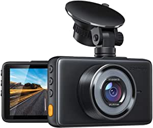
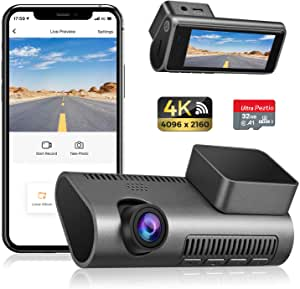

###Rove R2- 4K Dash Cam Built in WiFi GPS Car Dashboard Camera Recorder with UHD 2160P, 2.4" LCD, 150° Wide Angle, WDR, Night Vision

- 4K ULTRA HD RECORDING – The Rove R2-4k dash camera can record videos up to a resolution of 2160p
- BUILT-IN WiFi – Use the ROVE App to view and manage dash cam recordings instantly on your iOS and android devices
- DASH CAM WITH GPS – Built-in GPS accurately records your driving location and speed
- FEATURES WITH STATE OF THE ART TECHNOLOGY INCLUDED – The car dashboard camera has f1.8 apertures (the largest in the industry), parking mode, motion detection, 150° A+ wide angle lens, G-sensor, loop cycle recording, emergency video lock, time-lapse video, slow-mo video, supports up to 512GB class 10 - U3 speed micro SD card (NOTE: MEMORY CARD NOT INCLUDED)
- 100% USA-CHICAGO BASED CUSTOMER-CENTRIC COMPANY & CUSTOMER CARE – This dash camera for cars is backed by full 1-YEAR WARRAN

[<button class="button">$119.99 on Amazon</button>](https://www.amazon.com/gp/slredirect/picassoRedirect.html/ref=pa_sp_atf_aps_sr_pg1_1?ie=UTF8&adId=A0244023YQRX60LC14XO&url=%2FR2-4K-Dashboard-Camera-Recorder-Vision%2Fdp%2FB074JT3698%2Fref%3Dsr_1_1_sspa%3Fdchild%3D1%26keywords%3Ddash%2Bcam%26qid%3D1614637247%26sr%3D8-1-spons%26psc%3D1&qualifier=1614637247&id=3860007785111464&widgetName=sp_atf)
###APEMAN Dash Cam 1080P FHD DVR Car Driving Recorder 3 Inch LCD Screen 170° Wide Angle, G-Sensor, WDR, Parking Monitor, Loop Recording, Motion Detection

- 1080P Full HD Dash Cam - Simultaneous recording with Super High Resolution 1080P@30fps Full HD Lens, and 3 inch large LCD Screen deliver clearer videos&images and replay the key moment even when high speed driving.
- 170° Super Wide Angle - This car driving recorder employs 170° super wide angle lens
- Built in G-sensor - With built-in G-sensor, apeman dashboard camera can automatically detect a sudden shake/collision and lock the footage to prevent the video from being overwritten even in loop recording
- Super Night Vision - The combination of F1.8 large aperture, WDR, HDR ensures the clarity of images at night
- Easy to Set Up & Use - Motion Detection, Seamless Loop Recording, Parking Monitor satisfy your need for daily drivi

[<button class="button">$44.99 on Amazon</button>](https://www.amazon.com/gp/slredirect/picassoRedirect.html/ref=pa_sp_atf_aps_sr_pg1_1?ie=UTF8&adId=A10482101UH73CF3SPQIA&url=%2FAPEMAN-Recorder-170%25C2%25B0Wide-Recording-Detection%2Fdp%2FB07DLG9GFG%2Fref%3Dsr_1_2_sspa%3Fdchild%3D1%26keywords%3Ddash%2Bcam%26qid%3D1614637247%26sr%3D8-2-spons%26psc%3D1%26smid%3DA1GFGUIQT7X8JF&qualifier=1614637247&id=3860007785111464&widgetName=sp_atf)
###Dash Cam 4K WiFi Ultra HD 2160P Car Dash Cam with SD Card Included, Dash Camera for Cars with Night Vision, WDR, Loop Recording, 170° Wide Angle, G-Sensor, Motion Detection, 24H Parking Monitor

- 【4K Ultra HD 2160P Dash Cam】Equipped with NOVATEK Chip + GC CMOS + 6G 170 degree wide angle lens, A1 dashcam delivers professional 4K 30Fps videos and 12MP photos, which is 4 times resolution of traditional 1080P dash cameras, which can vividly capture your driving moment, allowing more detailed evidence.
- 【Build in Wi-fi and APP Control】Built-in 2.4GHz Wi-Fi transmitter, A1 car camera achieves blazing speed for file transfer
- 【Excellent Clarity Both Day and Night】Performs well in color precision and clarity, GC CMOS sensor with f/1.8 big aperture, WDR (Wide Dynamic Range) technology, achieves super night vision by automatically balancing the exposure in extreme dark scenarios, obtaining clear videos whether day and night.
- 【Protection Round the Clock】Hidden Space-capsule design: Compact, discreet and removable design, never blocks your view; G-Sensor: auto-locks the footage when impact happens whilst driving; Parking mode: auto power on then shoot a video for evidence once the collision sensor triggered; Loop recording: deletes the old video to make space when the disk storage is full.
- 【SD Card Included and Worry-Free Aftersales】We prepare dedicated 32GB SD card for each A1 car dash c

[<button class="button">$79.99 on Amazon</button>](https://www.amazon.com/Included-Recording-G-Sensor-Detection-Parking/dp/B08R1RDL5W/ref=sr_1_5?dchild=1&keywords=dash+cam&qid=1614637247&sr=8-5)
###VIOFO A129 Pro Duo 4K Dual Dash Cam 3840 x 2160P Ultra HD 4K Front and 1080P Rear Car WiFi Dash Camera Sony 8MP Sensor GPS, Buffered Parking Mode, G-Sensor, Motion Detection, WDR, Loop Recording

- 【Ultra HD Real 4K Dual Channel Dash Cam】 Adopt top quality Sony 8MP IMX317 Sensor on front camera and Sony IMX 291 sensor on rear camera, this dual dash cam captures super clear view at Ultra HD 4K 3840 * 2160 @30fps + 1920 * 1080P @30fps at the same time
- 【Buffered Parking Mode】Buffered parking mode will be able to record events leading up to an impact / motion that has been detected
- 【Built-in Wi-Fi & GPS】 2.4GHz & 5GHz dual-band Wi-Fi could transmit in two different standard frequency ranges to avoid wireless interference
- 【Premium Functions】 Loop recording, emergency recording, motion detection, time lapse and so 

[<button class="button">$248.90 on Amazon</button>](https://www.amazon.com/VIOFO-Buffered-G-Sensor-Detection-Recording/dp/B07RXQJ148/ref=sxin_9?ascsubtag=amzn1.osa.448e07c6-42a7-4919-81c1-b76eb116584e.ATVPDKIKX0DER.en_US&creativeASIN=B07RXQJ148&cv_ct_cx=dash+cam&cv_ct_id=amzn1.osa.448e07c6-42a7-4919-81c1-b76eb116584e.ATVPDKIKX0DER.en_US&cv_ct_pg=search&cv_ct_we=asin&cv_ct_wn=osp-single-source-earns-comm&dchild=1&keywords=dash+cam&linkCode=oas&pd_rd_i=B07RXQJ148&pd_rd_r=48fa6284-a8bb-46bf-a89f-70e3d4deb92a&pd_rd_w=l6695&pd_rd_wg=MXOJG&pf_rd_p=35b32c02-1b41-4e49-9b89-0297af2446e1&pf_rd_r=FAFBG057CXQWDZ8T9T13&qid=1614637247&sr=1-1-64f3a41a-73ca-403a-923c-8152c45485fe&tag=plonsite20-20)
