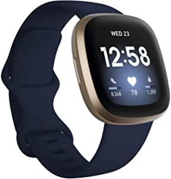
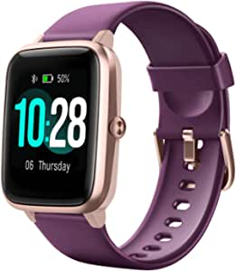
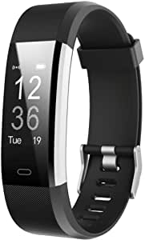

###Fitbit Versa 3 Health & Fitness Smartwatch with GPS, 24/7 Heart Rate, Alexa Built-in, 6+ Days Battery, Midnight Blue/Gold, One Size (S & L Bands Included)

- Run, bike, hike and more phone-free and see your real-time pace & distance with built-in GPS
- Active Zone Minutes uses your resting heart rate to gauge exercise effort and gives you a buzz when you step up the intensity so you can make the most of your workouts
- Better track heart rate 24/7 with PurePulse 2.0, Fitbit’s enhanced heart rate technology
- See your nightly blood oxygen levels at a glance with our collection of SpO2 clock faces
- Use Google Assistant or Amazon Alexa Built-in to get quick news, set bedtime reminders and alarms, control your smart home devices and more just by speaking to your watch (Voice assistant availability and features may vary, see fitbit.com/voice)
- Use the built-in mic and speaker to take Bluetooth calls hands-free, send callers to voicemail and adjust volume (Available when phone is nearby
- Free 90-day Fitbit Premium trial for new Premium users (New Premium users only
- Store and play music & podcasts on Deezer or Pandora, plus control Spotify all from your wrist (Subscriptions required for use of music services; not available in all countries)

[<button class="button">$229.95 on Amazon</button>](https://www.amazon.com/gp/slredirect/picassoRedirect.html/ref=pa_sp_atf_aps_sr_pg1_1?ie=UTF8&adId=A07585532ZNP5HKMSU464&url=%2FFitbit-Fitness-Smartwatch-Midnight-Included%2Fdp%2FB08DFPZG71%2Fref%3Dsr_1_1_sspa%3Fdchild%3D1%26keywords%3Dfitbit%26qid%3D1614630523%26sr%3D8-1-spons%26psc%3D1&qualifier=1614630523&id=4580071170939429&widgetName=sp_atf)
###Letsfit Smart Watch, Fitness Tracker with Heart Rate Monitor, Activity Tracker with 1.3 Inch Touch Screen, IP68 Waterproof Pedometer Smartwatch with Sleep Monitor, Step Counter for Women and Men

- Overtake your expectations: featuring a 1
- Protect & monitor your health: Our Letsfit activity watch includes a bunch of new features, including: music control, even Stress training
- Affordable & Functional: Like most traditional health trackers, Letsfit Smart Tracker can monitor your steps, calories burned, sport mileage, and sleep quality status 24 hours a day whilst syncing with our VeryFitPro app
- Call & message notifications: Receive and read SMS messages and SNS notifications straight to your device (including Facebook, twitter, WhatsApp, LinkedIn and Instagram)
- Smart Watch compatibility："VeryFitPro" requires Android OS

[<button class="button">$25.49 on Amazon</button>](https://www.amazon.com/Letsfit-Activity-Waterproof-Pedometer-Smartwatch/dp/B085FSYYFV/ref=sxin_9?ascsubtag=amzn1.osa.7100d0c0-b248-43b2-927e-a090e24b584e.ATVPDKIKX0DER.en_US&creativeASIN=B085FSYYFV&cv_ct_cx=fitbit&cv_ct_id=amzn1.osa.7100d0c0-b248-43b2-927e-a090e24b584e.ATVPDKIKX0DER.en_US&cv_ct_pg=search&cv_ct_we=asin&cv_ct_wn=osp-single-source-earns-comm&dchild=1&keywords=fitbits&linkCode=oas&pd_rd_i=B085FSYYFV&pd_rd_r=2b4a0f38-0343-4d84-af10-b14f28554f71&pd_rd_w=E4eNL&pd_rd_wg=tiaQc&pf_rd_p=35b32c02-1b41-4e49-9b89-0297af2446e1&pf_rd_r=FD2ADK6KZAAMD2Z98F8Z&qid=1614630523&sr=1-1-64f3a41a-73ca-403a-923c-8152c45485fe&tag=aimassociatesyj-20)
###LETSCOM Fitness Tracker HR, Activity Tracker Watch with Heart Rate Monitor, Waterproof Smart Fitness Band with Step Counter, Calorie Counter, Pedometer Watch for Women and Men

- Heart Rate & Sleep Monitoring: Tracks real-time heart rate automatically & continuously and automatically tracks your sleep duration & consistency with comprehensive analysis of sleep quality data, helping you adjust yourself for a healthier lifestyle
- All-day Activity Tracking: Accurately record all-day activities like steps, distance, calories burned, active minutes and sleep status
- Multi-Sport Modes & Connected GPS: 14 exercise modes help you better understand specific activity data; Connect the GPS on your cellphone can show run stats like pace and distance and record a map of your workout route
- See Calls & Messages on Your Wrist: Receive call, calendar, SMS and SNS (Facebook, WhatsApp, LinkedIn, Instagram, and Twitter) notifications on display; never miss the messages that matter
- Built-in USB Plug: Easy to charge with any USB block and computer; no charging cable and dock needed; one single charge gives you up to 7 days of working time
- Sport type: Yoga

[<button class="button">$23.99 on Amazon</button>](https://www.amazon.com/LETSCOM-Fitness-Activity-Waterproof-Pedometer/dp/B0779SKCXW/ref=sxin_9?ascsubtag=amzn1.osa.7100d0c0-b248-43b2-927e-a090e24b584e.ATVPDKIKX0DER.en_US&creativeASIN=B0779SKCXW&cv_ct_cx=fitbit&cv_ct_id=amzn1.osa.7100d0c0-b248-43b2-927e-a090e24b584e.ATVPDKIKX0DER.en_US&cv_ct_pg=search&cv_ct_we=asin&cv_ct_wn=osp-single-source-earns-comm&dchild=1&keywords=fitbits&linkCode=oas&pd_rd_i=B0779SKCXW&pd_rd_r=2b4a0f38-0343-4d84-af10-b14f28554f71&pd_rd_w=E4eNL&pd_rd_wg=tiaQc&pf_rd_p=35b32c02-1b41-4e49-9b89-0297af2446e1&pf_rd_r=FD2ADK6KZAAMD2Z98F8Z&qid=1614630523&sr=1-2-64f3a41a-73ca-403a-923c-8152c45485fe&tag=aimassociatesyj-20)
