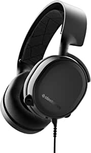
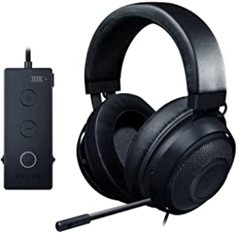
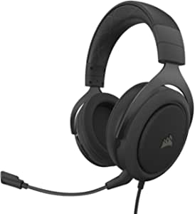

###SteelSeries Arctis 3 - All-Platform Gaming Headset - for PC, PlayStation 4, Xbox One, Nintendo Switch, VR, Android, and iOS - Black

- Optimal PS5 compatibility requires user to change settings on Sony PS5 – disable Sony 3D Audio and then increase default volume to 100%']

[<button class="button">$64.99 on Amazon</button>](https://www.amazon.com/gp/slredirect/picassoRedirect.html/ref=pa_sp_atf_aps_sr_pg1_1?ie=UTF8&adId=A03369691VZTXVZP15J1U&url=%2FSteelSeries-All-Platform-Headset-PlayStation-Nintendo%2Fdp%2FB07G12Z1HR%2Fref%3Dsr_1_2_sspa%3Fdchild%3D1%26keywords%3Dgaming%2Bheadsets%26qid%3D1614636855%26sr%3D8-2-spons%26psc%3D1&qualifier=1614636855&id=7902628230510058&widgetName=sp_atf)
###Razer Kraken Tournament Edition THX 7.1 Surround Sound Gaming Headset: Retractable Noise Cancelling Mic - USB DAC -  For PC, PS4, PS5, Nintendo Switch, Xbox One, Xbox Series X & S, Mobile – Black

- The Peripherals Manufacturer in the US: Source - The NPD Group, Inc., U.S
- THX 7.1 Surround Sound Capable: Provides industry-leading audio realism for in-game immersion by providing accurate spatial audio information beyond standard 7.1 surround sound directional cues
- Sound Built for Immersive Gaming: Outfitted with custom-tuned 50 mm drivers
- All-day Comfort: Oval, cooling gel-infused cushions that prevent overheating and pressure build-up
- Retractable Noise Cancelling Microphone: An improved cardioid mic reduces background and ambient noises for crystal-clear communication
- In-line Audio Controls: Includes an analog volume control wheel and mic mute switch
- Compatibility: Audio enhancer DAC connects via USB connector; THX Spatial Audio available on Windows 10 64-bit only

[<button class="button">$69.99 on Amazon</button>](https://www.amazon.com/Razer-Kraken-Tournament-Gel-Infused-Cushions/dp/B07G5TP4BN/ref=sr_1_3?dchild=1&keywords=gaming+headsets&qid=1614636855&sr=8-3)
###HyperX Cloud Alpha - Gaming Headset, Dual Chamber Drivers, Award Winning Comfort, Durable Aluminum Frame, Detachable Microphone, Works on PC, PS4, Xbox One, Nintendo Switch, and Mobile Devices – Red

- HyperX Dual Chamber Drivers for more distinction and less distortion
- Signature award winning HyperX comfort
- Durable aluminum frame with expanded headband
- Detachable braided cable with convenient in line audio control
- Detachable noise cancellation microphone
- Compatible with PC, PS4, PS4 Pro, Xbox One, Xbox One S, Mac, Mobile, Nintendo Switch, VR

[<button class="button">$80.99 on Amazon</button>](https://www.amazon.com/HyperX-Cloud-Alpha-Gaming-Headset/dp/B074NBSF9N/ref=sxin_9?ascsubtag=amzn1.osa.d2e717ec-3453-4442-bcd0-65a14acbd8f2.ATVPDKIKX0DER.en_US&creativeASIN=B074NBSF9N&cv_ct_cx=gaming+headsets&cv_ct_id=amzn1.osa.d2e717ec-3453-4442-bcd0-65a14acbd8f2.ATVPDKIKX0DER.en_US&cv_ct_pg=search&cv_ct_we=asin&cv_ct_wn=osp-single-source-earns-comm&dchild=1&keywords=gaming+headsets&linkCode=oas&pd_rd_i=B074NBSF9N&pd_rd_r=b098051b-8905-4d5e-a9be-fda5cc75e16d&pd_rd_w=NKjbG&pd_rd_wg=xp3rz&pf_rd_p=35b32c02-1b41-4e49-9b89-0297af2446e1&pf_rd_r=X9P1CNS3VHBAD2NDW1N3&qid=1614636855&sr=1-1-64f3a41a-73ca-403a-923c-8152c45485fe&tag=thewire06oa-20)
###Corsair HS60 PRO - 7.1 Virtual Surround Sound Gaming Headset with USB DAC - Works with PC, Xbox Series X, Xbox Series S, Xbox One, PS5, PS4, and Nintendo Switch - Carbon (CA-9011213-NA)

- Adjustable ear cups fitted with plush memory foam provide exceptional comfort for hours of gameplay
- High-quality custom-tuned 50mm neodymium Audio drivers deliver superb sound quality with the range to hear everything you need to on the battlefield
- Immerse yourself in 7.1 surround sound on PC creating a multi-channel audio experience that puts you in the middle of your game
- A fully detachable noise-cancelling unidirectional microphone reduces ambient noise for excellent voice clarity
- Multi-platform compatible with PC, PS5, PS4, Xbox Series X, Xbox Series S, Xbox one, Nintendo switch and mobile devices via a gold-plated 3.5mm connector
- The HS60 PRO’s light weight and durable construction, with aluminum yokes and a braided audio cable, give it years of longevity
- On-ear volume and mute controls enable on-the-fly adjustments without distracting you from your game
- CORSAIR iCUE software enables custom audio equalizer settings, immersive 7.1 surround sound, sidetone control, and more

[<button class="button">$49.61 on Amazon</button>](https://www.amazon.com/Corsair-HS60-Pro-Headphones-Compatible/dp/B07X9W8CBP/ref=sxin_9?ascsubtag=amzn1.osa.d2e717ec-3453-4442-bcd0-65a14acbd8f2.ATVPDKIKX0DER.en_US&creativeASIN=B07X9W8CBP&cv_ct_cx=gaming+headsets&cv_ct_id=amzn1.osa.d2e717ec-3453-4442-bcd0-65a14acbd8f2.ATVPDKIKX0DER.en_US&cv_ct_pg=search&cv_ct_we=asin&cv_ct_wn=osp-single-source-earns-comm&dchild=1&keywords=gaming+headsets&linkCode=oas&pd_rd_i=B07X9W8CBP&pd_rd_r=b098051b-8905-4d5e-a9be-fda5cc75e16d&pd_rd_w=NKjbG&pd_rd_wg=xp3rz&pf_rd_p=35b32c02-1b41-4e49-9b89-0297af2446e1&pf_rd_r=X9P1CNS3VHBAD2NDW1N3&qid=1614636855&sr=1-2-64f3a41a-73ca-403a-923c-8152c45485fe&tag=thewire06oa-20)
