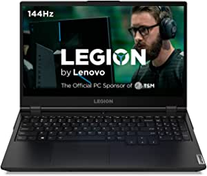
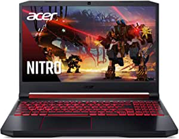

###Lenovo Legion 5 Gaming Laptop, 15.6" FHD (1920x1080) IPS Screen, AMD Ryzen 7 4800H Processor, 16GB DDR4, 512GB SSD, NVIDIA GTX 1660Ti, Windows 10, 82B1000AUS, Phantom Black

- Welcome to the next generation of gaming performance with the AMD Ryzen 7 4800H mobile processor, 16GB 3200MHz DDR4 memory, and 512GB M.2 NVMe PCIe SSD storage
- Enjoy fast refresh and deep colors with a 144 Hz refresh rate and outstanding clarity on a 15.6" FHD (1920 x 1080) IPS display
- The NVIDIA GeForce GTX 1660Ti GPU is a blazing-fast supercharger for your favorite games and the newest titles
- Get maximum performance via Dual Burn Support, which pushes the CPU and GPU together for improved framerates, and Legion Coldfront 2.0 for thermal tuning
- The Legion TrueStrike keyboard with soft-landing switches delivers hair-trigger inputs

[<button class="button">$999.99 on Amazon</button>](https://www.amazon.com/gp/slredirect/picassoRedirect.html/ref=pa_sp_atf_aps_sr_pg1_1?ie=UTF8&adId=A03181873UY2QHHDMJZV9&url=%2FLenovo-1920x1080-Processor-Windows-82B1000AUS%2Fdp%2FB08BB9RWXD%2Fref%3Dsr_1_1_sspa%3Fdchild%3D1%26keywords%3Dgaming%2Blaptops%26qid%3D1614635887%26sr%3D8-1-spons%26psc%3D1&qualifier=1614635887&id=1086678783335076&widgetName=sp_atf)
###ASUS TUF TUF506IU-ES74 Gaming A15 Gaming Laptop, 15.6” 144Hz Full HD IPS-Type, AMD Ryzen 7 4800H, GeForce GTX 1660 Ti, 16GB DDR4, 512GB PCIe SSD, 90WHr Battery, RGB Backlit KB, Windows 10 Home

- NVIDIA GeForce GTX 1660 Ti 6GB GDDR6 with ROG Boost
- 8-core AMD Ryzen 7 4800H Processor 45W (8M Cache, up to 4.2GHz)
- 15.6" 144Hz Full HD IPS-Type Display
- 16GB DDR4 3200MHz RAM | 512GB PCIe NVMe M.2 SSD | Windows 10 Home
- 90WHr battery | Up to 8.7 hours web browsing and up to 12.3 hours video playback
- Durable MIL-STD-810H military standard construction
- Self cleaning dual fans with anti-dust technology to extend system longevity

[<button class="button">$999.00 on Amazon</button>](https://www.amazon.com/ASUS-IPS-Type-GeForce-Battery-TUF506IU-ES74/dp/B0865RZR9S/ref=sr_1_3?dchild=1&keywords=gaming+laptops&qid=1614635887&sr=8-3)
###Acer Nitro 5 Gaming Laptop, 9th Gen Intel Core i5-9300H, NVIDIA GeForce GTX 1650, 15.6" Full HD IPS Display, 8GB DDR4, 256GB NVMe SSD, Wi-Fi 6, Backlit Keyboard, Alexa Built-in, AN515-54-5812

- 9th Generation Intel Core i5-9300H Processor (Up to 4.1 GHz)
- 15" Full HD Widescreen IPS LED-backlit display; NVIDIA GeForce GTX 1650 Graphics with 4 GB of dedicated GDDR5 VRAM
- 8GB DDR4 2666MHz Memory; 256GB PCIe NVMe SSD (2 x PCIe M.2 slots - 1 slot open for easy upgrades) & 1 - Available hard drive bay
- LAN: 10/100/1000 Gigabit Ethernet LAN (RJ-45 port); Wireless: Intel Wireless Wi-Fi 6 AX200 802.11ax
- Backlit keyboard; Acer Cool Boost technology with twin fans and dual exhaust ports

[<button class="button">$699.99 on Amazon</button>](https://www.amazon.com/Acer-i5-9300H-GeForce-Keyboard-AN515-54-5812/dp/B086KJBKDW/ref=sr_1_5?dchild=1&keywords=gaming+laptops&qid=1614635887&sr=8-5)
###MSI GL65 Leopard 10SFK-062 15.6" FHD 144Hz 3ms Thin Bezel Gaming Laptop Intel Core i7-10750H RTX2070 16GB 512GB NVMe SSD Win 10

- 15.6" FHD IPS-Level 144Hz 72%NTSC Thin Bezel close to 100%Srgb NVIDIA GeForce RTX 2070 8G GDDR6
- Intel Core i7-10750H 2.6-5.0GHz Intel Wi-Fi 6 AX201(2 x 2 ax)
- 512GB NVMe SSD 16GB (8G*2) DDR4 2666MHz 2 Sockets Max Memory 64GB
- USB 3.1 Gen2 Type C 1 USB 3.2 Gen1 3 Steel Series per-Key RGB with Anti-Ghost key+ silver lining 720p HD Webcam
- Win10 Multi-language Giant Speakers 3W x 2 6 cell (51Wh) Li-Ion 230W

[<button class="button">$1,311.73 on Amazon</button>](https://www.amazon.com/MSI-Leopard-10SFK-062-i7-10750H-RTX2070/dp/B085B3GFRL/ref=sr_1_6?dchild=1&keywords=gaming+laptops&qid=1614635887&sr=8-6)
