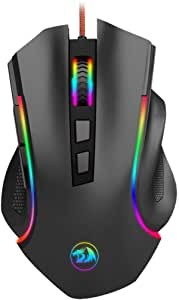

###Redragon M602 RGB Wired Gaming Mouse RGB Spectrum Backlit Ergonomic Mouse Griffin Programmable with 7 Backlight Modes up to 7200 DPI for Windows PC Gamers (Black)

- WIRED GAMING MOUSE; built for Gaming Computers - Ergonomic Redragon M602-RGB “Griffin” RGB Backlit Gaming PC Mouse up to 7200 DPI (user adjustable 800/1200/1600/2400/7200 DPI), 10G acceleration
- RGB BACKLIT MMO PROGRAMMABLE PC GAMING MOUSE; 7 MMO user programmable buttons, 5 Memory Profiles each with distinct LED color option for quick identification
- ERGONOMIC GAMER MOUSE; Delivering an extremely comfortable and precise experience for Computer Games
- HIGH-END PC GAMING MOUSE FEATURES; The Redragon M602-RGB Mouse features; Built-in Weight Tuning for the right balance, Anti-Skid Scroll Wheel, Durable smooth TEFLON feet pads for ultimate gaming control
- PC GAMING MOUSE COMPATIBILITY: Windows 10, Windows 8, Windows 7, Windows Vista, or Windows XP, Limited Mac OS support Works well with all major Gaming Computers Brands and Gaming Laptops

[<button class="button">$19.99 on Amazon</button>](https://www.amazon.com/gp/slredirect/picassoRedirect.html/ref=pa_sp_atf_aps_sr_pg1_1?ie=UTF8&adId=A04380321YM7ZOQJNVN9G&url=%2FRedragon-M602-Ergonomic-High-Precision-Programmable%2Fdp%2FB011HMDZ0Q%2Fref%3Dsr_1_1_sspa%3Fdchild%3D1%26keywords%3Dgaming%2Bmouse%26qid%3D1614633483%26sr%3D8-1-spons%26psc%3D1&qualifier=1614633483&id=1912198571670031&widgetName=sp_atf)
###Razer DeathAdder Essential Gaming Mouse: 6400 DPI Optical Sensor - 5 Programmable Buttons - Mechanical Switches - Rubber Side Grips - White

- The No.1 Best-Selling Gaming Peripherals Manufacturer in the US: Source - The NPD Group, Inc., U.S
- High-Precision 6,400 DPI Optical Sensor: Offers on-the-fly sensitivity adjustment through dedicated DPI buttons (reprogrammable) for gaming and creative work
- Durable Mechanical Switches: Supports up to 10 million clicks, backed by a 2 year warranty
- Ridged, Rubberized Scroll Wheel for Maximum Accuracy: Small, tactile bumps increases grip and allows for more controlled scrolling in high-stakes gaming situations
- 5 Programmable Buttons: Allows for button remapping and assignment of complex macro functions through Razer Synapse

[<button class="button">$29.99 on Amazon</button>](https://www.amazon.com/Razer-DeathAdder-Essential-Gaming-Mouse/dp/B07Y693ND1/ref=sr_1_3?dchild=1&keywords=gaming+mouse&qid=1614633483&sr=8-3)
###Logitech G502 Hero High Performance Gaming Mouse

- Hero 25K sensor through a software update from G HUB, this upgrade is free to all players: Our most advanced, with 1:1 tracking, 400+ ips, and 100 - 25,600 max dpi sensitivity plus zero smoothing, filtering, or acceleration
- 11 customizable buttons and onboard memory: Assign custom commands to the buttons and save up to five ready to play profiles directly to the mouse
- Adjustable weight system: Arrange up to five removable 3.6 grams weights inside the mouse for personalized weight and balance tuning', "Programmable RGB Lighting and Lightsync technology: Customize lighting from nearly 16.8 million colors to match your team's colors, sport your own or sync colors with other Logitech G gear", 'Mechanical switch button tensioning: Metal spring tensioning system and pivot hinges are built into left and right gaming mouse buttons for a crisp, clean click feel with rapid click feedback
- 1 year hardware limited warranty

[<button class="button">$47.49 on Amazon</button>](https://www.amazon.com/Logitech-G502-Performance-Gaming-Mouse/dp/B07GBZ4Q68/ref=sr_1_4?dchild=1&keywords=gaming+mouse&qid=1614633483&sr=8-4)
###PICTEK Gaming Mouse Wired [7200 DPI] [Programmable] [Breathing Light] Ergonomic Game USB Computer Mice RGB Gamer Desktop Laptop PC Gaming Mouse, 7 Buttons for Windows 7/8/10/XP Vista Linux, Black
![PICTEK Gaming Mouse Wired [7200 DPI] [Programmable] [Breathing Light] Ergonomic Game USB Computer Mice RGB Gamer Desktop Laptop PC Gaming Mouse, 7 Buttons for Windows 7/8/10/XP Vista Linux, Black](./PICTEKGam.jpeg)
- 【Excellent gaming performance with 7200 DPI and 4 polling rate】 PICTEK T7 programmable gaming mice, default five DPI levels available from 1200/2400/3500/5500/7200 DPI
- 【All mouse buttons are programmable】 support macro editing, 7 mouse buttons can be programmed by PICTEK easy-to-program gaming software which makes the mouse more intelligent and meets more demands for different games
- 【16 million color fancy cool LED backlit】 16 million color options for the backlight setting to match your style
- 【Ergonomic design】 PICTEK T7 with symmetrical & streamlined provides a comfortable claw-grip design, long-term use without fatigue
- 【Reliable quality & Service】PICTEK T7 PC gaming mouse, 30 million clicks lifespan , intricate polish manufacturing processes and meticulous assembly provide the functional reliability of the mouse for yea

[<button class="button">$15.99 on Amazon</button>](https://www.amazon.com/PICTEK-Programmable-Breathing-Ergonomic-Computer/dp/B01FZ3BR5S/ref=sr_1_5?dchild=1&keywords=gaming+mouse&qid=1614633483&sr=8-5)
###ROCCAT Kone AIMO Gaming Mouse (High Precision, Optical Owl-Eye Sensor (100 to 16.000 DPI), RGB Aimo LED Illumination, 23 Programmable Keys, Designed in Germany) White (Remastered)

- 5 lighting Zones - featuring five Independently configurable lighting Zones, you can now customize your gaming aesthetic like never before; they also Synergize perfectly to allow for even smoother and more fluid lighting transitions', "Iconic Kone ergonomics - The legendary Kone shape has been tried and tested and is loved by Gamers the world over; close your eyes and place your hand atop it and you'll know it's unmistakably the Kone AIMO", 'Evolutionary performance coating - grippy, durable and dirt-resistant thanks to a hybrid anti-wear coating; The performance finish helps you keep a firm hold of the Kone AIMO during even the most frantic of gaming sessions
- 24 button functions - Upgraded to include an improved thumb area, The Kone AIMO now boast additional versatility; the lowermost of the three thumb button defaults to Easy-Shift for an impressive total of 24 possible functions
- Roccat owl-eye sensor - experience unrelenting pointer precision with the all-new 16, 000DPI Roccat owl-eye Optical sensor; The sensor is adjustable in 1DPI increments and is characterized by exceptionally sharp accuracy and tracking capabilities

[<button class="button">$59.99 on Amazon</button>](https://www.amazon.com/gp/slredirect/picassoRedirect.html/ref=pa_sp_search_thematic_aps_sr_pg1_2?ie=UTF8&adId=A06563783SX2UVY3Q5EM3&url=%2FPrecision-Illumination-Programmable-Designed-Remastered%2Fdp%2FB07YCG26KZ%2Fref%3Dsxin_9_pa_sp_search_thematic_sspa%3Fcv_ct_cx%3Dgaming%2Bmouse%26dchild%3D1%26keywords%3Dgaming%2Bmouses%26pd_rd_i%3DB07YCG26KZ%26pd_rd_r%3D72b11609-47c3-42ab-9963-804b86ca1bf7%26pd_rd_w%3Dqjk4u%26pd_rd_wg%3DCZK7i%26pf_rd_p%3D4bad7638-dca1-43b9-ab64-2d55023aec7c%26pf_rd_r%3D36KSENE6VWEA4RS19PT2%26qid%3D1614633483%26sr%3D1-2-a8004193-6951-43f6-852a-aff7dbba9115-spons%26psc%3D1&qualifier=1614633483&id=8279333285812095&widgetName=sp_search_thematic)
