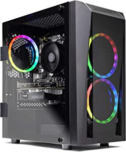

###CyberpowerPC Tracer IV R Xtreme 17.3" Gaming Notebook, AMD Ryzen 7 4800H 2.9GHz, GeForce RTX 2060 6GB, 16GB DDR4, 500GB PCI-E NVMe SSD, WiFi, Bluetooth & Win 10 Home (GTX99815)

- System: AMD Ryzen 7 4800H 2.9GHz 8-Core | AMD Renoir H Chipset | 16GB DDR4 | 500GB PCI-E NVMe SSD | Genuine Windows 10 Home 64-bit
- Graphics: NVIDIA GeForce RTX 2060 6GB Video Card | FHD IPS Anti-Glare 17.3" LED Display | Audio: Stereo Speakers
- Connectivity: 2x USB 3.1 Gen1 | 1x USB 2.0 | 1x USB Type C | 1x HDMI | 2x mini DP | 1x RJ-45 Ethernet 10/100/1000 | Wi-Fi 6 | Bluetooth 5
- Special Feature: RGB Keyboard | 1920x1080 FHD 144Hz Narrow Border IPS Anti-Glare LED Display | 720P HD Webcam
- 1 Year Limited Warranty & Lifetime Toll Free tech support Services

[<button class="button">$1,349.99 on Amazon</button>](https://www.amazon.com/gp/slredirect/picassoRedirect.html/ref=pa_sp_atf_aps_sr_pg1_1?ie=UTF8&adId=A10015981F08HDHFBLCA2&url=%2FCyberpowerPC-Notebook-GeForce-Bluetooth-GTX99815%2Fdp%2FB089WLKNDH%2Fref%3Dsr_1_1_sspa%3Fdchild%3D1%26keywords%3Dgaming%2Bpc%26qid%3D1614637140%26sr%3D8-1-spons%26psc%3D1&qualifier=1614637140&id=4780704931965550&widgetName=sp_atf)
###Webcam with Microphone, Wide View Angle 30 FPS Full HD Webcam for Streaming Online Gaming Class Conference Recording Skype Zoom FaceTime(Bonsaii WE8001)

- 【1080P 30fps Full HD Webcam】High dynamic technology can consistently provide high-definition picture and built-in autofocus technology can make your images stay clear
- 【2 in 1：Webcam with Microphone】This design satisfies your basic facetime need
- 【Anti-peeping Privacy Cover Design】Unlike other web camera, bonsai’s has its own privacy cover to make you have a safe internet using experience
- 【Driver-Free: Plug and Use】 Just plug your USB interface into to your device with no additional driver needed
- 【Reliable After-sale Customer Service】We offer this laptop camera 1 year of protecti

[<button class="button">$59.99 on Amazon</button>](https://www.amazon.com/gp/slredirect/picassoRedirect.html/ref=pa_sp_atf_aps_sr_pg1_1?ie=UTF8&adId=A0783398VR7GZSMLMC7Q&url=%2FMicrophone-Privacy-Conference-Teaching-Bonsaii%2Fdp%2FB08FDNXXTS%2Fref%3Dsr_1_2_sspa%3Fdchild%3D1%26keywords%3Dgaming%2Bpc%26qid%3D1614637140%26sr%3D8-2-spons%26psc%3D1&qualifier=1614637140&id=4780704931965550&widgetName=sp_atf)
###iBUYPOWER Gaming PC Computer Desktop Trace 4 9310 (AMD Ryzen 5 3600 3.6GHz, AMD Radeon RX 5500 XT 4GB, 8GB DDR4 RAM, 240GB SSD, Wi-Fi Ready, Windows 10 Home)

- System: AMD Ryzen 5 3600 3.6GHz (4.2GHz Max Turbo); 8GB DDR4 RAM; 240GB SSD; Genuine Windows 10 Home 64-bit
- Graphics: AMD Radeon RX 5500 XT 4GB dedicated graphics card; VR ready; Display connectors: HDMI, DisplayPort
- Connectivity: 4 x USB 3.0; 2 x USB 2.0; 1x RJ-45 Network Ethernet 10/100/1000; Audio: 7.1 Channel
- Special Add-Ons: Tempered Glass RGB Gaming Case; 802.11AC Wi-Fi Included; 16 Color RGB lighting case; generic keyboard & mouse no bloatware
- Warranty: 1 year parts & labor + free lifetime US tech support; Assembled in the U.S.A

[<button class="button">$699.99 on Amazon</button>](https://www.amazon.com/iBUYPOWER-Computer-Desktop-Trace-9310/dp/B08FPL6S4Y/ref=sr_1_3?dchild=1&keywords=gaming+pc&qid=1614637140&sr=8-3)
###SkyTech Blaze II Gaming Computer PC Desktop – Ryzen 5 2600 6-Core 3.4 GHz, NVIDIA GeForce GTX 1660 TI 6G, 500G SSD, 8GB DDR4, RGB, AC WiFi, Windows 10 Home 64-bit

- Ryzen 5 2600 6-Core 3.4GHz (3.9 GHz Max Boost) CPU Processor | 500G SSD – Up to 30x Faster Than Traditional HDD | A320M Motherboard
- NVIDIA GeForce GTX 1660 TI 6GB GDDR6 Video Card | 8 GB Gaming Memory DDR4 3000 with Heat Spreader | Windows 10 Home 64-bit
- PCIe AC Wi-Fi with Antenna | No bloatware | 1 x HDMI, 1 x D-Sub, 1 x DVD-D | 4 x USB 3.1 Gen1 Ports, 2 x USB 2.0 | HD Audio and Mic | Free RGB Keyboard & Mouse
- 3 x RGB RING Fans for Maximum Air Flow | Powered by 80 Plus Certified 500 Watt Power Supply | Skytech mATX Mid-Tower Tempered Glass Case
- 1 Year Warranty on Parts and Labor | Lifetime Free Technical Support | Assemble in the USA | This Powerful Gaming PC Capable to Run Any of Your Favorite Game at 1080P High to Ultra Resolution with 60+ FPS Such As Apex Legends, Fortnite, Player Unknown Battleground (PUBG), Overwatch, CS:GO, Battlefield V, Anthem, The Division 2, and More

[<button class="button">$999.99 on Amazon</button>](https://www.amazon.com/SkyTech-Blaze-Gaming-Computer-Desktop/dp/B07RL4K6CN/ref=sxin_9?ascsubtag=amzn1.osa.39cecfc2-e6e3-4ede-a252-5a29f45419c6.ATVPDKIKX0DER.en_US&creativeASIN=B07RL4K6CN&cv_ct_cx=gaming+pc&cv_ct_id=amzn1.osa.39cecfc2-e6e3-4ede-a252-5a29f45419c6.ATVPDKIKX0DER.en_US&cv_ct_pg=search&cv_ct_we=asin&cv_ct_wn=osp-single-source-earns-comm&dchild=1&keywords=gaming+pcs&linkCode=oas&pd_rd_i=B07RL4K6CN&pd_rd_r=f82d4488-ec9d-424b-8809-259fcb2aafc6&pd_rd_w=yCRCx&pd_rd_wg=KvZzb&pf_rd_p=35b32c02-1b41-4e49-9b89-0297af2446e1&pf_rd_r=JVYEJ10PS00ZVNSHVA3V&qid=1614637140&sr=1-1-64f3a41a-73ca-403a-923c-8152c45485fe&tag=geekcontent-20)
