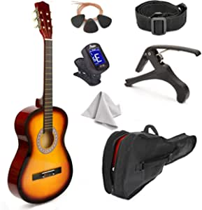
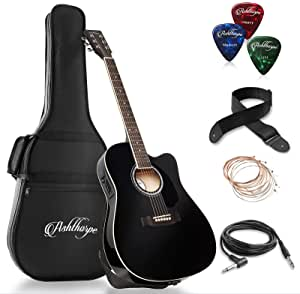
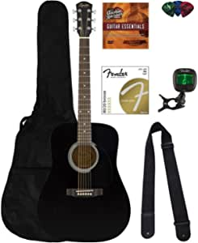

##Our Picks
###38" Wood Guitar With Case and Accessories for Kids/Boys/Girls/Teens/Beginners (38", Sunburst)

###Product Info:
- DURABILITY: Made of an all wood construction. Won’t get dented or cracked when dropped.
- SOUNDS: Tunes nicely and gives real sounds. Great for beginners who are learning to play a guitar.
- ACCESSORIES: This exclusive beginner guitar includes: shoulder strap for guitar, Carry case with shoulder strap, Spare strings, guitar picks.
- ATTRACTIVE: Smooth, Glossy finish
######Check Price
###Ashthorpe Full-Size Cutaway Thinline Acoustic-Electric Guitar Package - Premium Tonewoods - Black

###Product Info:
- Incredible sound: Perfect for musicians-in-the-making or advanced players, this guitar features an impressive tone, standout projection and incredible sonics. It's waiting to be heard.", 'Fine hardwood construction: Guitar is made from X-braced, A-grade Spruce wood, known for its resiliency and versatility and Basswood for warmth. Whether playing soft or loud, strumming or flatpicking, the guitar remains responsive and retains its tonal integrity.
- Thinline cutaway design: The body of this full-size (41") guitar is cut away at the neck for better access and more comfortable playing of the top frets. It\'s also thinline (3" thick) which creates an unparalleled sound & aesthetic, and is lightweight for burdenless travel and playing.
- Loaded with upgrades: On-board 4-band pickup/EQ (bass, mid-range, treble, and presence), two sets of upgraded phosphor bronze strings, and an ultra-glossy, tough-as-nails finish with chrome tuning pegs.
- Complete kit: Bundle includes the Ashthorpe guitar, a soft nylon "gig bag" guitar case, thin, medium & heavy celluloid picks, on-board 4-band pickup EQ, guitar cable, a shoulder strap, an extra set of strings and an owner\'s manual.
######Check Price
###Fender Squier Dreadnought Acoustic Guitar - Black Bundle with Fender Play Online Lessons, Gig Bag, Tuner, Strings, Strap, Picks, and Austin Bazaar Instructional DVD

###Product Info:
- Full-size steel-string acoustic that offers big sound at a small price
- All-laminate construction with lindenwood top and mahogany back and sides
- Scalloped "X"-bracing, mahogany neck and a durable dark-stained maple fingerboard
- Slim, easy-to-play neck
- Full-bodied dreadnought tone
######Check Price
