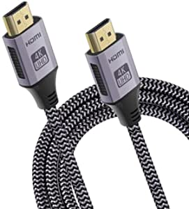
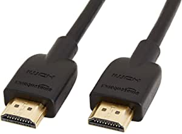
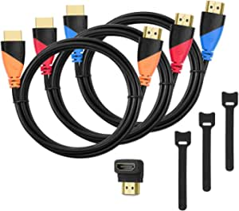

###Upgrade 4K@60HZ HDMI Cable 6.6FT,WLEAD 18Gbps High Speed HDMI 2.0 Braided Cord-Supports (4K 60Hz HDR,Video 4K 2160p 1080p HDCP 2.2 ARC-Compatible with Ethernet Monitor PS4/3 UHD TV,Blu-ray,Netflix

- 【Top Technology--4K@60HZ HDMI Cable】WLEAD 4K HDMI Cable support 4K*2K Ultra HD technology with resolution up to 3840 x 2160 @ 60 Hz,clearly displays every particle, and accurately processes every signal source.Ultra HD 4K 2160p, HD 2K 1080p,HDCP 2.2, 48-Bit Deep Color, Audio Return(ARC), Dolby TrueHD 7.1 audio and Hot plugging.Compatible for your streaming devices, Apple TV 4K,Blu-ray players,PS4/3,computers,or other HDMI-enabled devices to your HD TV,Samsung,LG,monitors or projectors.
- 【High Speed 18Gbps Data Capacity】WLEAD 4K High Speed HDMI Cable conforms to the standard HDMI 2.0 version.The industry standard bandwidth of 18Gbps enables unrestricted video in 4K / 1440p and HD 1080p
- 【Top-Notch Quality】This aluminum 4K HDMI Cable made by 24k High-quality gold-plated connectors, which provides snug connection with your devices for stable signal transfer
- 【Design in Details】Streamlined metal pieces seamlessly connected, grab it and off you go
- 👍 【Troubleshooting Promise】For the benefits of our customers,WLEAD provides Lifetime Unconditional Warran

[<button class="button">$8.99 on Amazon</button>](https://www.amazon.com/gp/slredirect/picassoRedirect.html/ref=pa_sp_atf_aps_sr_pg1_1?ie=UTF8&adId=A09818451LCE9FSFBZEHP&url=%2FUpgrade-WLEAD-Cord-Supports-ARC-Compatible-Ethernet%2Fdp%2FB08C35VX68%2Fref%3Dsr_1_1_sspa%3Fdchild%3D1%26keywords%3Dhdmi%2Bcable%26qid%3D1614633041%26sr%3D8-1-spons%26psc%3D1%26smid%3DA103JFG6UYSTTS&qualifier=1614633041&id=3165529049307397&widgetName=sp_atf)
###Amazon Basics High-Speed 4K HDMI Cable - 6 Feet

- HDMI A Male to A Male Cable: Supports Ethernet, 3D, 4K video and Audio Return Channel (ARC)
- Connects Blu-ray players, Fire TV, Apple TV, PS4, PS3, XBox One, Xbox 360, computers and other HDMI-enabled devices to TVs, displays, A/V receivers and more
- Cable allows you to share an Internet connection among multiple devices without the need for a separate Ethernet cable
- Meets the latest HDMI standards (4K Video at 30 Hz, 2160p, 48 bit/px color depth) that supports bandwidth up to 18Gbps and backwards compatible with earlier versions
- Cable Length: 6 feet (1.8 meters)

[<button class="button">$7.99 on Amazon</button>](https://www.amazon.com/AmazonBasics-High-Speed-HDMI-Cable-1-Pack/dp/B014I8SSD0/ref=sr_1_3?dchild=1&keywords=hdmi+cable&qid=1614633041&sr=8-3)
###HDMI 2.1 Cable 8K@60Hz 6FT,QGeeM 48Gbps Ultra High Speed HDMI Cord,Compatible with Apple TV,Roku,Samsung QLED,Sony LG,Nintendo Switch,Playstation,PS5,PS4,Xbox One Series X,HDMI 8k Ultra HD Cable

- 8K HDMI 2.1 Cable: Supports a range of higher video resolutions and refresh rates including 8K@60Hz UHD Video, 4K@120Hz, 2K, 1080P, 48 bit/px HDR color depth, enchanced Audio Return Channel (eARC), It is also compatible with HDMI 2.0b/2.0a/2.0/1.4/1.3/1.2/1.1 version.
- 48Gbps Super High Speed Data Transfer: QGeeM HDMI 8K Cord supports up to 48Gbps bandwidth, Supports HDCP2.2 when using HDCP2.2 video source
- Crazy stereo system: The sound output performance of HDMI 2.1 has also been greatly enhanced, and the audio return channel has been enhanced
- Universal Compatibility:Compatible with popular and latest devices and services including (but not limited to) for Xbox, for Playstation, for PS3, for PS4 Pro, for Nintendo Switch, for Apple TV, for Fire TV, for Samsung TV, for Sony TV, for Netflix, and for Dish.
- High Quality & Ultra Durability: 6.6ft HDMI A male to A male cable is produced by heavy duty gold plated connectors, Chrome plated Zinc house, 28AWG high purity copper conductor, triple shielding layer shielded, CL2 rated jacket, and covered with cotton yarn sleeve, it makes the cable can transfer the signals in high speed and low loss, tested plug and unplug for 6,000+ times, triple shielding can withstand more than 3,000+ / 90 degree bends lifesp

[<button class="button">$14.99 on Amazon</button>](https://www.amazon.com/QGeeM-Compatible-Samsung-Nintendo-Playstation/dp/B08CKDBQ93/ref=sr_1_5?dchild=1&keywords=hdmi+cable&qid=1614633041&sr=8-5)
###High-Speed HDMI Cable(3 Pack)-6ft with Gold Plated Connectors, Bonus Right Angle Adapter and Cable Tie, Support Ethernet, 3D,1080P

- ✓HIGH SPEED HDMI CABLES: Support Ethernet, 3D, 1080P videos and Audio Return Channel(ARC)
- ✓3 PACK COLOR CODED HDMI CORDS: Come in 3 different colors(orange, red and blue), very easy to plug the right cable for different devices
- ✓A MALE TO A MALE HDMI WIRE: Connect Blu-ray players, playstation 3, playstaion 4, Xbox One, Xbox 360, computers, projectors,TVs, displays, A/V receivers and more with standard HDMI port
- ✓PREMIUM QUALITY HDMI LINE: 32WG copper conductors, triple shielding and gold-plated connectors for better image and sound quality; Friendly customer service within 24 hours

[<button class="button">$8.99 on Amazon</button>](https://www.amazon.com/High-Speed-Corrosion-Resistant-Connectors-Ethernet/dp/B071XTGHFT/ref=sxin_10?ascsubtag=amzn1.osa.4b1d1786-30ae-4994-aca7-728d0b06d156.ATVPDKIKX0DER.en_US&creativeASIN=B071XTGHFT&cv_ct_cx=hdmi+cable&cv_ct_id=amzn1.osa.4b1d1786-30ae-4994-aca7-728d0b06d156.ATVPDKIKX0DER.en_US&cv_ct_pg=search&cv_ct_we=asin&cv_ct_wn=osp-single-source-earns-comm&dchild=1&keywords=hdmi+cables&linkCode=oas&pd_rd_i=B071XTGHFT&pd_rd_r=a91d7585-7b9b-467d-9926-f61588291332&pd_rd_w=hW4Y4&pd_rd_wg=FEw2L&pf_rd_p=35b32c02-1b41-4e49-9b89-0297af2446e1&pf_rd_r=Y8PTP1PZVV7DNSPY2VF4&qid=1614633041&sr=1-1-64f3a41a-73ca-403a-923c-8152c45485fe&tag=geekcontent-20)
###4K HDMI Cable 6.6 ft, iVANKY High Speed 18Gbps HDMI 2.0 Cable, 4K HDR, 3D, 2160P, 1080P, Ethernet - Braided HDMI Cord 32AWG, Audio Return(ARC) Compatible UHD TV, Blu-ray, PC, Projector

- High Speed Data Capacity - iVanky 4K HDMI Cable supports HDMI 2.0b including 18 Gbps, Mirror & Extend mode, Ultra HD 4K 2160p, HD 2K 1080p, QHD 1440p, HDCP 2.2, 48-Bit Deep Color, Audio Return(ARC), Dolby TrueHD 7.1 audio and Hot plugging.
- 4K HDMI Cable HDR - Perfect for your 4K UHD TV
- Innovative improvement - Designed for all devices with HDMI 2.0 standard and backwards compatible with HDMI 1.4, 1.3 & 1.2
- Ultra Durability Design - Built with premium slim aluminum shell and high-quality nylon braided jacket, this HDMI cord can withstand bend test of 10,000+ times without reducing cable flexibility and ensure the best performance possible.', "iVANKY's Customer Support - Feel free to contact our top-notch customer support team with any questions or concerns.

[<button class="button">$11.99 on Amazon</button>](https://www.amazon.com/Speed-Cable-iVanky-18Gbps-Ethernet/dp/B07M89LV8J/ref=sxin_10?ascsubtag=amzn1.osa.4b1d1786-30ae-4994-aca7-728d0b06d156.ATVPDKIKX0DER.en_US&creativeASIN=B07M89LV8J&cv_ct_cx=hdmi+cable&cv_ct_id=amzn1.osa.4b1d1786-30ae-4994-aca7-728d0b06d156.ATVPDKIKX0DER.en_US&cv_ct_pg=search&cv_ct_we=asin&cv_ct_wn=osp-single-source-earns-comm&dchild=1&keywords=hdmi+cables&linkCode=oas&pd_rd_i=B07M89LV8J&pd_rd_r=a91d7585-7b9b-467d-9926-f61588291332&pd_rd_w=hW4Y4&pd_rd_wg=FEw2L&pf_rd_p=35b32c02-1b41-4e49-9b89-0297af2446e1&pf_rd_r=Y8PTP1PZVV7DNSPY2VF4&qid=1614633041&sr=1-2-64f3a41a-73ca-403a-923c-8152c45485fe&tag=geekcontent-20)
