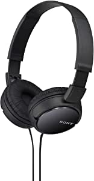

###Betron HD1000 On Ear Headphones, Bass Driven Sound with Powerful Acoustics and Enhanced Clarity, Includes 3.5mm Gold Plated Connector and Comfortable Earpads, Black

- Powerful Sound: Specifically designed to provide a wider, more enhanced sound range, this headphone set provides premium clarity; Giving your favorite tracks the dynamic sound they deserve, these headphones offer distinct power
- Punchy Bass: Made using innovative neodymium magnets to provide unparalleled stereo sound, the bass driven nature of these headphones produce intense power, rich sound and increased sound pressure
- Unique Design: Featuring a stunning black and gold color scheme, these over headphones really stand out from the crowd; Complete with a chic wooden look finish over each earpad, this set is unique and stylish
- Comfortable: Designed with maximum comfort in mind, both ear pads have been made using premium quality foam for an all day cushioned feel; Also featuring a flexible, curved headband, these headphones will suit virtually all head shapes and sizes
- Versatile: Equipped with a convenient 3.5mm audio connector, these headphones can be used alongside a variety of devices including tablets, computers, laptops and smartphones.

[<button class="button">$26.59 on Amazon</button>](https://www.amazon.com/gp/slredirect/picassoRedirect.html/ref=pa_sp_atf_aps_sr_pg1_1?ie=UTF8&adId=A07993262AKP1T5LRK6FI&url=%2FBetron-HD1000-Headphones-Acoustics-Comfortable%2Fdp%2FB016LJ90AY%2Fref%3Dsr_1_2_sspa%3Fdchild%3D1%26keywords%3Dheadphones%26qid%3D1614629483%26sr%3D8-2-spons%26psc%3D1&qualifier=1614629483&id=2436802824077395&widgetName=sp_atf)
###Sony MDRZX110/BLK ZX Series Stereo Headphones (Black)

- 30 millimeter drivers for rich, full frequency response
- Lightweight and comfortable on ear design
- Swivel design for portability
- 47 ¼ inch (1.2 meter) tangle free, Y type cord

[<button class="button">$9.99 on Amazon</button>](https://www.amazon.com/Sony-MDRZX110-BLK-Stereo-Headphones/dp/B00NJ2M33I/ref=sr_1_3?dchild=1&keywords=headphones&qid=1614629483&sr=8-3)
###Apple EarPods with Lightning Connector - White

- Unlike traditional, circular earbuds, the design of the EarPods is defined by the geometry of the ear which makes them more comfortable for more people than any other earbud-style headphones
- The speakers inside the EarPods have been engineered to maximize sound output and minimize sound loss, which means you get high-quality audio
- The EarPods with lightning connector also include a built-in remote that lets you adjust the volume, control the playback of music and video, and answer or end calls with a pinch of the cord
- Works with all devices that have a lightning connector and support iOS 10 or later, including iPod touch, iPad, and iPhone

[<button class="button">$18.46 on Amazon</button>](https://www.amazon.com/Apple-EarPods-Lightning-Connector-White/dp/B01M0GB8CC/ref=sr_1_4?dchild=1&keywords=headphones&qid=1614629483&sr=8-4)
###Mpow CH6S Kids Headphones with Microphone Over Ear, On Ear Headphones for Kids with HD Sound Sharing Function for Children Boys Girls, Volume Limit Safe 85dB,94dB Headset for School, Travel

- Built in Microphone, Hi-fi Stereo Sound: The kids headphones with mic is convenient for kids' on-line learning and communication at home; Stereo kids headphones with excellent sound effect, the best partner for your children to study, listen to music, watch movie, play game, talk with friends and have fun, no matter at home, in school or travel (NOTE: The built-in microphone DOESN'T work on desktop computer)", 'Distinct Volume Control Switch: Features distinct switch that can limit volume to 85Db and 94Db, better to protect hearing of your child and answer phone call while using with Phone; While in a noisy environment like car or Aero plane, the volume can be adjusted to 94Db for clear sounds
- Happy Sharing, 3
- Comfortable Fit: The plush circular cups fit perfectly on your ears and provide a comfortable listening practice you can use all day; Pinch-free hinges protect your little one’s fingers; The easy adjustable headband allows you to get the perfect fit; The headband is also made of plush leather material, so soft and light that you might forget you are wearing headphones
- Support: Mpow headphones offer quick customer service, for any questions while using, please contact us at any time via email or through the contact information on the instruction

[<button class="button">$18.99 on Amazon</button>](https://www.amazon.com/Mpow-Headphones-Over-Ear-Function-Cellphone/dp/B07PD9V78L/ref=sr_1_5?dchild=1&keywords=headphones&qid=1614629483&sr=8-5)
###Amazon Basics In-Ear Wired Headphones, Earbuds with Microphone, Black

- Black headphones with comfortable in-ear design and 3.5mm gold-plated plug
- Built-in microphone with controller (answer or hang up calls; pause or skip tracks)
- Compatible with any device with a 3.5mm jack, including Android and IOS smartphones; devices without a 3.5mm jack, like the iPhone 7, 8, 10, and Pixel 2, require an adapter
- 3.9-foot cable can be threaded through clothing or bag; 20-20KHz frequency range; 94±3dB; 10mW max input
- Backed by an Amazon Basics limited 1-year warranty
- Upgraded internal circuit to address durability issues in the previous version

[<button class="button">$13.49 on Amazon</button>](https://www.amazon.com/AmazonBasics-Ear-Headphones-Mic-Black/dp/B07HH1QSLB/ref=sxin_9_trfob_0?cv_ct_cx=headphones&dchild=1&keywords=headphones&pd_rd_i=B07HH1QSLB&pd_rd_r=11947bfd-84d5-478e-9a0b-2d9863229469&pd_rd_w=9HRPy&pd_rd_wg=A8f7d&pf_rd_p=dff4df0f-9209-4529-b092-2f5171681cdf&pf_rd_r=P7V68KYN9G04XZ4C4X29&qid=1614629483&sr=1-1-fcc74f9e-0165-48d2-a9e1-f41ea92a035c)
