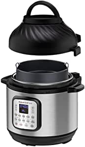

###Instant Pot Duo Crisp Pressure Cooker 11 in 1, 8 Qt with Air Fryer, Roast, Bake, Dehydrate and more

- The Instant Pot That Air Fries: The hottest new multi-cooker from the makers of the all-time bestselling Duo series, the Instant Pot Duo Crisp is a pressure cooker and air fryer with 2 convenient, removable lids
- 11-In-1 1-Touch Cooking Programs: Put cooking on autopilot with delicious results; Pressure cooks, Sautes, steams, slow cooks, sous\u202fvides, warms, air fries, roasts, bakes, broil and dehydrates
- Tender Juicy Meals with a Crisp Golden Finish: Innovative EvenCrisp technology ensures a perfect crunch every time; Imagine biting into fall-off-the-bone ribs with a perfect air fried crust
- Air Fryer Accessories: The multi-level air fryer basket with dehydrating and broiling tray is designed for optimal air flow; The protective pad is great for storage and countertop use
- Dishwasher Safe Stainless-Steel Cookware: Cook for up to 8 people with the premium quality (18/8) stainless-steel inner pot; Healthy and BPA/PFOA/PTFE-free
- Advanced Safety: 10 plus built-in safety features include automatic pressure and temperature control and overheat protection; New EasySeal lid automatically seals for pressure cooking and the pressure release button vents steam from a distance
- Family Meals Fast: The powerful 1500W heating element reduces preheating time and cooks up to 70% faster — from frozen to golden in minutes

[<button class="button">$179.95 on Amazon</button>](https://www.amazon.com/gp/slredirect/picassoRedirect.html/ref=pa_sp_atf_aps_sr_pg1_1?ie=UTF8&adId=A01919532VKORKRR60RDY&url=%2FInstant-Pot-Air-Fryer-One-Touch%2Fdp%2FB07VT23JDM%2Fref%3Dsr_1_1_sspa%3Fdchild%3D1%26keywords%3Dinstant%2Bpots%26qid%3D1614631366%26sr%3D8-1-spons%26psc%3D1&qualifier=1614631366&id=1903558140382725&widgetName=sp_atf)
###Ninja FD401 Foodi 8-Quart 9-in-1 Deluxe XL Pressure Cooker, Broil, Dehydrate, Slow Cook, Air Fryer, and More, with a Stainless Finish

- The Ninja Foodi Deluxe—the deluxe pressure cooker that crisps.
- Deluxe cooking capacity - XL 8-quart pot, XL 5-quart Cook & Crisp Basket and Deluxe Reversible Rack let you cook for a small group.
- TenderCrisp Technology lets you quickly pressure cook ingredients to lock in juices, then give them a crispy, golden air-fryer finish.
- Deluxe Reversible Rack lets you steam and broil, as well as TenderCrisp up to 8 chicken breasts at once or add servings to layered 360 meals.
- XL 8-quart ceramic-coated pot: Nonstick, PTFE/PFOA free, and easy to hand-wash.
- XL 5-quart Cook & Crisp Basket: Large-capacity, ceramic-coated, PTFE/PFOA-free nonstick basket is dishwasher safe and holds up to a 7-lb
- 9 functions: Pressure Cook, Air Fry/Air Crisp, Steam, Slow Cook, Yogurt, Sear/Saute, Bake/Roast, Broil, Dehydrate

[<button class="button">$219.99 on Amazon</button>](https://www.amazon.com/Ninja-FD401-Fryer-Stainless-Pressure-8-Quart/dp/B07S85TPLG/ref=sxin_9?ascsubtag=amzn1.osa.fb7d85ef-3d72-4cdb-b510-4c7c832f1be2.ATVPDKIKX0DER.en_US&creativeASIN=B07S85TPLG&cv_ct_cx=instant+pots&cv_ct_id=amzn1.osa.fb7d85ef-3d72-4cdb-b510-4c7c832f1be2.ATVPDKIKX0DER.en_US&cv_ct_pg=search&cv_ct_we=asin&cv_ct_wn=osp-single-source-earns-comm&dchild=1&keywords=instant+pots&linkCode=oas&pd_rd_i=B07S85TPLG&pd_rd_r=fe709e5f-fda9-4afa-b449-721e5f3bc857&pd_rd_w=xaBSc&pd_rd_wg=vhwZ1&pf_rd_p=35b32c02-1b41-4e49-9b89-0297af2446e1&pf_rd_r=ZPD3WTR1516G3GZNRRJW&qid=1614631366&sr=1-2-64f3a41a-73ca-403a-923c-8152c45485fe&tag=scrippsonsite-20)
