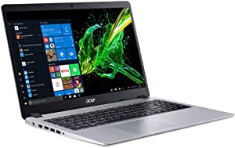

###2020 Premium HP Stream 11 Laptop Computer 11.6" HD WLED Anti-Glare Intel Celeron Processor N4000 4GB RAM 32GB eMMC Office 365 Personal USB-C WiFi HDMI Win 10 + iCarp Wireless Mouse

- 4GB RAM | 32GB eMMC
- Equipped With The Powerful and Latest Intel Celeron Processor N Series, Intel Dual-Core N4000, (1.1 GHz base frequency, up to 2.6 GHz with Intel Turbo Boost Technology, 4 MB Intel Smart Cache
- 11.6 " diagonal HD(1366 x 768) SVA Anti-glare Widescreen LED-backlit Display I Integrated Intel UHD Graphics 600
- 1 USB 3.1 Gen 1 Type-C (Data transfer only, data 5 Gb/s signaling rate); 2 USB 3.1 Gen 1 (Data transfer only); 1 HDMI; 1 headphone/microphone combo, 1 microSD media card reader
- Windows\xa010\xa0in\xa0S\xa0mode, 802.11b/g/n/ac (1x1) Wi-Fi and Bluetooth 4.2 Combo, HP Webcam with integrated digital microphone, Dual speakers,1-year Office 365 Personal, 2-cell, 37.69 Wh Li-ion, up to 13 hours battery life : 【iCarp Wireless Mouse Included】

[<button class="button">$349.00 on Amazon</button>](https://www.amazon.com/gp/slredirect/picassoRedirect.html/ref=pa_sp_atf_aps_sr_pg1_1?ie=UTF8&adId=A06977331GUFRYMZUY6VB&url=%2FHP-Stream-11-WLED-Anti-Glare-Processor%2Fdp%2FB08GG7PQCK%2Fref%3Dsr_1_1_sspa%3Fdchild%3D1%26keywords%3Dlaptops%26qid%3D1614629360%26sr%3D8-1-spons%26psc%3D1&qualifier=1614629360&id=6917062566285272&widgetName=sp_atf)
###2020 Newest Lenovo Ideapad 3 15 Laptop Computer/ 15.6" FHD/ 10th Gen Intel Core i3-1005G1 Beat i5-7200U/ 8GB DDR4/ 256GB PCIe SSD/ Work from Home/ Windows 10/ AC WiFi/ iPuzzle External DVD Drive

- CPU: 10th Generation Intel Core i3-1005G1 (1.2 GHz base frequency, up to 3.4 GHz with Intel Turbo Boost Technology, 4 MB cache, 2 cores)
- Display: 15.6" FHD NON-TOUCH; Graphics: Intel UHD Graphics
- RAM: 8GB DDR4-2666 SDRAM Memory; Hard drive: 256GB M.2 PCIe NVMe Solid State Drive; No Optical Drive
- Wireless: 2 x 2 802.11AC Wi-Fi and Bluetooth Combo; Ports: 1 x USB 2.0, 2 x USB-A 3.0, 1x HDMI, Headphone/mic combo
- ▌Authorized iPuzzle Bundle ▌ Bundled with iPuzzle External DVD Drive, Authorized Sellers ON

[<button class="button">$519.00 on Amazon</button>](https://www.amazon.com/gp/slredirect/picassoRedirect.html/ref=pa_sp_atf_aps_sr_pg1_1?ie=UTF8&adId=A094348039GQ3SZAOKR7U&url=%2FLenovo-Computer-i3-1005G1-i5-7200U-External%2Fdp%2FB08P4PG4Y7%2Fref%3Dsr_1_2_sspa%3Fdchild%3D1%26keywords%3Dlaptops%26qid%3D1614629360%26sr%3D8-2-spons%26psc%3D1&qualifier=1614629360&id=6917062566285272&widgetName=sp_atf)
###ASUS Laptop L210 Ultra Thin Laptop, 11.6” HD Display, Intel Celeron N4020 Processor, 4GB RAM, 64GB Storage, NumberPad, Windows 10 Home in S Mode with One Year of Microsoft 365 Personal, L210MA-DB01

- Efficient Intel Celeron N4020 Processor (4M Cache, up to 2.8 GHz)
- 11.6” HD (1366 x 768) Slim Display
- 64GB eMMC Flash Storage and 4GB DDR4 RAM
- Windows 10 in S Mode with One Year of Microsoft 365 Personal
- Slim and Portable: 0.7” thin and weighs only 2.2 lbs (battery included)

[<button class="button">$225.00 on Amazon</button>](https://www.amazon.com/ASUS-Processor-NumberPad-Microsoft-L210MA-DB01/dp/B081V6W99V/ref=sr_1_5?dchild=1&keywords=laptops&qid=1614629360&sr=8-5)
###Acer Aspire 5 Slim Laptop, 15.6 inches Full HD IPS Display, AMD Ryzen 3 3200U, Vega 3 Graphics, 4GB DDR4, 128GB SSD, Backlit Keyboard, Windows 10 in S Mode, A515-43-R19L, Silver

- AMD Ryzen 3 3200U Dual Core Processor (Up to 3.5GHz); 4GB DDR4 Memory; 128GB PCIe NVMe SSD
- 15.6 inches full HD (1920 x 1080) widescreen LED backlit IPS display; AMD Radeon Vega 3 Mobile Graphics
- 1 USB 3.1 Gen 1 port, 2 USB 2.0 ports & 1 HDMI port with HDCP support
- 802.11ac Wi-Fi; Backlit Keyboard; Up to 7.5 hours battery life
- Windows 10 in S mo

[<button class="button">$364.99 on Amazon</button>](https://www.amazon.com/Acer-Display-Graphics-Keyboard-A515-43-R19L/dp/B07RF1XD36/ref=sxin_9?ascsubtag=amzn1.osa.656f41c5-dc64-4cb5-b7c9-a53431476ba5.ATVPDKIKX0DER.en_US&creativeASIN=B07RF1XD36&cv_ct_cx=laptops&cv_ct_id=amzn1.osa.656f41c5-dc64-4cb5-b7c9-a53431476ba5.ATVPDKIKX0DER.en_US&cv_ct_pg=search&cv_ct_we=asin&cv_ct_wn=osp-single-source-earns-comm&dchild=1&keywords=laptops&linkCode=oas&pd_rd_i=B07RF1XD36&pd_rd_r=1d0d5d24-6089-489e-bb85-4a0d6e19298a&pd_rd_w=qMl8T&pd_rd_wg=XAGJD&pf_rd_p=35b32c02-1b41-4e49-9b89-0297af2446e1&pf_rd_r=4DNE7K7VB2P5CZBHTWE9&qid=1614629360&sr=1-1-64f3a41a-73ca-403a-923c-8152c45485fe&tag=geekcontent-20)
