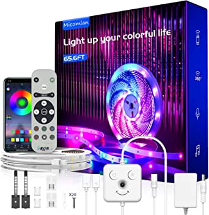
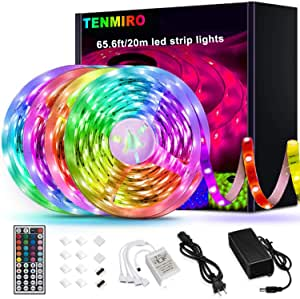

###MINGER LED Strip Lights 16.4ft, RGB Color Changing LED Lights for Home, Kitchen, Room, Bedroom, Dorm Room, Bar, with IR Remote Control, 5050 LEDs, DIY Mode

- Multicolor changing: the RGB LED strip lights kit has not only RGB(Red, Green, Blue), 16 multicolored options, but also DIY selection
- Remote control: 44-key IR remote allows you to choose colors, adjustable brightness and multiple lighting modes to fit room mood
- Bright LED Lights: it features 150 bright 5050 LEDs that easily light up a room, bedroom, dorm room, kitchen countertop
- Easy to install: with back adhesive and flexible strip design, it can stick on any dry and flat surface
- Notice for using: please do not roll up when using it to avoid whole strip getting overheat

[<button class="button">$13.99 on Amazon</button>](https://www.amazon.com/gp/slredirect/picassoRedirect.html/ref=pa_sp_atf_aps_sr_pg1_1?ie=UTF8&adId=A04261713E9MRZAQEFJ0Z&url=%2FMINGER-Changing-Lighting-Flexible-Decoration%2Fdp%2FB07JP5375R%2Fref%3Dsr_1_1_sspa%3Fdchild%3D1%26keywords%3Dled%2Bstrip%2Blights%26qid%3D1614635079%26sr%3D8-1-spons%26psc%3D1&qualifier=1614635079&id=8343058637693257&widgetName=sp_atf)
###66ft LED Strip Lights, Music Sync Color Changing RGB LED Lights“Smile Face”Controller & Remote Built-in Mic, Bluetooth APP Light Strip Rope Lights， LED Light Strip for Bedroom

- ☺【Unique Design“Smile Face”Controller & Remote】lovely and cute appearance is very popular with children
- ☺【ALL-INCLUSIVE Accessories Kits for Installation and Customization】① Terminal is protected by insulating materials
- ☺【More User-Friendly Ways to Control Your Lights】① Download the app "Lotus Lantern" which is available on Google Play and iOS App Store,you can adjust brightness, change colors
- ☺【DIY Grouping Control Function】You only need to use your mobile APP to achieve the sync control or individually control all the light device
- ☺【Perfect Customer Service】We offer a 18 months warranty for LED strip light, If you still have any issues during installation, defective items, replacements or refund, please contact our customer service email for a prompt solution, Micomlan will get it resolved within 24 hou

[<button class="button">$25.49 on Amazon</button>](https://www.amazon.com/gp/slredirect/picassoRedirect.html/ref=pa_sp_atf_aps_sr_pg1_1?ie=UTF8&adId=A049172477KHOI7N0OI9&url=%2FChanging-Controller-Bluetooth-Lights%25EF%25BC%258C-Bedroom%2Fdp%2FB08FZWYBMZ%2Fref%3Dsr_1_3_sspa%3Fdchild%3D1%26keywords%3Dled%2Bstrip%2Blights%26qid%3D1614635079%26sr%3D8-3-spons%26psc%3D1&qualifier=1614635079&id=8343058637693257&widgetName=sp_atf)
###Phopollo Led Strip Lights, 30ft 5050 Flexible Led Lights with 44 Keys Remote Controller and 12V Power Supply for Bedroom

- High brightness and low energy consumption: Consists of 270 individual 5050 LEDs emitters; operating on 12V low voltage power; more than 25000 hours service life
- Multicolor option and IR remote: Consists of multiple color channels, not only can change the mode and speed, also there are 16 options of color setting
- Easy installation and strong adhesive: Strong double side sticky adhesive on the backside allows for quick and easy installation in a wide variety of locations; cut the lights to desired length using a just pair of scissors
- Durable and safe: Strong double layer pcb board; safe to touch with 12 volt low working voltage and extremely low heat
- Widely use: Suitable for bedroom, cabinet, kitchen, bar, TV decoration

[<button class="button">$17.99 on Amazon</button>](https://www.amazon.com/gp/slredirect/picassoRedirect.html/ref=pa_sp_atf_aps_sr_pg1_1?ie=UTF8&adId=A09359112PG6JHDYG1L4B&url=%2FPhopollo-Lights-Flexible-Controller-Bedroom%2Fdp%2FB08HJ4VL8V%2Fref%3Dsr_1_4_sspa%3Fdchild%3D1%26keywords%3Dled%2Bstrip%2Blights%26qid%3D1614635079%26sr%3D8-4-spons%26psc%3D1&qualifier=1614635079&id=8343058637693257&widgetName=sp_atf)
###Tenmiro 65.6ft Led Strip Lights, Ultra Long RGB 5050 Color Changing LED Light Strips Kit with 44 Keys Ir Remote Led Lights for Bedroom, Kitchen, Home Decoration

- Ultra Long Strip Lights: 65.6ft led strip lights are long enough to reach around your entire room and light the whole place up, cuttable design allows you to adjust the length of led lights however you like, for bedroom, living room, cabinet, party, christmas, etc
- Multi Color and Diy: Led lights colorful and durable, the brightness of the lights strip can be adjusted and offer millions different colors and 8 lighting modes(jump, fade, flash etc) by 44keys remote
- Easy Installation: Complete led light strip kit Including 4 rolls of 16.4ft led light strips, power adapter, 44keys remote Control, controller, instruction manual, led strip lights installation accessories(4 pin connectors, gapless solderless connectors, back adhesive hooks), no need for other devices, self adhesive tape easy to install', "Cuttable and Linkable: The led lights can be easily cut and linked with other strip led lights, which can be cut every 3 leds along the cutting marks, you can also customize the length of the led lights, while arrows of the lights should be faced to each other when connecting, if using solderless connecto then while '+12V' should be faced to each other when connecting", 'Multiple Scenes Available: Rgb led strip lights is a suitable house ornament, transforms your home, kitchen, ceiling, back of tv, desk, stairs, bar and more with color changing lights

[<button class="button">$25.99 on Amazon</button>](https://www.amazon.com/Tenmiro-Ultra-Long-Flexible-Changing-Decoration/dp/B087D55WK2/ref=sr_1_5?dchild=1&keywords=led+strip+lights&qid=1614635079&sr=8-5)
###50ft Led Strip Lights, Keepsmile 5050 RGB Color Changing Led Light Strips, Led Lights for Bedroom, Kitchen, Home Decoration

- LED Strip Lights with Remote: 50ft led strip lights are long enough to reach around your entire room and light the whole place up
- Multi Color and Diy: Led lights colorful and durable, the brightness of the lights strip can be adjusted and offer millions different colors and 8 lighting modes(jump, fade, flash etc) by remote', "Cuttable and linkable: Cuttable design allows you to adjust the length of light strip however you like, if you don't need such a long lights, you can be cutted between every 3 LEDs
- Multiple Scenes Available: Rgb led strip lights is a suitable house ornament, transforms your home, kitchen, ceiling, back of tv, desk, stairs, bar and more with color changing lights

[<button class="button">$21.99 on Amazon</button>](https://www.amazon.com/Keepsmile-Changing-Bedroom-Kitchen-Decoration/dp/B08SLQYFV2/ref=sr_1_6?dchild=1&keywords=led+strip+lights&qid=1614635079&sr=8-6)
