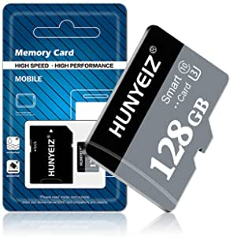
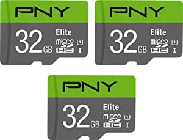

###Gigastone 128GB 2-Pack Micro SD Card with Adapter, Gaming, A1, U1 C10 Class 10 100MB/s, Full HD available, Micro SDXC UHS-I Memory Card

- [Gaming Series] Especially designed for Gaming Consoles
- [Ultra HD] Read/Write up to 100/50 MB/s
- [Compatibility] Compatible with Nintendo Switch, Gaming Console, Laptop, Tablet, PC, Smartphones, Camera, Dash Cam, Action Camera, e-Reader, Drone, Security Camera
- [Environment] Waterproof, shockproof, temperature-proof and X-Ray proof
- [Support] Gigastone 5-year limited warranty

[<button class="button">$36.98 on Amazon</button>](https://www.amazon.com/gp/slredirect/picassoRedirect.html/ref=pa_sp_atf_aps_sr_pg1_1?ie=UTF8&adId=A0621643EVA4QRHXR24G&url=%2FGigastone-128GB-U1-C10-Nintendo%2Fdp%2FB07P273R8B%2Fref%3Dsr_1_1_sspa%3Fdchild%3D1%26keywords%3Dmicro%2Bsd%2Bcards%26qid%3D1614631433%26sr%3D8-1-spons%26psc%3D1&qualifier=1614631433&id=7271873449310177&widgetName=sp_atf)
###128GB Micro SD Memory Card,128GB Micro SD Card,TF Card 128GB Class 10 with A Free SD Card Adapter for Android Cellphone,Camera,Tachograph,Tablet Computers Drone（128GB）

- 【Micro SD card with SD card adapter】This micro sd card 128GB comes with an SD card adapter, you can put the micro sd card into the adapter, and then you can use it on any SD card interface.
- 【Stable and never worry about data loss】 Micro sd card 128 GB includes SD adapter, 128 GB SD Card is made of high-quality chips, providing reliable performance, making it ideal for write-intensive applications and ensuring clear recording Evidence HD without dropped frames.
- 【Protection】 In order to provide the best performance and stability, the HUNYEIZ SD Card 128GB memory card for camera has been tested and can withstand extreme conditions
- 【Fast reading rate and large capacity】SD Card 128GB fast reading rate, can be viewed and transferred instantly, the maximum capacity of 128GB TF card is 128GB, there is enough space to store thousands of snapshots and hours of full HD Video, which saves you from worrying about insufficient storage space.
- 【One-year warranty】Customer satisfaction is the greatest motivation to pursue higher quali

[<button class="button">$15.85 on Amazon</button>](https://www.amazon.com/gp/slredirect/picassoRedirect.html/ref=pa_sp_atf_aps_sr_pg1_1?ie=UTF8&adId=A09760641UOQMXPA955PI&url=%2FAdapter-Cellphone-Tachograph-Computers-Drone%25EF%25BC%2588128GB%25EF%25BC%2589%2Fdp%2FB08V53QHGV%2Fref%3Dsr_1_2_sspa%3Fdchild%3D1%26keywords%3Dmicro%2Bsd%2Bcards%26qid%3D1614631433%26sr%3D8-2-spons%26psc%3D1&qualifier=1614631433&id=7271873449310177&widgetName=sp_atf)
###SanDisk 128GB Ultra MicroSDXC UHS-I Memory Card with Adapter - 120MB/s, C10, U1, Full HD, A1, Micro SD Card - SDSQUA4-128G-GN6MA

- Ideal for Android smartphones and tablets, and MIL cameras
- Up to 128GB to store even more hours of Full HD video (2)
- Up to 120MB/s transfer speeds let you move up to 1000 photos in a minute (5)
- Load apps faster with A1-rated performance (1)
- 10-year manufacturer warranty (See official SanDisk website for more details regarding warranty in your region.)

[<button class="button">$19.99 on Amazon</button>](https://www.amazon.com/SanDisk-128GB-MicroSDXC-Memory-Adapter/dp/B08GYKNCCP/ref=sr_1_3?dchild=1&keywords=micro+sd+cards&qid=1614631433&sr=8-3)
###SAMSUNG: EVO Select 128GB MicroSDXC UHS-I U3 100MB/s Full HD & 4K UHD Memory Card with Adapter (MB-ME128HA)

- IDEAL FOR RECORDING 4K UHD VIDEO: Samsung microSD EVO Select is perfect for high res photos, gaming, music, tablets, laptops, action cameras, DSLR's, drones, smartphones (Galaxy S20 5G, S20+ 5G, S20 Ultra 5G, S10, S10+, S10e, S9, S9+, Note9, S8, S8+, Note8, S7, S7 Edge, etc
- BUILT TO LAST RELIABILITY: Memory Card Is Also Water Proof, Temperature Proof, X Ray Proof and Magnetic Proof
- EXTENDED COMPATIBILITY: Includes Full Size Adapter for Use in Cameras, Laptops and Desktop Computers
- 10 YEAR LIMITED WARRANTY: 10 Year Limited Does Not Extend to Dashcam , CCTV, Surveillance Camera and Other Write Intensive Uses

[<button class="button">$19.99 on Amazon</button>](https://www.amazon.com/SAMSUNG-Select-microSDXC-Adapter-MB-ME128HA/dp/B0887GP791/ref=sr_1_4?dchild=1&keywords=micro+sd+cards&qid=1614631433&sr=8-4)
###PNY 32GB Elite Class 10 U1 MicroSDHC Flash Memory Card 3-Pack, 32GB 3-Pack

- Class 10, U1 speed rating, with read speeds up to 100MB/s
- Class 10 - UHS-I, U1 speed class performance allows for fast and smooth continuous HD shooting and full HD video recording
- Record and transfer videos, photos, music, files and more from Micro SD enabled host devices such as Android smartphones and tablets, action and surveillance cameras, drones, computers and more
- Included SD Adapter for compatibility with SD enabled host devices, including DSLR cameras, video cameras, desktops, and laptops
- Reliable & DURABLE: Magnet proof, shock proof, temperature proof, waterproof

[<button class="button">$16.99 on Amazon</button>](https://www.amazon.com/PNY-Elite-microSDHC-Memory-3-Pack/dp/B07YXJM282/ref=sr_1_5?dchild=1&keywords=micro+sd+cards&qid=1614631433&sr=8-5)
