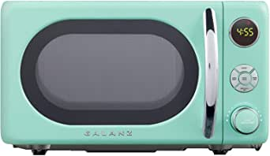

###AmazonBasics Microwave bundle with Echo Dot (3rd Gen) - Charcoal

- This bundle contains the AmazonBasics Microwave and the Echo Dot (3rd Gen).
- Now it’s easier to defrost vegetables, make popcorn, cook potatoes, and reheat rice
- Automatically reorder popcorn when you run low and save 10% on popcorn orders—enabled by Amazon Dash Replenishment technology.
- Compact size saves counter space, plus 10 power levels, a kitchen timer, a child lock, and a turntable.
- Alexa is always getting smarter and adding new presets.

[<button class="button">$99.98 on Amazon</button>](https://www.amazon.com/gp/slredirect/picassoRedirect.html/ref=pa_sp_atf_aps_sr_pg1_1?ie=UTF8&adId=A026607017F0AK3WPAE7R&url=%2FAmazonBasics-Microwave-bundle-Echo-Dot%2Fdp%2FB07VQJ5P3L%2Fref%3Dsr_1_1_sspa%3Fdchild%3D1%26keywords%3Dmicrowave%26qid%3D1614635636%26sr%3D8-1-spons%26psc%3D1&qualifier=1614635636&id=1194390336756862&widgetName=sp_atf)
###Farberware 1.1 Cu. Ft. Stainless Steel Countertop Microwave Oven With 6 Cooking Programs, LED Lighting, 1000 Watts

- Spacious & stylish: with 1
- Six cooking programs: auto cooking programs (popcorn, potato, pizza, frozen vegetable, dinner plate) provide convenient control and avoid guesswork
- Express cooking: cook your leftovers with just a touch of a button by touching the number pad (1 through 6 minutes)
- Digital clock: easy-to-read LED display lights up the digital clock and highlights each cooking setting
- Child lock: lock the control panel using the child safety lock option to prevent accidental use or access by children
- Defrost: for all your frozen foods, defrost by time or Weight so you can enjoy more flavorful foods
- Glass turntable: large 

[<button class="button">$99.99 on Amazon</button>](https://www.amazon.com/Farberware-FMO11AHTBKB-1000-Watt-Microwave-Stainless/dp/B01EIZSF6I/ref=sr_1_3?dchild=1&keywords=microwave&qid=1614635636&sr=8-3)
###Galanz GLCMKA07GNR-07 Retro Microwave Oven, 0.7 Cu.Ft, Surf Green

- 【700W WITH 6 VARIABLE POWER LEVEL】 Galanz 0.7 Cu.Ft, 700 watts microwave oven with lighting pull handle, microwave oven offers six power level to cook
- 【DEFROST & LED DISPLAY】 For all your frozen foods, defrost by time or weight so you can enjoy more flavorful foods
- 【360°ROTATING EVENLY HEATING】 360° heating and rotation of glass turntable during operation helps cook food more evenly and then improves the cooking efficiency
- 【INTERIOR LIGHT & CHILD LOCK】 Interior light for checking the status without having to open the doors
- 【PACKAGE INCLUDES】 1 x Countertop Microwave Oven; 1 x Glass Tray; 1 x Roller Ring; 1 x Shaft; 1 x Power Cord.

[<button class="button">$79.99 on Amazon</button>](https://www.amazon.com/Galanz-GLCMKA07GNR-07-Retro-Microwave-Cu-Ft/dp/B08H82L31Z/ref=sr_1_4?dchild=1&keywords=microwave&qid=1614635636&sr=8-4)
###Toshiba EM131A5C-SS Microwave Oven with Smart Sensor, Easy Clean Interior, ECO Mode and Sound On/Off, 1.2 Cu. ft, Stainless Steel

- Stylish Stainless Steel with easy-to-clean interior, with external dimension(wdh): 20.5 x 17.1 x 12.8 inches, with internal dimension (wdh): 13.07 x 15 x 9.5 inches
- Pre-programmed sensor menu for optimum heating of popular foods like pizza, potato, vegetables and more
- One touch popcorn button and two defrost settings – custom defrost and 1 pounds auto defrost
- Equipped with power-saving Eco mode, sound on/off option and child safety lock
- 1100 watts with 10 power settings, clock, and kitchen timer
- Bright digital display, easy-to-read control panel, interior light and 12.4 inch glass turntable
- If you wish to mute the buzzer of the microwave, please long press on the button "8" for 3-5 secon

[<button class="button">$124.99 on Amazon</button>](https://www.amazon.com/Toshiba-EM131A5C-SS-Microwave-Interior-Stainless/dp/B076VB5JFQ/ref=sr_1_5?dchild=1&keywords=microwave&qid=1614635636&sr=8-5)
###BLACK+DECKER Digital Microwave Oven with Turntable Push-Button Door, Child Safety Lock, Stainless Steel, 0.9 Cu.ft

- Pre-programmed buttons for popcorn, potato, pizza, frozen vegetable, beverage and dinner plate
- 900 Watts with 10 power settings, clock and kitchen timer, 30 seconds express cooking
- Large LED digital display, easy-to-read control panel, child safety lock, interior light, removable 10.6” glass turntable
- Push-button door release for easy access
- Dimensions (W x D x H): 19.1” x 14.8” x 11.5”, Internal dimensions: 12.36” x 13.66” x 8.70” (W x D x H)
- UL approv

[<button class="button">$89.08 on Amazon</button>](https://www.amazon.com/BLACK-DECKER-EM925AB9-Microwave-Push-Button/dp/B07HG9YGZY/ref=sxin_9?ascsubtag=amzn1.osa.9d468327-fc66-44ec-aa11-aa615a259658.ATVPDKIKX0DER.en_US&creativeASIN=B07HG9YGZY&cv_ct_cx=microwave&cv_ct_id=amzn1.osa.9d468327-fc66-44ec-aa11-aa615a259658.ATVPDKIKX0DER.en_US&cv_ct_pg=search&cv_ct_we=asin&cv_ct_wn=osp-single-source-earns-comm&dchild=1&keywords=microwaves&linkCode=oas&pd_rd_i=B07HG9YGZY&pd_rd_r=946d0f7e-8ccc-4aef-b426-a0fbfd36989f&pd_rd_w=PiKiF&pd_rd_wg=2n5QN&pf_rd_p=35b32c02-1b41-4e49-9b89-0297af2446e1&pf_rd_r=VR4RTH7Q9TS5JM01P7SR&qid=1614635636&sr=1-1-64f3a41a-73ca-403a-923c-8152c45485fe&tag=the-angle-20)
