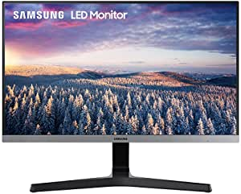
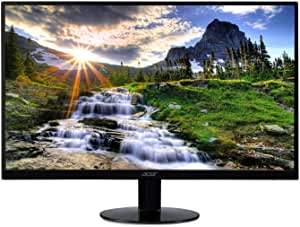
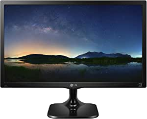

###Samsung 24" FHD Monitor with Bezel-LESS Design - LS24R350FHNXZA, Dark Blue Gray

- 24 inch monitor with 3-sided bezel-less screen for maximum viewing and dual monitor usage
- Amd Radeon free Sync provides responsive game experience without screen tearing
- 75Hz refresh rate delivers a more fluid picture
- Game mode provides optimal color settings and image contrast for more vivid scenes
- Easier on eyes with Flicker Free and eye saver mode to reduce Blue light emissions which are harmful for the retina
- All Action, No Delay - Superfluid entertainment experience
- More Gaming Power-Ideal game settings instantly give you the ed

[<button class="button">$149.99 on Amazon</button>](https://www.amazon.com/gp/slredirect/picassoRedirect.html/ref=pa_sp_atf_aps_sr_pg1_1?ie=UTF8&adId=A0444419123DRU2TGVPFK&url=%2FSamsung-Monitor-Bezel-LESS-Design-LS24R350FHNXZA%2Fdp%2FB07Y2QPG3B%2Fref%3Dsr_1_1_sspa%3Fdchild%3D1%26keywords%3Dmonitor%26qid%3D1614631563%26sr%3D8-1-spons%26psc%3D1&qualifier=1614631563&id=1500336686293473&widgetName=sp_atf)
###Acer SB220Q bi 21.5 Inches Full HD (1920 x 1080) IPS Ultra-Thin Zero Frame Monitor (HDMI & VGA Port), Black

- 21.5 inches Full HD (1920 x 1080) widescreen IPS display
- And Radeon free sync technology
- Refresh rate: 75 hertz - Using HDMI port
- Zero-frame design; Ultra-thin; 4ms response time; IPS panel
- Ports: 1 x HDMI & 1 x VGA
- Aspect ratio - 16:9
- Tilt angle -5 degree to 15 degree
- 75 hertz

[<button class="button">$93.99 on Amazon</button>](https://www.amazon.com/Acer-SB220Q-Ultra-Thin-Frame-Monitor/dp/B07CVL2D2S/ref=sr_1_2?dchild=1&keywords=monitor&qid=1614631563&sr=8-2)
###Sceptre 20" 1600x900 75Hz Ultra Thin LED Monitor 2x HDMI VGA Built-in Speakers, Machine Black Wide Viewing Angle 170° (Horizontal) / 160° (Vertical)

- 20" Led HD+ monitor high resolution 1600 x 900
- 2 x HDMI ports ( convertible to DVI )
- Fast response time 5ms
- Vesa wall mount ready
- Built in speakers
- Mounting Type: VESA wall mount hole pattern 75mm x 75mm

[<button class="button">$79.97 on Amazon</button>](https://www.amazon.com/Sceptre-E205W-16003R-Frameless-Speakers-Metallic/dp/B07743412C/ref=sr_1_3?dchild=1&keywords=monitor&qid=1614631563&sr=8-3)
###LG 24M47VQ 24-Inch LED-lit Monitor, Black

- 2 MS response time
- 1920 x 1080 Full HD Resolution
- HDMI, D-Sub, DVI-D
- Reader Mode
- Screen spl

[<button class="button">$99.99 on Amazon</button>](https://www.amazon.com/LG-24M47VQ-24-Inch-LED-lit-Monitor/dp/B00W95RR32/ref=sr_1_4?dchild=1&keywords=monitor&qid=1614631563&sr=8-4)
