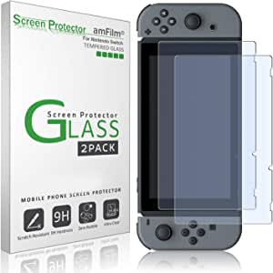

###Nintendo Switch with Neon Blue and Neon Red Joy‑Con - HAC-001(-01)

- 3 Play Styles: TV Mode, Tabletop Mode, Handheld Mode
- 6.2-inch, multi-touch capacitive touch screen
- 4.5-9+ Hours of Battery Life *Will vary depending on software usage conditions
- Connects over Wi-Fi for multiplayer gaming; Up to 8 consoles can be connected for local wireless multiplayer
- Model number: HAC-001(-01)

[<button class="button">$299.00 on Amazon</button>](https://www.amazon.com/Nintendo-Switch-Neon-Blue-Joy%E2%80%91/dp/B07VGRJDFY/ref=sr_1_1?dchild=1&keywords=nintendo+switch&qid=1614629290&sr=8-1)
###amFilm Tempered Glass Screen Protector for Nintendo Switch 2017 (2-Pack)

- Specifically designed for Nintendo Switch
- Ultra-clear High Definition with 99.9% transparency to allow an optimal, natural viewing experience
- Ultra thin-0.3mm thickness is reliable and resilient, and promises full compatibility with touchscreen sensitivity
- Highly durable, and scratch resistant - surface hardness 9H and topped with oleophobic coating to reduce fingerprints.
- Includes: 2x GLASS Screen Protector, Wet Wipes, Micro-Fiber Cleaning Cloth, Squeeze Card, Easy Installation Use Guide, Hinge Stickers

[<button class="button">$7.79 on Amazon</button>](https://www.amazon.com/amFilm-Tempered-Screen-Protector-Nintendo-Switch/dp/B01N3ASPNV/ref=sxin_9?ascsubtag=amzn1.osa.b014b1f6-ce0e-417e-b65c-abae71d587cf.ATVPDKIKX0DER.en_US&creativeASIN=B01N3ASPNV&cv_ct_cx=nintendo+switch&cv_ct_id=amzn1.osa.b014b1f6-ce0e-417e-b65c-abae71d587cf.ATVPDKIKX0DER.en_US&cv_ct_pg=search&cv_ct_we=asin&cv_ct_wn=osp-single-source-earns-comm&dchild=1&keywords=nintendo+switch&linkCode=oas&pd_rd_i=B01N3ASPNV&pd_rd_r=58c6d1cc-ac7a-4f1a-ac20-4034392ed627&pd_rd_w=UIf2A&pd_rd_wg=gtuvg&pf_rd_p=35b32c02-1b41-4e49-9b89-0297af2446e1&pf_rd_r=RCSKH61HXBAJKNB16T7C&qid=1614629290&sr=1-2-64f3a41a-73ca-403a-923c-8152c45485fe&tag=popularscience_os-20)
###iVoler Carrying Storage Case for Nintendo Switch, Portable Travel All Protective Hard Messenger Bag Soft Lining 18 Games for Switch Console Pro Controller & Accessories Black

- Deluxe Travel Carrying Case
- Multiple Storage
- Hard Protective Case
- Convenient to Use
- Scope of Delivery: 1x iVoler Case for Nintendo Switch.The Nintendo Switch console, pro controllers, and other accessories shown in images are for usage demonstration purposes only and are not included with this case.

[<button class="button">$33.99 on Amazon</button>](https://www.amazon.com/Nintendo-Carrying-All-Protective-Controller-Accessories-3DS/dp/B076GYVWRY/ref=sxin_9?ascsubtag=amzn1.osa.b014b1f6-ce0e-417e-b65c-abae71d587cf.ATVPDKIKX0DER.en_US&creativeASIN=B076GYVWRY&cv_ct_cx=nintendo+switch&cv_ct_id=amzn1.osa.b014b1f6-ce0e-417e-b65c-abae71d587cf.ATVPDKIKX0DER.en_US&cv_ct_pg=search&cv_ct_we=asin&cv_ct_wn=osp-single-source-earns-comm&dchild=1&keywords=nintendo+switch&linkCode=oas&pd_rd_i=B076GYVWRY&pd_rd_r=58c6d1cc-ac7a-4f1a-ac20-4034392ed627&pd_rd_w=UIf2A&pd_rd_wg=gtuvg&pf_rd_p=35b32c02-1b41-4e49-9b89-0297af2446e1&pf_rd_r=RCSKH61HXBAJKNB16T7C&qid=1614629290&sr=1-3-64f3a41a-73ca-403a-923c-8152c45485fe&tag=popularscience_os-20)
###Genki - The Original Bluetooth Adapter for the Nintendo Switch and Switch Lite. Switch Accessories Compatible with most BT Headphones and Airpods - Low Latency with aptX Technology

- EFFORTLESSLY connect your favorite bluetooth headset with your Nintendo Switch or Switch Lite using Genkis Switch audio adapter
- ALREADY TRUSTED by 17 902 backers on Kickstarter and Indiegogo via our crowdfunding campaign
- VOICE CHAT with your friends in Fortnite by using the included boom mic
- EASILY CONNECT a second headset to the same bluetooth adapt

[<button class="button">$49.99 on Amazon</button>](https://www.amazon.com/Genki-Nintendo-Switch-Bluetooth-Adapter/dp/B07JZKXSQT/ref=sxin_9?ascsubtag=amzn1.osa.b014b1f6-ce0e-417e-b65c-abae71d587cf.ATVPDKIKX0DER.en_US&creativeASIN=B07JZKXSQT&cv_ct_cx=nintendo+switch&cv_ct_id=amzn1.osa.b014b1f6-ce0e-417e-b65c-abae71d587cf.ATVPDKIKX0DER.en_US&cv_ct_pg=search&cv_ct_we=asin&cv_ct_wn=osp-single-source-earns-comm&dchild=1&keywords=nintendo+switch&linkCode=oas&pd_rd_i=B07JZKXSQT&pd_rd_r=58c6d1cc-ac7a-4f1a-ac20-4034392ed627&pd_rd_w=UIf2A&pd_rd_wg=gtuvg&pf_rd_p=35b32c02-1b41-4e49-9b89-0297af2446e1&pf_rd_r=RCSKH61HXBAJKNB16T7C&qid=1614629290&sr=1-4-64f3a41a-73ca-403a-923c-8152c45485fe&tag=popularscience_os-20)
