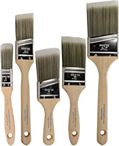
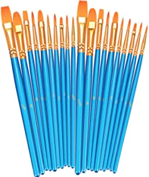

Paintbrushes are one of the most important tools that an artist has. When it comes to paintbrushes there are many kinds, all depending on what kind of painting the artist wants to do.

There are different sizes, different brush textrues, even different lengths.

###Amazon Basics Detail Paint Brush Set, 7 pcs

- Set includes: 7 different-size detail paint brushes; shapes include liners, rounds, and flat; ideal for art projects, crafts, hobbies, and more
- Wood handle: short, lightweight handle made of wood with a smooth brown finish; offers control and a comfortable hold
- Nylon bristles: sturdy nylon bristles provide strength and precise, reliable results
- Versatile: suitable for almost any type of paint, including acrylic, watercolor, enamel, oil, cel-vinyl, and gouache

[<button class="button">$7.14 on Amazon</button>](https://www.amazon.com/gp/slredirect/picassoRedirect.html/ref=pa_sp_atf_aps_sr_pg1_1?ie=UTF8&adId=A0458875MMP409NV941W&url=%2FAmazonBasics-Detail-Paint-Brush-Set%2Fdp%2FB08935XV2M%2Fref%3Dsr_1_1_sspa%3Fdchild%3D1%26keywords%3Dpaint%2Bbrush%26qid%3D1614565647%26sr%3D8-1-spons%26psc%3D1&qualifier=1614565647&id=1637013366794454&widgetName=sp_atf)
###Pro Grade - Paint Brushes - 5 Ea - Paint Brush Set

- Paint Brush Set Includes 1 Ea of 1" Flat, 1-1/2" Angle, 2" Stubby Angle, 2" Flat & 2-1/2" Angle
- Paint Brushes For Interior Or Exterior Projects
- Professional Results On Walls, Trim, Cabinets, Doors, Fences, Decks, Touch Ups, Arts And Crafts.
- Premium Quality Paint Brushes At A Cheap Price! No Cardboard Covers Come With This Set.
- The SRT filament blend holds more paint to save time, less streaks & premium finish on walls & trim.
[<button class="button">$6.69 on Amazon</button>](https://www.amazon.com/gp/slredirect/picassoRedirect.html/ref=pa_sp_atf_aps_sr_pg1_1?ie=UTF8&adId=A02130042L42GVJDH5CNJ&url=%2FPro-Grade-Professional-Painting-Commercial-Paintbrush%2Fdp%2FB07JHQ4L4F%2Fref%3Dsr_1_2_sspa%3Fdchild%3D1%26keywords%3Dpaint%2Bbrush%26qid%3D1614565647%26sr%3D8-2-spons%26psc%3D1&qualifier=1614565647&id=1637013366794454&widgetName=sp_atf)
###BOSOBO Paint Brushes Set, 2 Pack 20 Pcs Round Pointed Tip Paintbrushes Nylon Hair Artist Acrylic Paint Brushes for Acrylic Oil Watercolor, Face Nail Art, Miniature Detailing & Rock Painting, Blue

- ► TWO PACKS OF TEN SIZES ART BRUSHES: 10 size professional round-pointed paintbrushes with a variety of shapes make MIXING COLOR more easy, perfect for artists, amateurs, students, teens, kids, children and painters of all levels
- ► All-PURPOSED PAINTING BRUSHES SETS: Nice combination of tips for design purposes, versatile miniature paint brushes allow you to do fine detailing and art painting precisely to reach tight, small spots or tiny points
- ► HIGH QUALITY CRAFTSMANSHIP: Artist quality small paint brushes designed with durable synthetic nylon bristles, rust-proof nickel ferrules, and sturdy wooden handles
- ► EASY MAINTENANCE: After using your fine tip paint brushes for acrylic, oil or watercolor painting, it’s very convenient to clean them with warm soapy water and reshape the paintbrush tips
- ► WARM TIPS: Clean your brushes immediately after using them, avoid scrubbing while cleani
[<button class="button">$6.99 on Amazon</button>](https://www.amazon.com/BOSOBO-Paintbrushes-Watercolor-Miniature-Detailing/dp/B07GH7WGC3/ref=sr_1_6?dchild=1&keywords=paint+brush&qid=1614565647&sr=8-6)
