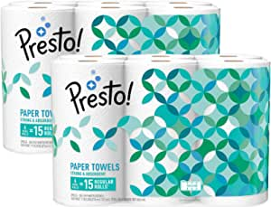

###Amazon Brand - Presto! Flex-a-Size Paper Towels, Huge Roll, 12 Count = 30 Regular Rolls

- Up to 75% more absorbent versus leading 1-ply brand
- Includes 12 Huge Rolls (2 Packs of 6 Huge Rolls) of 158 2-ply sheets per roll
- 12 Huge Rolls = 30 Regular Rolls (based on a regular roll with 63 sheets)
- Flex-a-Size lets you suit your towel to your mess
- Made with pulp sourced from sustainably managed forests and controlled sources
- Running low? Restock by asking, “Alexa, order Presto! paper towels” through your Alexa device
- An Amazon brand

[<button class="button">$27.49 on Amazon</button>](https://www.amazon.com/gp/slredirect/picassoRedirect.html/ref=pa_sp_atf_aps_sr_pg1_1?ie=UTF8&adId=A01723951LZ2U95J64FSG&url=%2FAmazon-Brand-Flex-Size-Regular%2Fdp%2FB074CR89QG%2Fref%3Dsr_1_1_sspa%3Fdchild%3D1%26keywords%3Dpaper%2Btowels%26qid%3D1614631837%26sr%3D8-1-spons%26psc%3D1&qualifier=1614631837&id=5260998326176848&widgetName=sp_atf)
###Bounty Quick-Size Paper Towels, White, 12 Family Rolls = 30 Regular Rolls (Packaging May Vary)

- Pack contains 12 Family Rolls of Bounty white Quick Size paper towels, 12 Family Rolls equals 30 Regular Rolls
- This pack contains 60 more sheets per pack which means 6 extra days’ worth of paper vs
- Bounty, the Quicker Picker Upper
- 2X More Absorbent 

[<button class="button">$30.44 on Amazon</button>](https://www.amazon.com/gp/slredirect/picassoRedirect.html/ref=pa_sp_atf_aps_sr_pg1_1?ie=UTF8&adId=A0283589156K419HHDLBX&url=%2FBounty-Quick-Size-Paper-Towels-Family%2Fdp%2FB079VP6DH6%2Fref%3Dsr_1_2_sspa%3Fdchild%3D1%26keywords%3Dpaper%2Btowels%26qid%3D1614631837%26sr%3D8-2-spons%26psc%3D1&qualifier=1614631837&id=5260998326176848&widgetName=sp_atf)
###Seventh Generation Toilet Paper, Bath Tissue, 100% Recycled Paper, 12 Rolls (Pack of 4) (Packaging May Vary)

- We recently updated our paper pattern, so you may receive flowers or butterflies
- 2 ply bathroom tissue designed for softness and strength
- Made with 100 percentage recycled paper, no added dyes, inks, or fragrances
- Septic safe and compatible with low flow toilets in RVS and campers
- Shipment includes one 48 rolls
- Whitened without chemicals containing chlorine

[<button class="button">$27.58 on Amazon</button>](https://www.amazon.com/gp/slredirect/picassoRedirect.html/ref=pa_sp_atf_aps_sr_pg1_1?ie=UTF8&adId=A01817893IWKX1X4JFTDK&url=%2FSeventh-Generation-Toilet-Tissue-Recycled%2Fdp%2FB00T87VN20%2Fref%3Dsr_1_4_sspa%3Fdchild%3D1%26keywords%3Dpaper%2Btowels%26qid%3D1614631837%26sr%3D8-4-spons%26psc%3D1&qualifier=1614631837&id=5260998326176848&widgetName=sp_atf)
###Brawny Tear-A-Square Paper Towels, 12 = 24 Regular Rolls, 3 Sheet Size Options, Quarter Size Sheets, 12 Count, 12 Count (Pack of 1)

- Brawny tear a square 2 ply, premium white paper towel has a unique quarter sheet size option with 256 quarter sheets per roll; Brawny tear a square provides a smaller sheet size option for your smaller tasks so that your roll can last longer
- Messy surprises lurk all around the house and they come in all sizes; Brawny tear a square paper towels offer three sheet size options in each paper towel roll: Full sheet, half sheet and quarter sheet so you can use just what you need without the waste; Gone is guilt of using a full or half sheet paper towel when only a quarter sheet is needed for your smaller tasks
- Like all other Brawny paper towel products, Brawny tear a square paper towels are strong, absorbent and durable; They are perfect for both tough messes and small everyday clean ups like food preparation and cooking, cleaning glass, kitchen counters and bathroom vanities
- Use brawny tear a square quarter sheet size paper towels for small spills and quick clean ups, to place snacks, as a napkin or a coaster: Brawny tear a square has the strength for messes big, small and anywhere in between
- This package contains 12 tear a square 2 ply white premium paper towel rolls; Each paper towel roll has 256 quarter sheets; Each quarter sheet measures 5.5 (L) X 5.5 (W) inches
- Made with pulp sourced from the Sustainable Forestry Initiative(r) Fiber Sourcing Standard
- 12 ROLLS/ROLLOS 128 2-PLY Sheets per roll/HOJAS POR ROLLO 645.3 square feet (59.9 meter²) 11 inch/PLG X 5.5 inch/PLG (27.9 centimeter X 13.9 centimeter)

[<button class="button">$23.99 on Amazon</button>](https://www.amazon.com/Brawny-Square-Regular-Options-Quarter/dp/B07ND3P3SR/ref=sr_1_6?dchild=1&keywords=paper+towels&qid=1614631837&sr=8-6)
