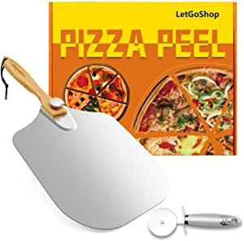
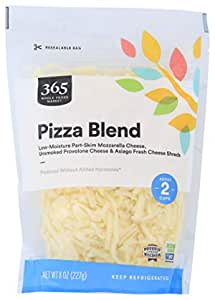

##Our Picks
###LetGoShop Pizza Peel Aluminum Metal Pizza Spatula 12 inch x 14 inch, Large Pizza Paddle with Foldable Wooden Handle Easy Storage for Baking Pizza and Bread, Pizza Turning Peel Set with Pizza Cutter

###Product Info:
- t Available
######Check Price
###365 by Whole Foods Market, Cheese Shreds, Pizza Blend, 8 Ounce

###Product Info:
- Brought to you by Whole Foods Market.\xa0 The packaging for this product has a fresh new look. During this transition, you may get the original packaging or the new packaging in your order, but the product and quality is staying exactly the same. Enjoy!
- Low-Moisture Part-Skim Mozzarella Cheese, Unsmoked Provolone Cheese & Asiago Fresh Cheese Shreds. Equals about 2 cups of shredded cheese.
- Proudly Wisconsin Cheese.
- Produced without added hormone (made with milk from cows not treated with rBST).
- Non-GMO Certified
######Check Price
###365 by Whole Foods Market, Cheese Shreds, Pizza Blend, 8 Ounce

###Product Info:
- Brought to you by Whole Foods Market.\xa0 The packaging for this product has a fresh new look. During this transition, you may get the original packaging or the new packaging in your order, but the product and quality is staying exactly the same. Enjoy!
- Low-Moisture Part-Skim Mozzarella Cheese, Unsmoked Provolone Cheese & Asiago Fresh Cheese Shreds. Equals about 2 cups of shredded cheese.
- Proudly Wisconsin Cheese.
- Produced without added hormone (made with milk from cows not treated with rBST).
- Non-GMO Certified
######Check Price
