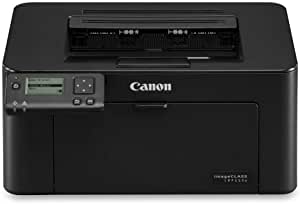

###HP Neverstop Laser Printer 1001nw, Wireless Laser with Cartridge-Free Monochrome-Toner-Tank (5HG80A)

- Lowest cost per page on laser printing in-class: This reloadable laser printer offers black-and-white printing at 21 ppm, wireless capabilities, a 150-sheet paper tray, and a mess-free toner refill experience
- Less than 1 cent per page: This wireless laser printer comes with up to 5,000 pages of toner in the box—up to 7x more pages than traditional, in-class laser printers
- Reload with more toner, for a lot less: With the Toner Reload Kit (sold separately), get up to 2,500 pages worth of Original HP Toner -- up to 2.5x more pages than-class HP Toner cartridges
- The best-in-class mobile print app, HP Smart: Simplify printer set up and sharing with all your devices so you can instantly print, scan and copy with whatever device you have on hand
- Wireless printing: The Neverstop Laser Printer keeps your office connected with built-in wireless and ethernet capabilities, and lets you print from your smartphone or tablet without a network using Wi-Fi Direct
- Eco-label certified: The environmental-friendly Neverstop Laser Printer is ENERGY STAR 3.0 certified with an 16% smaller environmental footprint than other printers in its class
- One-year limited hardware warranty: Get help with 24-hour, 7 days a week free Web support
- See specification sheet for terms and conditions

[<button class="button">$249.89 on Amazon</button>](https://www.amazon.com/gp/slredirect/picassoRedirect.html/ref=pa_sp_atf_aps_sr_pg1_1?ie=UTF8&adId=A00356593HL01MURZ8NGO&url=%2FHP-Neverstop-Printer-Cartridge-Free-Monochrome-Toner-Tank%2Fdp%2FB0844PGXJR%2Fref%3Dsr_1_1_sspa%3Fdchild%3D1%26keywords%3Dprinters%26qid%3D1614633543%26sr%3D8-1-spons%26psc%3D1&qualifier=1614633543&id=2973287110562243&widgetName=sp_atf)
###Canon LBP113w imageCLASS (2207C004) Wireless, Mobile-Ready Laser Printer, 23 Pages Per Minute, Black

- Print at speeds of up to 23 pages per minute.
- Supports mobile solutions, including Apple AirPrint, Canon Print Business, Morea Print Service, and Google Cloud Print.
- Easily connect mobile devices without a router using a Wi-Fi Direct Connection.
- Paper capacity allows for up to 150-sheets.
- Energy saver mode uses approximately 4 watts in sleep mode.

[<button class="button">$109.00 on Amazon</button>](https://www.amazon.com/Canon-LBP113w-imageCLASS-2207C004-Mobile-Ready/dp/B07H6C1B3L/ref=sr_1_5?dchild=1&keywords=printers&qid=1614633543&sr=8-5)
