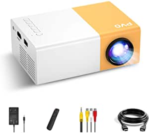
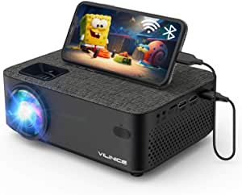

###DR. J Professional HI-04 Mini Projector Outdoor Movie Projector with 100Inch Projector Screen, 1080P Supported Compatible with TV Stick, Video Games, HDMI,USB,TF,VGA,AUX,AV [Latest Upgrade]
![DR. J Professional HI-04 Mini Projector Outdoor Movie Projector with 100Inch Projector Screen, 1080P Supported Compatible with TV Stick, Video Games, HDMI,USB,TF,VGA,AUX,AV [Latest Upgrade]](https://images-na.ssl-images-amazon.com/images/I/718A7339wbL.__AC_SX300_SY300_QL70_ML2_.jpg)
- [100Inch Projector Screen Included] PORTABLE LED VIDEO PROJECTOR: To meet our customer\'s new needs, DR.J has improved not only the brightness, contrast ratio of the projector, but also included a 100" Portable Projector Screen in the package
- HIGHEST 1080P RESOLUTIONS SUPPORTED: Supported resolution:1920*1080, Aspect Ratio: 4:3/16:9, Contrast Ratio: 2000:1, Lamp lifetime: 40000 hours, Watching Size: 32”-176” with projector distance 1.5m-5m
- MULTIMEDIA PORTABLE PROJECTOR: DR.J projector is compatible with TV Box, ChromeBook, PCs, Laptops, Tablets, Blue-ray DVD player, SD Card, USB Flash Drive, Video Games, Media players (Music, Pictures, Video, TXT), Smartphones ( Wireless HDMI Dongle not included).
- IDEAL CHOICE FOR HOME ENTERTAINMENT: DR.J LED projector is great for home theater, indoor and outdoor movies & kinds of video games by HDMI port connection
- IDEAL CHOICE FOR CHRISTMAS: 

[<button class="button">$79.99 on Amazon</button>](https://www.amazon.com/DR-J-Upgraded-4Inch-Projector-Display/dp/B07174LM85/ref=sr_1_3?dchild=1&keywords=projectors&qid=1614637462&sr=8-3)
###Mini Projector, PVO Portable Projector for Cartoon, Kids Gift, Outdoor Movie Projector, LED Pico Video Projector for Home Theater Movie Projector with HDMI USB TV AV Interfaces and Remote Control

- ☀ Gift for Children: Mini projector is a must-have product for children to watch cartoons and videos, which is very popular with children
- ☀ Upgrade Performance: YG300 Pro upgraded in 2020, support 1080P full HD and the natural resolution have increased to 640*360
- ☀ Multiple Interface: Small projector is equipped with multiple ports, including HDMI, USB, audio, Micro SD, TF and AV interfaces
- ☀ Power Bank supply: The mini portable projector is powered by a power adapter (does not have a built-in battery), It can also be powered by mobile phone charger, car charger or power pack via micro-USB interface (need to support 5V/2.5A), enjoy anytime, anywhere.

[<button class="button">$55.99 on Amazon</button>](https://www.amazon.com/Projector-PVO-Portable-Cartoon-Interfaces/dp/B08B8DKYPS/ref=sr_1_4_mod_primary_lightning_deal?dchild=1&keywords=projectors&qid=1614637462&sbo=Tc8eqSFhUl4VwMzbE4fw%2Fw%3D%3D&smid=A2S3N4BQ1P65T0&sr=8-4)
###WiFi Projector,VILINICE 5000L Mini Outdoor Movie Projector ,Portable Phone Projector with Wireless Mirroring,1080P and 240" Supported, Compatible with Fire Stick,HDMI,VGA,USB,TV,Box,Laptop,DVD

- NEWEST WIFI & USB CONNECTION: So many people would like to transpose their smartphone screen to the projector for a large format viewing experience
- SUPPORTED 1080P & 5000L LCD PROJECTOR: Our Video projector particularly adopts multilayer optical films and high-quality glass to reduce reflections and increase light transmission, thus allowing this portable HD projector to display sharper images without blurring
- HiFi STEREO SPEAKERS and ADVANCED CIRCULATION COOLING SYSTEM: This overhead projector has two 3W HiFi stereo speakers with an SRS sound system, which you can get the superior sound experience
- MULTI-MEDIA HOME THEATER PROJECTOR: Equipped with various ports such as VGA / USB / HDMI / AV / SD / audio output, the outdoor movie projector allows you to easily transmit audio and video from computers, monitors, televisions, PS4, DVD players, etc
- 【24 MONTHS & LIFETIME PROFESSIONAL SUPPORT】Register your product and Activate Warranty after receiving your video projector, you will get an extended 2 months to return and 24 months promi

[<button class="button">$99.99 on Amazon</button>](https://www.amazon.com/Projector-VILINICE-Mirroring-Supported-Compatible/dp/B08DNV8N55/ref=sr_1_5?dchild=1&keywords=projectors&qid=1614637462&sr=8-5)
###BenQ HT2150ST 1080P Short Throw Projector | 2200 Lumens | 96% Rec.709 for Accurate Colors | Low Input Lag Ideal for Gaming | Stream Netflix & Prime Video,White

- UNPARALLELED PICTURE QUALITY:: Native 1080p Full HD image quality with 2200 ANSI Lumens, 15, 000:1 contrast ratio, 6x RGBRGB color wheel delivers rich colors and crisp details that are calibrated for movies and gaming.
- VIDEO GAMES ON THE BIG SCREEN: superior short throw projection enables you to project 100 inch screen from just 3 Feet letting you fully immerse into your games
- LOW INPUT LAG: The specialized low input lag and unique game modes ensure gamers an ultra-smooth and comprehensive gaming experience
- INDUSTRY LEADING WARRANTY : 3-year limited parts and labor coverage makes you rest easy that our us-based customer service team is here when you need it
- AWARD WINNING PROJECTOR - Best Overall - Best Projectors for Gaming 2019 - IGN
- FLEXIBLE INSTALLATION: Vertical keystone correction and a 1
- DLP TECHNOLOGY: DLP is the leading technology used in 90% of the world’s cinemas and 100% of digital IMAX theate

[<button class="button">$780.77 on Amazon</button>](https://www.amazon.com/BenQ-HT2150ST-Theater-Projector-Gaming/dp/B01K2V0WP4/ref=sxin_9?ascsubtag=amzn1.osa.3997f88c-41fb-48d8-a2ce-2dc09d12e078.ATVPDKIKX0DER.en_US&creativeASIN=B01K2V0WP4&cv_ct_cx=projectors&cv_ct_id=amzn1.osa.3997f88c-41fb-48d8-a2ce-2dc09d12e078.ATVPDKIKX0DER.en_US&cv_ct_pg=search&cv_ct_we=asin&cv_ct_wn=osp-single-source-earns-comm&dchild=1&keywords=projectors&linkCode=oas&pd_rd_i=B01K2V0WP4&pd_rd_r=f08943a8-69b5-485c-874e-5222fbb664b2&pd_rd_w=RcJpv&pd_rd_wg=279dC&pf_rd_p=35b32c02-1b41-4e49-9b89-0297af2446e1&pf_rd_r=6SMMH4FHARS8RCCX1XGM&qid=1614637462&sr=1-1-64f3a41a-73ca-403a-923c-8152c45485fe&tag=tgl0a3-20)
###ViewSonic M1 Portable Projector with Dual Harman Kardon Speakers HDMI USB Type C Auto Keystone Built-in Battery, Stream Netflix with Dongle

- PORTABLE PROJECTOR: Ultra-portable WVGA (854x480p) LED projector that delivers convenient entertainment in nearly any room
- BIG SCREEN PROJECTION: Shorter throw lens project up to 100-inches from 8-feet 9-inches
- PREMIUM AUDIO: Built-in Dual Harman Kardon speakers deliver room-filling audio
- EASY SETUP: Simple setup and control, just plug & play your presentations, videos, and pictures
- LONG BATTERY LIFE: A built-in battery provides up to 6 hours of power, and can charge mobile devices via USB Type C when the power adapter is plugged in
- INDUSTRY-LEADING WARRANTY: 3-year limited parts and labor coverage, and access to our US-based customer service team
- FLEXIBLE CONNECTIVITY: Supports most media players, PCs, Macs, and mobile devices with input options such as HDMI, USB, and more
- INCLUDED IN THE BOX: M1 Projector, USB Type C Cable, Remote Control, Projector Case, Quick Start Guide, and Power Adapter

[<button class="button">$280.99 on Amazon</button>](https://www.amazon.com/ViewSonic-M1-Portable-Projector-Speakers/dp/B078WG5P4W/ref=sxin_9?ascsubtag=amzn1.osa.3997f88c-41fb-48d8-a2ce-2dc09d12e078.ATVPDKIKX0DER.en_US&creativeASIN=B078WG5P4W&cv_ct_cx=projectors&cv_ct_id=amzn1.osa.3997f88c-41fb-48d8-a2ce-2dc09d12e078.ATVPDKIKX0DER.en_US&cv_ct_pg=search&cv_ct_we=asin&cv_ct_wn=osp-single-source-earns-comm&dchild=1&keywords=projectors&linkCode=oas&pd_rd_i=B078WG5P4W&pd_rd_r=f08943a8-69b5-485c-874e-5222fbb664b2&pd_rd_w=RcJpv&pd_rd_wg=279dC&pf_rd_p=35b32c02-1b41-4e49-9b89-0297af2446e1&pf_rd_r=6SMMH4FHARS8RCCX1XGM&qid=1614637462&sr=1-2-64f3a41a-73ca-403a-923c-8152c45485fe&tag=tgl0a3-20)
