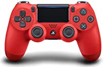

###Controller Wireless for PS4, Usergaing DualShock 4 Wireless Controller for Sony Playstation 4/Pro/Slim/PC with Audio Function, Speaker and Dualshock

- 🎮【 The Best Choice of PS4 Controller】This PS4 Controller Galaxy Style is widely compatible with PS4/PS4 Pro/PC and Laptop（Win7/8/8.1/10);
- 🎮【 All Features】Original size,Built-in speaker and 3.5mm audio jack,Touch pad,Integrated light bar,Sharing at your Fingertips,Strong rumble vibration
- 🎮【 Optimized Button & High-Sensitive Controller】PS4 controller wireless layout of gamepad button is optimized with excellent dual analog joystick design
- 🎮【 Double-Shock and 6-AXIS】Our wireless ps4 controller has 6-axis sensor and dual vibration feedback for a more realistic gaming feeli

[<button class="button">$32.99 on Amazon</button>](https://www.amazon.com/gp/slredirect/picassoRedirect.html/ref=pa_sp_atf_aps_sr_pg1_1?ie=UTF8&adId=A01451721KHOYHWHBS9PZ&url=%2FController-Usergaing-DualShock-Playstation-Dualshock%2Fdp%2FB08R61KLK5%2Fref%3Dsr_1_1_sspa%3Fdchild%3D1%26keywords%3Dps4%2Bcontroller%26qid%3D1614634629%26sr%3D8-1-spons%26psc%3D1&qualifier=1614634629&id=1354875765479089&widgetName=sp_atf)
###DualShock 4 Wireless Controller for PlayStation 4 - Magma Red

- The feel, shape, and sensitivity of the dual analog sticks and trigger buttons have been improved to provide a greater sense of control, no matter what you play
- The new multi touch and clickable touch pad on the face of the DualShock 4 Wireless Controller opens up worlds of new gameplay possibilities for both newcomers and veteran gamers', "The DualShock 4 Wireless Controller features a built in speaker and stereo headset jack, putting several new audio options in the player's hands", 'The Dualshock 4 wireless controller can be easily recharged by plugging it into your PlayStation 4 system, even when in rest mode, or with any standard charger using a USB cable (type A to micro B sold separately)

[<button class="button">$64.99 on Amazon</button>](https://www.amazon.com/DualShock-Wireless-Controller-PlayStation-Magma-4/dp/B01MD19OI2/ref=sr_1_3?dchild=1&keywords=ps4+controller&qid=1614634629&sr=8-3)
###PS4 Controller Wireless, PICTEK 1300mAh Controller for Playstation 4/Pro/Slim, Dual Vibration Game Controller Joystick with Headset Jack

- 🎮【Nonstop Playing PS4 Controller】 Adopted with 1300mAh rechargeable battery, the largest capacity in the market, PICTEK wireless controller for PlayStation 4 offers longer nonstop playing time which is up to 16 hours, thus you can use it for almost one day without charging.
- 🎮【Immersive Gaming Experience】 Our wireless ps4 controller has 6-axis sensor and dual vibration feedback for a more realistic gaming feeling
- 🎮【Make You Unstoppable in Games】 The linear trigger of this ps4 controller has a built-in Hall sensor, which can provide a better sense of game and control
- 🎮【Ergonomically Designed PS4 Controller】 Compared with other normal game controllers, the wireless gaming controller is ergonomically designed with asymmetric joysticks
- 🎮【Strong Compatibility】 Our wireless controller working for PS4, PC and other Android devices (A USB cable is needed for PC connection), Supporting tremendous popular games such as PUBG, Fortnite, Rules of Survival, Super Mario and more, you can play any games you want with our PC game controll

[<button class="button">$34.99 on Amazon</button>](https://www.amazon.com/PICTEK-Controller-Wireless-Vibration-Playstation/dp/B0852VFKP8/ref=sxin_9?ascsubtag=amzn1.osa.b87b954b-9312-4d88-bd63-2f6008632660.ATVPDKIKX0DER.en_US&creativeASIN=B0852VFKP8&cv_ct_cx=ps4+controller&cv_ct_id=amzn1.osa.b87b954b-9312-4d88-bd63-2f6008632660.ATVPDKIKX0DER.en_US&cv_ct_pg=search&cv_ct_we=asin&cv_ct_wn=osp-single-source-earns-comm&dchild=1&keywords=ps4+controllers&linkCode=oas&pd_rd_i=B0852VFKP8&pd_rd_r=fa9f65aa-5df2-47cc-9a4a-015fb9f4d737&pd_rd_w=5pXTe&pd_rd_wg=pKSyC&pf_rd_p=35b32c02-1b41-4e49-9b89-0297af2446e1&pf_rd_r=DDZYYRA1K05XQVQ62VRV&qid=1614634629&sr=1-2-64f3a41a-73ca-403a-923c-8152c45485fe&tag=digitaltren0b-20)
