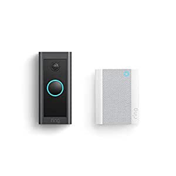

###Introducing Ring Video Doorbell Wired with Ring Chime

- This bundle includes Ring Video Doorbell Wired and Ring Chime
- 1080p HD wired video doorbell with two-way talk, advanced motion detection, standard 2.4 GHz connectivity and customizable privacy settings
- Get real-time notifications sent straight to your phone, Alexa device, or Ring Chime so you’ll always know when someone stops by
- Advanced motion detection helps you know when someone’s at your front door before they ring your doorbell
- Night vision with sharp contrast ensures you’ll never miss a detail – even in the dark
- Hardwire Video Doorbell Wired using your existing doorbell wiring and the included tool kit for around-the-clock power and peace of mind
- With a Ring Protect Plan (subscription sold separately), record all your videos, review what you missed for up to 60 days, and share videos and photos
- Connect with Alexa to hear alerts on your compatible Echo device or see a Live View with an Echo device with scre

[<button class="button">$79.99 on Amazon</button>](https://www.amazon.com/Introducing-Ring-Video-Doorbell-Wired/dp/B08SSDZ6R8/ref=sr_1_1?dchild=1&keywords=ring+doorbell&qid=1614632746&sr=8-1)
