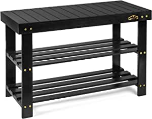

###Simple Houseware 4-Tier Shoe Rack Storage Organizer 20-Pair, Grey

- Stores up to 12-20 pairs of shoes, Additional bottom storage for slippers.
- Sturdy metal construction with washable 600 D polyester fabric, each shelf holding up to 30 lbs.
- Easy Assembly Personalized Storage: You can remove the panel to build into a 2-tier or 3-tier shoe rack to fit different kind of shoes.
- Great solution to keep your entryway, closet, dormitory, patio, mudroom and garage away from mess.
- Product Dimension: 31.25" W x 12.25" D x 31.5" H

[<button class="button">$22.87 on Amazon</button>](https://www.amazon.com/gp/slredirect/picassoRedirect.html/ref=pa_sp_atf_aps_sr_pg1_1?ie=UTF8&adId=A05969801YJZUTWXGA2YS&url=%2FSimple-Houseware-4-Tier-Storage-Organizer%2Fdp%2FB081K8TNC6%2Fref%3Dsr_1_1_sspa%3Fdchild%3D1%26keywords%3Dshoe%2Brack%26qid%3D1614636448%26sr%3D8-1-spons%26psc%3D1&qualifier=1614636448&id=975625995224936&widgetName=sp_atf)
###Homemaid Living Bamboo 3 Tier Shoe Rack Bench, Premium Shoe Organizer or Entryway Bench, Perfect for Shoe Cubby, Entry Bench, Bathroom Bench, Entryway Organizer, Hallway or Living Room(Black)

- STURDY, DURABLE AND BUILT TO LAST - Heavy-duty bench top is made of 100% natural bamboo and can hold up an impressive 300lbs
- SHOE BENCH AND STORAGE - Each shoe rack shelf accommodates up to 4 pairs of shoes being an ideal size of 28.5" long x 12.5" deep x 17.7" tall.
- EASY TO ASSEMBLE - The bamboo shoe rack bench is easy to assemble, sturdy, and durable
- BEAUTIFUL LOOK - Water-resistant bamboo that wipes down easily with a damp clo

[<button class="button">$39.99 on Amazon</button>](https://www.amazon.com/gp/slredirect/picassoRedirect.html/ref=pa_sp_atf_aps_sr_pg1_1?ie=UTF8&adId=A02053131RN282YGCT1LR&url=%2FHomemaid-Living-Organizer-Entryway-Bathroom%2Fdp%2FB089434T88%2Fref%3Dsr_1_4_sspa%3Fdchild%3D1%26keywords%3Dshoe%2Brack%26qid%3D1614636448%26sr%3D8-4-spons%26psc%3D1&qualifier=1614636448&id=975625995224936&widgetName=sp_atf)
###7 Tiers Shoe Rack 24-30 Pairs Shoe Storage Organizer Non-woven Shoe Shelf Boots Organizer

- 【LARGE CAPACITY】Stores up to 24-30 pairs adult shoes, with different height design, it can fit boots, high heels or slippers.
- 【100g VS 80g CLOTH & STURDY STRUCTURE】Constructed with 100g thicker waterproof non-woven, durable iron pipes and connectors, rather than others with 80g or below non-woven, it owns outstanding tear resistance, more durable and long-lasting, each shelf holding up to 50 lbs.
- 【DEEP SIDE POCKETS】This shoe rack have 2 rows hanging side pockets, it allows you storage your small stuffs to this deep pockets, like shoe cover, foldable shopping bag
- 【EASY ASSEMBLY & DIMENSIONS】43.3”L x 11.02”W x 35.43”H, instructions included, you can setup it per the instructions step by step, recommend lay out all pieces according to the marked number and then to start assemble, if you have any questions about the process, please contact us any time without hesitation.
- 【100% SATISFACTION GUARANTEE】: Tribesigns offer 12 months quality assurance and LIFETIME professional customer servi

[<button class="button">$29.99 on Amazon</button>](https://www.amazon.com/Tribesigns-Tiers-Storage-Organizer-Non-Woven/dp/B081V518B7/ref=sr_1_7?dchild=1&keywords=shoe+rack&qid=1614636448&sr=8-7)
