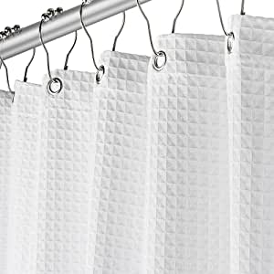
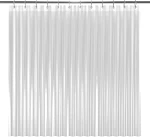
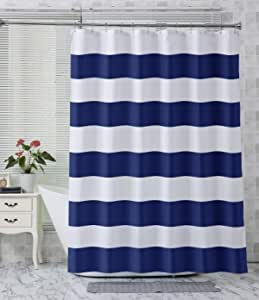
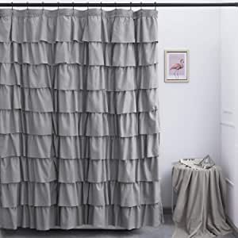

###Fabric White Shower Curtain for Bathroom - Spa, Hotel Luxury Matt Waffle Weave Square Design, Water Repellent, 230 GSM Heavy Duty Cloth, 72" x 72" for Decorative Bathroom Curtains

- Elegant Design: Give Your Bathroom A Clean Feel with This Cloth White Shower Curtain Fabric, Rustproof Metal Grommets ★Hooks Shown Are Not Included★
- Water Resistant: A Water-Resistant Waffle Weave Design Keeps Your Fabric Shower Curtain White Clean and Dry.
- Designed to Last: Our Bathroom Shower Curtains Feature 230 GSM Heavy-Duty Fabric and Strong Metal Rust-Free Grommets Soft Touch Cloth and Comfortable Cotton Feeling, Environmentally Friendly.
- Easy Care: This Soft And PVC-Free Machine Washable Hotel Shower Curtain Takes the Pain Out of Clean-Up, Just Wash It in Cold Water, Do Not Bleach, Use Mild Detergent, Tumble Dry Low.
- 100% Satisfaction: Upgrade Your Bathroom with A Durable and Decorative Modern Shower Curtain Measures 72 X 72 Inches to Fit Standard Size Shower / Bathtub Risk-Free!

[<button class="button">$22.89 on Amazon</button>](https://www.amazon.com/gp/slredirect/picassoRedirect.html/ref=pa_sp_atf_aps_sr_pg1_1?ie=UTF8&adId=A0502502ET0UPJWI1QVF&url=%2FCreative-Scents-Fabric-Curtain-Bathroom%2Fdp%2FB07SC2XSV7%2Fref%3Dsr_1_1_sspa%3Fdchild%3D1%26keywords%3Dshower%2Bcurtains%26qid%3D1614634926%26sr%3D8-1-spons%26psc%3D1&qualifier=1614634926&id=1464964505642014&widgetName=sp_atf)
###LiBa PEVA 8G Shower Curtain Liner, 72" W x 72" H, Clear 8G Heavy Duty Waterproof Shower Curtain Liner Anti-Microbial Mildew Resistant

- MILDEW RESISTANT- Proprietary Mildew Treatment inhibits mildew growth 4x longer than any other shower liner you’ll find on the market! An active agent with odor protection that works to stop microorganism growth before it can even start, protecting your shower liner for the entirety of its life.
- WATERPROOF DESIGN- Ultra smooth speciality design created to repel water and to promote water bead formation so water swiftly rolls off the surface, keeping your bathroom dry and clean
- CONVENIENT & DURABLE- Measuring 72" x 72", the Liba shower liner fits any standard size shower or tub, whether you have a straight or curved shower rod! Three heavy duty magnets on the bottom keep the curtain in place- and away from your body
- ECO-FRIENDLY- Made with 100% high quality and eco-friendly PEVA material
- #1 RECOMMENDED- Recommended by major news publications like Today, Yahoo Life, Women’s Health, and more! We go the extra distance to ensure our shower curtain liners rise above the rest.

[<button class="button">$10.99 on Amazon</button>](https://www.amazon.com/LiBa-Mildew-Resistant-Anti-Bacterial-Curtain/dp/B00LS9UD2M/ref=sr_1_2?dchild=1&keywords=shower+curtains&qid=1614634926&sr=8-2)
###N&Y HOME Fabric Shower Curtain Liner Solid White with Magnets, Hotel Quality, Machine Washable,70 x 72 inches for Bathroom, 70"x72"

- Fabric Shower Curtain Liner With 2 Magnets: 100 Gsm Thick and Made of 100% Premium Polyester Fabric for Your Bathroom
- *HOTEL LUXURY QUALITY: Superior quality polyester liner is applicable to hotel and home décor
- *QUICK DRY: The fabric is to let water bead stay on the surface, dry quickly
- *DURABLE and LONG LASTING: Reinforced top header with 12 button holes prevents from tearing and promotes the shower curtain liner long lasting
- *PVC FREE: High quality fabric with no vinyl and plc
- *EASY CARE: Machine washable for easy home care, keep your shower curtain fresh and cle

[<button class="button">$7.83 on Amazon</button>](https://www.amazon.com/HOME-Repellent-Resistant-Washable-Odorless/dp/B078YNC9G9/ref=sr_1_3?dchild=1&keywords=shower+curtains&qid=1614634926&sr=8-3)
###AmazerBath Fabric Shower Curtain, Navy Stripe Polyester Fabric Shower Curtains with 2 Heavy Duty Clear Stones, Decorative Curtains for Bathroom Hotel Quality, 72 X 72 Inches

- 100% Polyester
- Premium quality - Made of premium polyester fabric
- 2 heavy duty clear stones - Heavy duty clear stones on bottom corners make the item get more weight to reduce curtain blowing.
- Reinforced metal holes - 12 durable metal grommets fit most curtain hooks.
- Easy cleaning - Machine washable and dries quickly
- Classic design - Classic pattern and lovely color make your bathroom fabulo

[<button class="button">$14.99 on Amazon</button>](https://www.amazon.com/AmazerBath-Polyester-Curtains-Decorative-Bathroom/dp/B07V8S93DY/ref=sxin_9_lp-trr-2-na_fee5bf8ec89842f7b473fb786816110a19d98496?cv_ct_cx=shower+curtains&dchild=1&keywords=shower+curtains&pd_rd_i=B07V8S93DY&pd_rd_r=1b0550c8-937e-4923-bba3-0c8da35dbde3&pd_rd_w=1DqDh&pd_rd_wg=o4Scs&pf_rd_p=79c6e13e-fbdb-4ab1-8d83-9d1dbd2f11f4&pf_rd_r=ZPSRBP29H9B6ND5HDJS5&qid=1614634926&sr=1-1-5519553e-2baa-451e-af83-b0156e5c6669)
###Ameritex Ruffle Shower Curtain Home Decor | Soft Polyester, Decorative Bathroom Accessories | Great for Showers & Bathtubs (72" x 72", Grey)

- Well Styled: Ruffle Weave Shower Curtain fits in well with any decor
- High Quality: Made of Premium Polyester Fabric, Elegant Ruffles Can Also Be Home Decor
- Serve Well: Used to add some differences and fashion to your bathroom
- Easy Care: Machine washable- use of a liner recommended

[<button class="button">$25.00 on Amazon</button>](https://www.amazon.com/Ameritex-Christmas-Polyester-Decorative-Accessories/dp/B07JVQD22M/ref=sxin_9_lp-trr-2-na_fee5bf8ec89842f7b473fb786816110a19d98496?cv_ct_cx=shower+curtains&dchild=1&keywords=shower+curtains&pd_rd_i=B07JVQD22M&pd_rd_r=1b0550c8-937e-4923-bba3-0c8da35dbde3&pd_rd_w=1DqDh&pd_rd_wg=o4Scs&pf_rd_p=79c6e13e-fbdb-4ab1-8d83-9d1dbd2f11f4&pf_rd_r=ZPSRBP29H9B6ND5HDJS5&qid=1614634926&sr=1-2-5519553e-2baa-451e-af83-b0156e5c6669)
