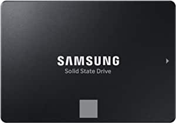
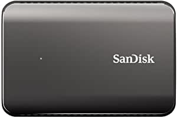

###WD_Black 500GB SN850 NVMe Internal Gaming SSD - Gen4 PCIe, M.2 2280, 3D NAND - WDS500G1X0E

- Next-gen PCIe Gen4 technology optimized for top-tier gaming (not intended for NAS or server environments)
- Irrationally fast read/write speeds up to 7000/5300MB/s (1TB model) and up to 1,000,000 IOPS (1TB and 2TB models)
- Up to 2TB capacity to hold your favorite battle-ready games
- Downloadable WD_BLACK Dashboard software to customize and control your gaming experience
- Compact form factor design for easy connectivity

[<button class="button">$119.99 on Amazon</button>](https://www.amazon.com/gp/slredirect/picassoRedirect.html/ref=pa_sp_atf_aps_sr_pg1_1?ie=UTF8&adId=A06998492P4IV1QKLJCPT&url=%2FWD_Black-500GB-SN850-Internal-Gaming%2Fdp%2FB08KFN1KT1%2Fref%3Dsr_1_1_sspa%3Fdchild%3D1%26keywords%3Dssds%26qid%3D1614629716%26sr%3D8-1-spons%26psc%3D1&qualifier=1614629716&id=5018746556138181&widgetName=sp_atf)
###Crucial P2 1TB 3D NAND NVMe PCIe M.2 SSD Up to 2400MB/s - CT1000P2SSD8

- Capacity: Up to 2TB with sequential reads/writes up to 2400MB/s/1900MB/s
- NVMe PCIe interface, marking the next step in storage innovation
- Includes SSD management software for performance optimization, data security, and firmware updates
- 5-year limited warranty

[<button class="button">$104.95 on Amazon</button>](https://www.amazon.com/gp/slredirect/picassoRedirect.html/ref=pa_sp_atf_aps_sr_pg1_1?ie=UTF8&adId=A0995795IXR5QTT2JVNJ&url=%2FCrucial-NAND-NVMe-PCIe-2400MB%2Fdp%2FB089DNM8LR%2Fref%3Dsr_1_2_sspa%3Fdchild%3D1%26keywords%3Dssds%26qid%3D1614629716%26sr%3D8-2-spons%26psc%3D1&qualifier=1614629716&id=5018746556138181&widgetName=sp_atf)
###SAMSUNG 870 EVO 500GB 2.5 Inch SATA III Internal SSD (MZ-77E500B/AM)

- THE SSD ALL-STAR: The latest 870 EVO has indisputable performance, reliability and compatibility built upon Samsung's pioneering technology", 'EXCELLENCE IN PERFORMANCE: Enjoy professional level SSD performance with 870 EVO, which maximizes the SATA interface limit to 560/530 MB/s sequential speeds*, Accelerates write speeds and maintains long term high performance with a larger variable buffer
- INDUSTRY DEFINING RELIABILITY: Meet the demands of every task from everyday computing to 8K video processing, with up to 2,400 TBW** under a 5 year limited warranty***
- MORE COMPATIBLE THAN EVER: 870 EVO has been compatibility tested for major host systems and applications, including chipsets, motherboards, NAS, and video recording devices****
- UPGRADE WITH EASE: Simply plug 870 EVO into the standard 2.5 inch SATA form factor on your desktop PC or laptop and let the renewed migration software takes care of the rest', "SAMSUNG MAGICIAN SOFTWARE: Make your drive work smoothly with enhanced Samsung Magician 6 software that helps you easily manage your drive, keep up with the latest updates, monitor the drive's health and status, or even enhance its performance****

[<button class="button">$64.99 on Amazon</button>](https://www.amazon.com/SAMSUNG-500GB-Internal-MZ-77E500B-AM/dp/B08QBMD6P4/ref=sr_1_4?dchild=1&keywords=ssds&qid=1614629716&sr=8-4)
###SanDisk Extreme 900 Portable 960GB SSD (SDSSDEX2-960G-G25)

- Storage Capacity: 960GB Portable, External Solid State Drive.
- Sequential Read (up to): 850 MB/s.
- Sequential Write (up to): 850 MB/s.
- Interface: USB 3.1.
- Dimensions: 0.70 x 3.25 x 5.25 

[<button class="button">$299.44 on Amazon</button>](https://www.amazon.com/SanDisk-Extreme-Portable-960GB-SDSSDEX2-960G-G25/dp/B01127E6P4/ref=sxin_9?ascsubtag=amzn1.osa.3d281b1c-00d0-4c47-8cda-be81f03f3205.ATVPDKIKX0DER.en_US&creativeASIN=B01127E6P4&cv_ct_cx=ssds&cv_ct_id=amzn1.osa.3d281b1c-00d0-4c47-8cda-be81f03f3205.ATVPDKIKX0DER.en_US&cv_ct_pg=search&cv_ct_we=asin&cv_ct_wn=osp-single-source-earns-comm&dchild=1&keywords=ssds&linkCode=oas&pd_rd_i=B01127E6P4&pd_rd_r=30c89f4f-66e2-4c64-8f2a-cc68cf9abd0f&pd_rd_w=q0cxj&pd_rd_wg=yHPzO&pf_rd_p=35b32c02-1b41-4e49-9b89-0297af2446e1&pf_rd_r=Q0ST42690TF472BTCS4E&qid=1614629716&sr=1-2-64f3a41a-73ca-403a-923c-8152c45485fe&tag=pcmagcontent-20)
