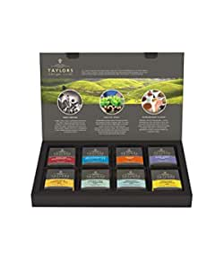
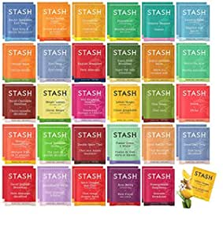
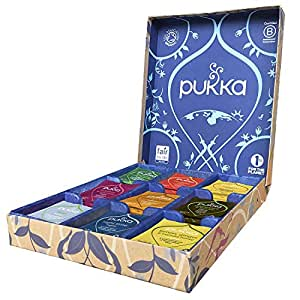

##Our Picks
###Taylors of Harrogate Assorted Specialty Teas Box , 48 count (Pack of 1)

###Product Info:
- Varieties included: English Breakfast, Earl Grey, Decaffeinated Breakfast, Lemon & Orange, Pure Assam, Green Tea with Jasmine, Organic Peppermint, and Organic Chamomile. Variety packs include six tea bags of each variety. Total 48 tea bags included. From black and green teas to Earl Grey and fusion teas, there's something in the line-up for every tea fan to savor. Each variety can be enjoyed as a standalone beverage, but many pair up nicely with biscuits and other sweets.", 'Assorted range of 48 tea bags
- Variety packs include six tea bags of each variety.', "We’re an independent family tea and coffee company from Harrogate in Yorkshire. We have strong family values, like a love for fairness, quality, creativity and the importance of treating people with respect. And we're completely, utterly devoted to the pursuit of extraordinary flavour.", 'Total 48 tea bags included.
- Assorted Tea
- Variety packs include six tea bags of each variety.
######Check Price
###Stash Tea Bags Sampler Assortment Box - 52 COUNT - Perfect Variety Pack Gift Box - Gift for Family, Friends, Coworkers - English Breakfast, Green, Moroccan Mint, Peach, Chamomile and more

###Product Info:
- t Available
######Check Price
###Pukka Herbs Tea Selection Luxury Gift Box, Collection of Organic, Herbal Teas, 45 Count

###Product Info:
- 45 sachets of incredible organic herbal teas selected from the Pukka range
- Supreme Matcha Green - Turmeric Glow - Peppermint & Licorice - Detox - Elderberry & Echinacea - Three Ginger - Love - Lemon Ginger & Manuka Honey - Night Time
- Bring these incredible herbs alive by infusing in freshly boiled water for up to 15 minutes
- 100% organically grown and ethically sourced ingredients. Vegetarian, kosher and non-GM
- A gift for you and for the planet. 1% of the sales from this box will go towards environmental causes and our packaging is both recyclable and comes from renewable sources.
- An assorted collection gift set of individually wrapped speciality Pukka teabags, nine different varieties mixed in one box
######Check Price
