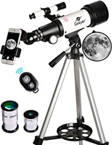

##Our Picks
###Gskyer Telescope, 600x90mm AZ Astronomical Refractor Telescope, German Technology Scope

###Product Info:
- t Available
######Check Price
###Celestron - AstroMaster 70AZ Telescope - Refractor Telescope - Fully Coated Glass Optics - Adjustable Height Tripod – Bonus Astronomy Software Package

###Product Info:
- t Available
######Check Price
###Gskyer Telescope, 70mm Aperture 400mm AZ Mount Astronomical Refracting Telescope for Kids Beginners - Travel Telescope with Carry Bag, Phone Adapter and Wireless Remote

###Product Info:
- t Available
######Check Price
