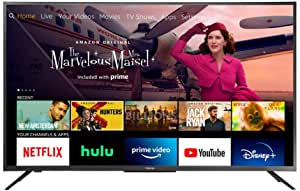
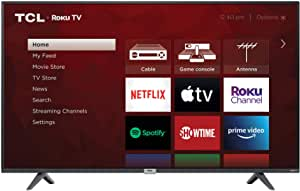
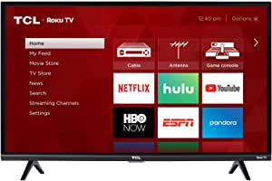
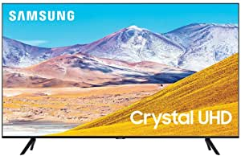

##Our Picks
###All-New Toshiba 50LF621U21 50-inch Smart 4K UHD with Dolby Vision - Fire TV Edition, Released 2020

###Product Info:
- Fire TV Edition brings together live-over-the air TV and your streaming content on the home screen. Connect any HD antenna (sold separately) to watch live over-the-air TV or stream movies and shows from Disney+, Netflix, YouTube, Prime Video, Hulu, and more.
- This TV is smart and simple in every way. Just plug it in, connect to Wi-Fi and enjoy. Plus, your TV keeps getting smarter with new Alexa skills and features through automatic over-the-air software updates, so that you always have the latest.
- Experience breathtaking 4K Ultra HD picture quality with over 8 million pixels for stunning clarity, deep contrast and vivid colors. Watch movies and TV shows come to life in ultra high definition.
- Everything you’d expect from a remote – plus launch apps, search for TV shows, switch inputs, control smart home devices and more, using just your voice. With Prime Video, Netflix buttons, instantly access your favorite apps.
- Item arrives in packaging that reveals what’s inside and can’t be hidden.
######[Check Price](https://www.amazon.com/gp/slredirect/picassoRedirect.html/ref=pa_sp_atf_aps_sr_pg1_1?ie=UTF8&adId=A01467041DWBOKZKFI2TY&url=%2FAll-New-Toshiba-50LF621U21-50-inch-Vision%2Fdp%2FB086VR2KY8%2Fref%3Dsr_1_1_sspa%3Fdchild%3D1%26keywords%3Dtelevision%26qid%3D1613439839%26sr%3D8-1-spons%26psc%3D1&qualifier=1613439839&id=5499413347689250&widgetName=sp_atf)
###All-New Toshiba 43LF621U21 43-inch Smart 4K UHD with Dolby Vision - Fire TV Edition, Released 2020

###Product Info:
- Voice remote with Alexa: Use your voice to watch live TV, launch apps, search for titles, play music, switch inputs, control smart home devices, and more.
- Endless Entertainment: Watch over 500,000 streaming movies and TV episodes with access to tens of thousands of channels, apps, and Alexa skills.
- Access your favorite content: Fire TV Edition seamlessly integrates live over-the-air TV and streaming channels on a unified home screen.
- Watch high dynamic range (HDR) content on your TV: With an HDR-compatible 4K TV, you can enjoy HDR movies and TV shows, in addition to all your current content.
- Item arrives in packaging that reveals what’s inside and can’t be hidden.
######[Check Price](https://www.amazon.com/gp/slredirect/picassoRedirect.html/ref=pa_sp_atf_aps_sr_pg1_1?ie=UTF8&adId=A0537842HEX7EUT36Y0K&url=%2FAll-New-Toshiba-43LF621U21-43-inch-Vision%2Fdp%2FB0874XJYW8%2Fref%3Dsr_1_2_sspa%3Fdchild%3D1%26keywords%3Dtelevision%26qid%3D1613439839%26sr%3D8-2-spons%26psc%3D1&qualifier=1613439839&id=5499413347689250&widgetName=sp_atf)
###TCL 4K Smart LED TV, 50" (50S435)

###Product Info:
- Dimensions (W x H x D): TV without stand: 44. 1 X 25. 7 X 3. 2 inches, TV with stand: 44. 1 X 28 X 8 inches
- Smart functionality delivers all your favorite content with over 500,000 movies and TV episodes, accessible through the simple and intuitive Roku TV
- Pairs 4K Ultra HD picture clarity with the contrast, color, and detail of high dynamic range (HDR) for the most lifelike picture
- Direct lit LED produces great picture quality. Stand Separation Distance 39.6 inch
- Inputs: 3 HDMI 2. 0 with HDCP 2. 2 (one with HDMI ARC), 1 USB (media player), RF, Composite, Headphone Jack, Optical Audio Out, Ethernet
######[Check Price](https://www.amazon.com/TCL-4K-Smart-LED-50S435/dp/B08DHFX4FV/ref=sr_1_3?dchild=1&keywords=television&qid=1613439839&sr=8-3)
###TCL 32S327 32-Inch 1080p Roku Smart LED TV

###Product Info:
- Easy Voice Control: Works with Amazon Alexa or Google Assistant to help you find movie titles, launch or change channels, even switch inputs, using just your voice. Also available through the Roku mobile app
- Smart Functionality offers access to over 5,000 streaming channels featuring more than 500,000 movies and TV episodes via Roku TV
- 1080p Full HD Resolution excellent detail, color, and contrast. Wireless Connection: 802.11 2x2 Dual Band
- Direct-lit LED produces great picture quality with 60Hz refresh rate for fast moving action scenes with virtually no motion blur
- Inputs: 3 HDMI, 1 USB, RF, Composite, Headphone Jack, optical audio out
######[Check Price](https://www.amazon.com/TCL-32S327-32-Inch-1080p-Smart/dp/B07F981R8M/ref=sr_1_4?dchild=1&keywords=television&qid=1613439839&sr=8-4)
###SAMSUNG 50-inch Class Crystal UHD TU-8000 Series - 4K UHD HDR Smart TV with Alexa Built-in (UN50TU8000FXZA, 2020 Model)

###Product Info:
- Crystal processor 4K: This ultra-fast processor transforms everything you watch into stunning 4K.
- Multi voice: Smart TV with Alexa and Bixby.
- Smart TV powered by Tizen: Go beyond Smart TV with next-gen apps, super easy control, and a host of enhancements that elevate the TV watching experience.', "HDR: Unveils shades of color you can't find on HDTV.", 'Crystal display: Experience crystal clear colors that are fine-tuned to deliver a naturally crisp and vivid picture.
- Alexa built-in: Ask more from your TV. Just ask Alexa to open apps, change the channel, search for movies and shows, play music, control your smart home devices and more. To talk to Alexa, press and hold the mic button on your remote.
######[Check Price](https://www.amazon.com/SAMSUNG-50-inch-Crystal-TU-8000-Built/dp/B084JCXSL6/ref=sr_1_5?dchild=1&keywords=television&qid=1613439839&sr=8-5)
