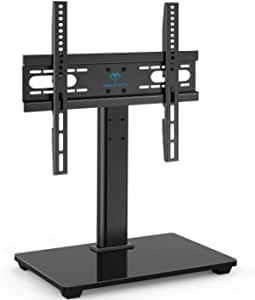
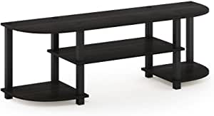
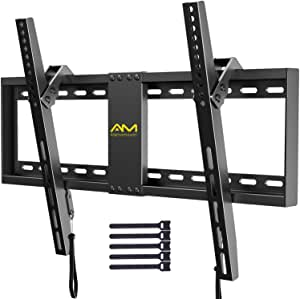

###ONKRON Mobile TV Stand Rolling TV Cart for 40 to 65 Inch LCD LED TV Screens with Wheels Shelves (TS1351)

- This mobile TV stand fits most modern LCD, LED, OLED 40-65" inch TVsets weighing up to 100 lbs
- The stand supports the following VESA standards: 200x200, 300x100, 400x200, 200x300, 300x200, 300x300, 300x400, 400x300, 400x400, 500x400, 600x200, 600x300 and 600x400 mm
- Height of the mounted screen can be adjusted from 47.2" to 59" off the floor to the middle of the screen in 2-inch increments
- Heavy-duty SPCC steel frame can safely hold TVs weighing up to 100 lbs; 4 locking caster wheels allow for effortless repositioning from one room to another
- The AV shelf has a weight capacity of 10 lbs; hollow metal columns comprise a nifty cable organizing system - just tuck the cords inside the TV stand and enjoy that wonderful feeling of control over entropy and chaos

[<button class="button">$119.99 on Amazon</button>](https://www.amazon.com/gp/slredirect/picassoRedirect.html/ref=pa_sp_atf_aps_sr_pg1_1?ie=UTF8&adId=A0580670XVXBEJZPPGJT&url=%2FONKRON-Rolling-Screens-Shelves-TS1351%2Fdp%2FB085QL383L%2Fref%3Dsr_1_1_sspa%3Fdchild%3D1%26keywords%3Dtv%2Bstand%26qid%3D1614636653%26sr%3D8-1-spons%26psc%3D1&qualifier=1614636652&id=5595176522552620&widgetName=sp_atf)
###PERLESMITH Universal TV Stand - Table Top TV Stand for 37-55 inch LCD LED TVs - Height Adjustable TV Base Stand with Tempered Glass Base & Wire Management, VESA 400x400mm

- ✅ 【UNIVERSAL DESIGN】 Universal TV mounting bracket design fits most 37" - 55" flat-panel LCD/LED/Plasma TVs up to 88lbs, VESA(mounting hole pattern) - compatible faceplate fits VESA 100X100mm (4”x4”) 200X100mm (8"x4") 200X200mm(8"x8") 300X200mm (12"x8") 300X300mm (12"x12") 400X300mm (16"x12") 400X400mm (16"x16")
- ✅【ADJUSTABLE HEIGHT】 This universal TV stand has it all
- ✅【EASY INSTALLATION】 Universal TV stand/base tabletop stand to mount your TV and AV components on an entertainment center or a desk/table
- ✅【DURABILITY & SAFETY】 Our TV mounting bracket is compatible with Samsung, Sony, LG, Sharp, Insignia, Vizio, Haier, Toshiba, Sharp, Element, and TCL
- ✅【WORLD-CLASS CUSTOMER SERVICE】Patent No.: US D853,403

[<button class="button">$30.99 on Amazon</button>](https://www.amazon.com/PERLESMITH-Universal-Stand-Adjustable-Management/dp/B077MJZ6ZG/ref=sr_1_2?dchild=1&keywords=tv+stand&qid=1614636653&sr=8-2)
###Furinno Turn-S-Tube Wide TV Entertainment Center, Espresso/Black

- Wood and Pvc
- Imported
- Simple stylish design comes in multiple color options, is functional and suitable for any room
- Material: engineered Particle Board, PVC tubes.
- Fits in your space, fits on your budget; Green label product
- Sturdy on flat surface; Easy no hassle no tools 10-minutes assembly even a kid can accomplish
- Holds up to 55-inch flat screen panel up to 40 l

[<button class="button">$37.20 on Amazon</button>](https://www.amazon.com/Furinno-11058EX-BK-Turn-S-Tube-Entertainment/dp/B00EDTE32K/ref=sr_1_3?dchild=1&keywords=tv+stand&qid=1614636653&sr=8-3)
###WALI Universal TV Stand Table Top for Most 22 to 65 inch LCD Flat Screen TV, VESA up to 800 by 400mm , Black (TVS001)

- Compatibility: The TV stands holds 22" - 65" TVs and weighing up to 110 lbs
- Mult Adjustable: 2 level height adjustable mounting holes for better-viewing flexibility.
- Protection: 3mm feet soft pad on base prevents scratching of floor or cabinet surface.
- Installation: Mounting has never been so easy: 20 minutes to install it.
- Package Includes: WALI TV Stand (Black) x 1, Mounting Hardware Kit x 1, User Manual x 1, 10 Year protection.

[<button class="button">$16.99 on Amazon</button>](https://www.amazon.com/WALI-Universal-Stand-Screen-TVS001/dp/B01HE1IVNA/ref=sr_1_4?dchild=1&keywords=tv+stand&qid=1614636653&sr=8-4)
###AM alphamount Tilting TV Wall Mount Bracket for 32-82 Inch LED LCD OLED Flat Screen/Curved TVs-Low Profile TV Wall Mount Holds up to 132 lbs-Easy Install with All Hardware Included, Max VESA 600x400mm

- 😘ADJUSTABLE OPTIMAL VIEWING-This TV wall mount tilts your TV up to 7 degrees forwards or backwards to reduce glare for better viewing
- 😘ULTRA-SLIM PROFILE-The low-profile design securely holds your TV only 1.2" from the wall, saving space greatly with stylish appearance
- 😘SAVE YOUR TIME-Simple install in under 15 minutes
- 😘UNIVERSAL TV Mount-This tilt TV mount bracket fits 32-82 inch TVs, great for Samsung, TCL, LG, Sony, VIZIO, Panasonic, Toshiba, Sharp, Insignia and so on
- 😘WORLD-CLASS SERVICE-Comes with velcro to manage the wires to keep everything ti

[<button class="button">$20.99 on Amazon</button>](https://www.amazon.com/AM-alphamount-lbs-Easy-Hardware-600x400mm/dp/B08765RDRD/ref=sxin_11_trfob_1?cv_ct_cx=tv+stand&dchild=1&keywords=tv+stand&pd_rd_i=B08765RDRD&pd_rd_r=f98499cc-ff11-42c6-b15f-f52a04e999c7&pd_rd_w=2XCHi&pd_rd_wg=mpVPg&pf_rd_p=dff4df0f-9209-4529-b092-2f5171681cdf&pf_rd_r=41N0DN9556P12MST4D19&qid=1614636653&sr=1-1-fcc74f9e-0165-48d2-a9e1-f41ea92a035c)
