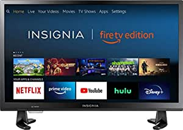
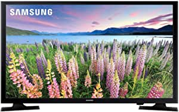

###Insignia NS-32DF310NA19 32-inch Smart HD TV - Fire TV Edition

- Insignia HD Smart TV – Fire TV Edition delivers 720p picture quality with deep blacks and rich colors.
- With the Fire TV experience built-in, enjoy tens of thousands of channels, apps, and Alexa skills, including Disney+, Netflix, YouTube, Prime Video, Hulu, SHOWTIME, STARZ, and more
- Fire TV Edition seamlessly integrates live over-the-air TV and streaming channels on a unified home screen (HD antenna required).
- Easily control your TV with the included Voice Remote with Alexa—plus, launch apps, search for titles, play music, switch inputs, control smart home devices, and more, using just your voice.
- Dimensions (W x H x D): TV without stand: 28.9” x 17.3” x 3”, TV with stand: 28.9” x 19” x 8.

[<button class="button">$129.99 on Amazon</button>](https://www.amazon.com/gp/slredirect/picassoRedirect.html/ref=pa_sp_atf_aps_sr_pg1_1?ie=UTF8&adId=A06247283D6GYPAZH2X3S&url=%2FInsignia-NS-32DF310NA19-32-inch-720p-Smart%2Fdp%2FB07FPP6TB5%2Fref%3Dsr_1_1_sspa%3Fdchild%3D1%26keywords%3Dtv%26qid%3D1614630675%26sr%3D8-1-spons%26psc%3D1&qualifier=1614630675&id=2586387567648285&widgetName=sp_atf)
###Fire TV Stick Lite with Alexa Voice Remote Lite (no TV controls) | HD streaming device | 2020 release

- Our most affordable Fire TV stick - Enjoy fast streaming in Full HD
- Press and ask Alexa - Use your voice to easily search and launch shows across multiple apps.
- Tens of thousands of channels, Alexa skills, and apps - Including Netflix, YouTube, Prime Video, Disney+, Apple TV+, and HBO Max
- 500,000+ movies and TV episodes - With thousands included in your Prime membership.
- Live TV - Watch your favorite live TV, news, and sports with subscriptions to SLING TV, YouTube TV, and others.
- Free TV - Access over 20,000 free movies and TV shows from apps like IMDb TV, Tubi, Pluto TV and more.
- Listen to music - Stream on Amazon Music, Spotify, Pandora, and othe

[<button class="button">$29.99 on Amazon</button>](https://www.amazon.com/gp/slredirect/picassoRedirect.html/ref=pa_sp_atf_aps_sr_pg1_1?ie=UTF8&adId=A09691551WUKU7GXL61RA&url=%2Ffire-tv-stick-lite%2Fdp%2FB07YNLBS7R%2Fref%3Dsr_1_2_sspa%3Fdchild%3D1%26keywords%3Dtv%26qid%3D1614630675%26sr%3D8-2-spons%26psc%3D1&qualifier=1614630675&id=2586387567648285&widgetName=sp_atf)
###TCL 4K Smart LED TV, 50" (50S435)

- Dimensions (W x H x D): TV without stand: 44
- Smart functionality delivers all your favorite content with over 500,000 movies and TV episodes, accessible through the simple and intuitive Roku TV
- Pairs 4K Ultra HD picture clarity with the contrast, color, and detail of high dynamic range (HDR) for the most lifelike picture
- Direct lit LED produces great picture quality
- Inputs: 3 HDMI

[<button class="button">$299.99 on Amazon</button>](https://www.amazon.com/TCL-4K-Smart-LED-50S435/dp/B08DHFX4FV/ref=sr_1_3?dchild=1&keywords=tv&qid=1614630675&sr=8-3)
###SAMSUNG 40 inches LED Smart FHD TV 1080P (2019 Model)

- Full HD 1080p Resolution
- PurColor
- Micro Dimming Pro
- Samsung Smart TV
- SmartThings App Support

[<button class="button">$259.88 on Amazon</button>](https://www.amazon.com/Samsung-UN40N5200AFXZA-40-Inch-Assistant-Compatibility/dp/B07YXH57B8/ref=sr_1_5?dchild=1&keywords=tv&qid=1614630675&sr=8-5)
