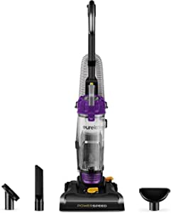
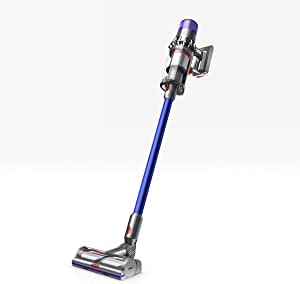

###Eureka NEU182B PowerSpeed Bagless Upright Vacuum Cleaner, Purple

- Powerful vacuum cleaner The dynamic motor and brush roll can lift stubborn and heavy debris Plus the 12 6” wide nozzle cleans more with a quickness
- 10 lbs light weight upright vacuum The Eureka Power Speed is pretty lightweight and easy to maneuvre Designed for whole home clean
- 5 height adjustments It works well on carpet shag rug hard floors, etc
- 4.1L extra-large capacity the extra-large dust cup holds more dirt and requires less frequent emptying Clean more empty less
- Multiple accessories included a quick-release handle connected to the stretch hose for above-floor cleaning A 7-inch-long crevice tool, dusting brush and upholstery tool help clean hard-to-reach areas Extract dirt, pet hair freshen up your car curtains ceilings or door frames For your convenience they are all stored right on board

[<button class="button">$73.15 on Amazon</button>](https://www.amazon.com/gp/slredirect/picassoRedirect.html/ref=pa_sp_atf_aps_sr_pg1_1?ie=UTF8&adId=A07023088IIIGY9W1DBA&url=%2FEureka-PowerSpeed-Bagless-Upright-Cleaner%2Fdp%2FB083C2DTKX%2Fref%3Dsr_1_1_sspa%3Fdchild%3D1%26keywords%3Dvacuum%2Bcleaner%26qid%3D1614635996%26sr%3D8-1-spons%26psc%3D1&qualifier=1614635996&id=2513145213679513&widgetName=sp_atf)
###BISSELL Cleanview Bagless Vacuum Cleaner, 2486, Orange

- OnePass technology with powerful suction and innovative brush design to clean on the first pass
- Scatter free technology reduces scatter on hard floors
- On board storage keeps specialized tools including the turbobrush tool, dusting brush, crevice tool, and extension wand close by while cleaning
- Powerful, multi cyclonic system for lasting suction that captures and keeps dirt in the bin, where it belongs
- Large capacity, easy empty dirt tank empties with the press of a button
- The combination of a 25 foot power cord, a 6 foot hose and a 13.5 inch cleaning path provide an extended cleaning reach
- Power source type: Corded electric

[<button class="button">$74.99 on Amazon</button>](https://www.amazon.com/BISSELL-Cleanview-Bagless-Cleaner-2486/dp/B07L69RL4B/ref=sr_1_4?dchild=1&keywords=vacuum+cleaner&qid=1614635996&sr=8-4)
###Dyson V11 Torque Drive Cordless Vacuum Cleaner, Blue

- Dyson's most intelligent, powerful cordless vacuum
- Engineered for whole-home, deep cleaning
- Intelligently optimizes suction and run time across all floor types
- Up to 60 minutes of run time
- High torque cleaner head
- Advanced whole-machine filtrati

[<button class="button">$599.99 on Amazon</button>](https://www.amazon.com/Dyson-Torque-Cordless-Vacuum-Cleaner/dp/B07NX8XBMP/ref=sxin_9_lp-trr-2-na_f05ec730732b6b515be1cfe75d3d4ff241dd4bf8?cv_ct_cx=vacuum+cleaner&dchild=1&keywords=vacuum+cleaners&pd_rd_i=B07NX8XBMP&pd_rd_r=b9a68a55-30f7-4c06-a9cc-a198e6359da4&pd_rd_w=DmFAH&pd_rd_wg=5hqXp&pf_rd_p=79c6e13e-fbdb-4ab1-8d83-9d1dbd2f11f4&pf_rd_r=C35FQN775B5TAC2BYRR5&qid=1614635996&sr=1-2-5519553e-2baa-451e-af83-b0156e5c6669)
