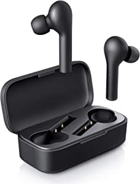
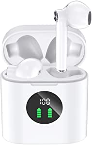

###Echo Buds – Wireless earbuds with immersive sound, active noise reduction, and Alexa

- Immersive sound – Premium speaker drivers deliver crisp, dynamic audio
- Hands-free with Alexa – Echo Buds work with the Alexa app to stream music, play Audible audiobooks, make calls, or get directions—just ask.
- Access other assistants – Supports access to Siri or Google Assistant from a supported device—just press and hold your earbud.
- Long-lasting battery – Get up to 5 hrs music playback per charge, up to 2 hrs with a 15-min quick charge, and up to 20 hrs with the charging case.
- Customizable fit for better sound – 3 sizes of ear tips help form a comfortable in-ear seal for immersive listening.
- Exercise ready – Sweat-resistant with a secure fit that’s made to move with you.
- Alexa is always getting smarter and adding new skills – Request a rideshare, get a guided workout, or order dinner, all hands-free.
- Designed to protect your privacy - Built with multiple layers of privacy protections and controls, including the ability to mute the mics with the Alexa app.

[<button class="button">$129.99 on Amazon</button>](https://www.amazon.com/gp/slredirect/picassoRedirect.html/ref=pa_sp_atf_aps_sr_pg1_1?ie=UTF8&adId=A0853027IFMANDV71A9L&url=%2FEcho-Buds%2Fdp%2FB07F6VM1S3%2Fref%3Dsr_1_1_sspa%3Fdchild%3D1%26keywords%3Dwireless%2Bearbuds%26qid%3D1614629531%26sr%3D8-1-spons%26psc%3D1&qualifier=1614629531&id=5061411141201793&widgetName=sp_atf)
###AUKEY True Wireless Earbuds, Bluetooth 5 Headphones in Ear with Charging Case, Hands-Free Headset with Mic, Touch Control, 35 Hours Playback for iPhone and Android

- Superior Sound Quality: Experience crisp, high-fidelity sound while Bluetooth 5 provides faster pairing and a stable, efficient wireless connection
- One-Step Reconnection: Simply take the earbuds out of the charging case and they will automatically connect to your phone (after being paired the first time)
- Convenient Touch Control: Effortlessly manage audio playback & calls with the multi-function touch panel and microphone on each earbud
- Great Battery Life: The earbuds alone provide up to 5 hours of high-quality sound output on a single charge, and the included charging case provides an additional 6 charges, giving 30 hours of total playtime
- Package Contents: AUKEY EP-T21 True Wireless Earbuds, Charging Case, Three Pairs of Ear-Tips (S/M/L), Micro-USB Cable, User Manual, Quick Start Guide

[<button class="button">$29.99 on Amazon</button>](https://www.amazon.com/gp/slredirect/picassoRedirect.html/ref=pa_sp_atf_aps_sr_pg1_1?ie=UTF8&adId=A0861155OAZ1GVIVBOF2&url=%2FAUKEY-Wireless-Bluetooth-Headphones-Charging%2Fdp%2FB07X8ZZ2M9%2Fref%3Dsr_1_2_sspa%3Fdchild%3D1%26keywords%3Dwireless%2Bearbuds%26qid%3D1614629531%26sr%3D8-2-spons%26psc%3D1%26smid%3DA142BGUZC6UH73&qualifier=1614629531&id=5061411141201793&widgetName=sp_atf)
###Wireless Earbuds, Mpow MBits S True Bluetooth Earbuds In Ear w/Mic CVC8.0 Noise Cancelling Earphones, Bluetooth 5.0 Headphones Sports, Deep Bass/IPX8 Waterproof/35H Playtime/Touch Control/3 Mode,Black

- Crystal Clear Call &Superior Stereo Sound
- Lightweight & IPX8 Waterproof
- Auto Pairing & Touch Contr

[<button class="button">$22.94 on Amazon</button>](https://www.amazon.com/Mpow-Bluetooth-Cancelling-Headphones-Waterproof/dp/B08DKZM85T/ref=sr_1_5?dchild=1&keywords=wireless+earbuds&qid=1614629531&sr=8-5)
###MIFA True Wireless Earbuds, TWS Bluetooth Headphones Stereo Sound Earphones, 30H Playtime Wireless Charging Case & Power Display, Sweat Proof Dual Bluetooth 5.0 Headset with Built-in Mic for Sports

- 【Wireless Charging & Type-C Quick Charge】MIFA Bluetooth earbuds support wireless charging so you can upright it on the wireless charger (not included) to get charging
- 【Power Display & 30H Playtime】Features with smart LED digital display, you can easily know the battery consumption on both bluetooth earphones and the charging case so you can master the best time to charge it
- 【Hi-Fi Stereo Sound】Powered by powerful 10mm speaker driver unit and half in-ear acoustic structure, MIFA twin Bluetooth 5.0 wireless earbuds delivers fantastic sound beside your ear with mellow bass, clear treble
- 【Secure Fit & One-key Control】Adopting ergonomic half-in-ear design, and weighting only 3.5g of each earbud, which brings you stable and comfortable fitting experience
- 【Effortless pairing & Bluetooth 5.0】Opening the charging case lid, these wireless Bluetooth earbuds will automatically power on and enter pairing mode, then you can connect them to your device without taking them out of the charging ca

[<button class="button">$28.99 on Amazon</button>](https://www.amazon.com/MIFA-Wireless-Bluetooth-Headphones-Earphones/dp/B08R8GBWQ1/ref=sr_1_6?dchild=1&keywords=wireless+earbuds&qid=1614629531&sr=8-6)
###Sony WF-1000XM3 Industry Leading Noise Canceling Truly Wireless Earbuds Headset/Headphones with AlexaVoice Control And Mic For Phone Call, Black

- Digital noise canceling: Industry leading anc lends a personalized, virtually soundproof experience
- 24bit Audio signal processing delivers dramatically improved sound quality
- Battery life up to 24 hours with carrying case (with 10min quick charge for 90min of play time)
- Easy and clear hands free calling; Leave your phone where it is, just speak with a double tap to the earbud
- Truly wireless design with uninterrupted L/R simultaneous Bluetooth transmission
- Alexa enabled for voice access to music, information, and more
- Smart listening by adaptive sound control automatically switches to ambient sound mode based on your activity

[<button class="button">$228.00 on Amazon</button>](https://www.amazon.com/gp/slredirect/picassoRedirect.html/ref=pa_sp_mtf_aps_sr_pg1_1?ie=UTF8&adId=A0608492J276YHY2H3GU&url=%2FSony-WF-1000XM3-Industry-Canceling-Wireless%2Fdp%2FB07T81554H%2Fref%3Dsr_1_7_sspa%3Fdchild%3D1%26keywords%3Dwireless%2Bearbuds%26qid%3D1614629531%26sr%3D8-7-spons%26psc%3D1&qualifier=1614629531&id=5061411141201793&widgetName=sp_mtf)
