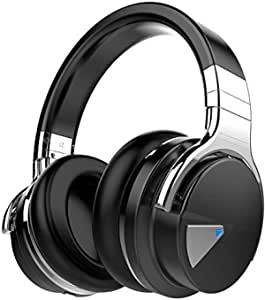
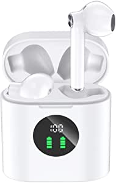

###Echo Buds – Wireless earbuds with immersive sound, active noise reduction, and Alexa

- Immersive sound – Premium speaker drivers deliver crisp, dynamic audio
- Hands-free with Alexa – Echo Buds work with the Alexa app to stream music, play Audible audiobooks, make calls, or get directions—just ask.
- Access other assistants – Supports access to Siri or Google Assistant from a supported device—just press and hold your earbud.
- Long-lasting battery – Get up to 5 hrs music playback per charge, up to 2 hrs with a 15-min quick charge, and up to 20 hrs with the charging case.
- Customizable fit for better sound – 3 sizes of ear tips help form a comfortable in-ear seal for immersive listening.
- Exercise ready – Sweat-resistant with a secure fit that’s made to move with you.
- Alexa is always getting smarter and adding new skills – Request a rideshare, get a guided workout, or order dinner, all hands-free.
- Designed to protect your privacy - Built with multiple layers of privacy protections and controls, including the ability to mute the mics with the Alexa app.

[<button class="button">$129.99 on Amazon</button>](https://www.amazon.com/gp/slredirect/picassoRedirect.html/ref=pa_sp_atf_aps_sr_pg1_1?ie=UTF8&adId=A0853027IFMANDV71A9L&url=%2FEcho-Buds%2Fdp%2FB07F6VM1S3%2Fref%3Dsr_1_1_sspa%3Fdchild%3D1%26keywords%3Dwireless%2Bheadphones%26qid%3D1614634741%26sr%3D8-1-spons%26psc%3D1&qualifier=1614634741&id=6972722191242576&widgetName=sp_atf)
###COWIN E7 Active Noise Cancelling Headphones Bluetooth Headphones with Microphone Deep Bass Wireless Headphones Over Ear, Comfortable Protein Earpads, 30 Hours Playtime for Travel/Work, Black

- Active Noise Cancelling technology
- Proprietary 45mm large-aperture drivers
- High-quality built-in Microphone and NFC technology
- The professional protein earpad and 90° swiveling earcu

[<button class="button">$49.99 on Amazon</button>](https://www.amazon.com/gp/slredirect/picassoRedirect.html/ref=pa_sp_atf_aps_sr_pg1_1?ie=UTF8&adId=A03664881OVZHREXAY08J&url=%2FCancelling-Headphones-Bluetooth-Microphone-Comfortable%2Fdp%2FB019U00D7K%2Fref%3Dsr_1_2_sspa%3Fdchild%3D1%26keywords%3Dwireless%2Bheadphones%26qid%3D1614634741%26sr%3D8-2-spons%26psc%3D1%26smid%3DAP4XNPLE1XK1&qualifier=1614634741&id=6972722191242576&widgetName=sp_atf)
###VEATOOL Wireless Earbuds Bluetooth Headphones 48hrs Playtime Sport Earphones with LED Display TWS Stereo Deep Bass Ear Buds with Earhooks Waterproof in-Ear Built-in Mic Headset for Running Workout

- 【Dual LED Displays Charging Case】 Wireless earbuds with LED display make it obvious to show the battery power of the case and ear buds

[<button class="button">$38.99 on Amazon</button>](https://www.amazon.com/VEATOOL-Bluetooth-Headphones-Earphones-Waterproof/dp/B08TRD6WP6/ref=sr_1_4?dchild=1&keywords=wireless+headphones&qid=1614634741&sr=8-4)
###MIFA True Wireless Earbuds, TWS Bluetooth Headphones Stereo Sound Earphones, 30H Playtime Wireless Charging Case & Power Display, Sweat Proof Dual Bluetooth 5.0 Headset with Built-in Mic for Sports

- 【Wireless Charging & Type-C Quick Charge】MIFA Bluetooth earbuds support wireless charging so you can upright it on the wireless charger (not included) to get charging
- 【Power Display & 30H Playtime】Features with smart LED digital display, you can easily know the battery consumption on both bluetooth earphones and the charging case so you can master the best time to charge it
- 【Hi-Fi Stereo Sound】Powered by powerful 10mm speaker driver unit and half in-ear acoustic structure, MIFA twin Bluetooth 5.0 wireless earbuds delivers fantastic sound beside your ear with mellow bass, clear treble
- 【Secure Fit & One-key Control】Adopting ergonomic half-in-ear design, and weighting only 3.5g of each earbud, which brings you stable and comfortable fitting experience
- 【Effortless pairing & Bluetooth 5.0】Opening the charging case lid, these wireless Bluetooth earbuds will automatically power on and enter pairing mode, then you can connect them to your device without taking them out of the charging ca

[<button class="button">$28.99 on Amazon</button>](https://www.amazon.com/MIFA-Wireless-Bluetooth-Headphones-Earphones/dp/B08R8GBWQ1/ref=sr_1_5?dchild=1&keywords=wireless+headphones&qid=1614634741&sr=8-5)
###Sony WH-1000XM4 Wireless Industry Leading Noise Canceling Overhead Headphones with Mic for Phone-Call and Alexa Voice Control, Black

- Industry-leading noise canceling with Dual Noise Sensor technology
- Next-level music with Edge-AI, co-developed with Sony Music Studios Tokyo
- Up to 30-hour battery life with quick charging (10 min charge for 5 hours of playback)
- Touch Sensor controls to pause/play/skip tracks, control volume, activate your voice assistant, and answer phone calls
- Speak-to-chat technology automatically reduces volume during conversations
- Superior call quality with precise voice pickup
- Wearing detection pauses playback when headphones are removed

[<button class="button">$348.00 on Amazon</button>](https://www.amazon.com/Sony-WH-1000XM4-Canceling-Headphones-phone-call/dp/B0863TXGM3/ref=sxin_9?ascsubtag=amzn1.osa.756f989d-d0b2-4d11-8b94-34a803b10da7.ATVPDKIKX0DER.en_US&creativeASIN=B0863TXGM3&cv_ct_cx=wireless+headphones&cv_ct_id=amzn1.osa.756f989d-d0b2-4d11-8b94-34a803b10da7.ATVPDKIKX0DER.en_US&cv_ct_pg=search&cv_ct_we=asin&cv_ct_wn=osp-single-source-earns-comm&dchild=1&keywords=wireless+headphones&linkCode=oas&pd_rd_i=B0863TXGM3&pd_rd_r=d192458f-80f1-4d6c-bbe8-98bba2f3d37f&pd_rd_w=WLXaz&pd_rd_wg=Tvoxg&pf_rd_p=35b32c02-1b41-4e49-9b89-0297af2446e1&pf_rd_r=9V18B56FA4D962ETWBZD&qid=1614634741&sr=1-1-64f3a41a-73ca-403a-923c-8152c45485fe&tag=androidcentralosp-20)
