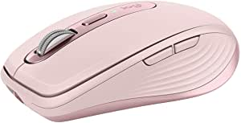
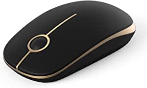

###Logitech MX Anywhere 3 Compact Performance Mouse, Wireless, Comfort, Fast Scrolling, Any Surface, Portable, 4000DPI, Customizable Buttons, USB-C, Bluetooth - Rose

- MAGSPEED SCROLLING - Speed, precision, and silence
- GO-ANYWHERE COMFORT – Low-profile design contoured for your hand, with ultra-soft silicone side grips
- TRACK ANYWHERE – EVEN GLASS - Track on virtually any surface, including glass – meaning you can work seamlessly at the desk, at a cafe, even on the couch.
- USB-C QUICK CHARGING - Stays powered up to 70 days on a full charge – and gets 3 hours of use from a 1-minute quick charge
- MULTI-DEVICE, MULTI-OS - Connect up to three devices and switch between them at the tap of a button
- WORK FASTER WITH BUTTON CUSTOMIZATIONS AND PREDEFINED PROFILES for Adobe Photoshop, Adobe Premiere Pro, Final Cut Pro, Google Chrome, Safari, Microsoft Word, Excel, & PowerPoint.
- MODERN DESIGN, PREMIUM MATERIALS - Modern design features a steel scroll wheel, grippy silicon side grips, and comes in Pale Gray, Graphite, and Rose finishes.
- FLOW ENABLED – Control multiple computers across Windows and macOS operating syste

[<button class="button">$79.99 on Amazon</button>](https://www.amazon.com/gp/slredirect/picassoRedirect.html/ref=pa_sp_atf_aps_sr_pg1_1?ie=UTF8&adId=A03843183C76T7B82IGVY&url=%2FLogitech-Performance-Scrolling-Customizable-Bluetooth%2Fdp%2FB089NG7RCC%2Fref%3Dsr_1_1_sspa%3Fdchild%3D1%26keywords%3Dwireless%2Bmouse%26qid%3D1614633172%26sr%3D8-1-spons%26psc%3D1&qualifier=1614633172&id=7163135875602691&widgetName=sp_atf)
###VicTsing MM057 2.4G Wireless Portable Mobile Mouse Optical Mice with USB Receiver, 5 Adjustable DPI Levels, 6 Buttons for Notebook, PC, Laptop, Computer, Macbook - Black

- Comfortable Ergonomic DesignAfter thousands of samples of palm data we designed this ergonomic mouse
- Multi-function Wireless Mouse5 levels DPI: 800/1200/1600/2000/2400 easily change the cursor sensitivity depending on your activity
- Wide CompatibilityWell compatible with Windows7/8/10/XP Vista7/8 and Linux etc
- Operating system: Windows 7

[<button class="button">$9.99 on Amazon</button>](https://www.amazon.com/VicTsing-Wireless-Portable-Receiver-Adjustable/dp/B013WC0P2A/ref=sr_1_3?dchild=1&keywords=wireless+mouse&qid=1614633172&sr=8-3)
###Jelly Comb 2.4G Slim Wireless Mouse with Nano Receiver MS001 (Black and Gold)

- Smooth Navigation with Less Noise Mouse Click - Slim ergonomic design and smooth frosted surface for an incredible user experience
- Universal Compatibility - work with Windows XP, Windows Vista, Windows 7, Mac OS X 10.4 etc.【【This product is not compatible with macbook pro or other laptops which only have type c ports】】
- Portable and Durable - USB-receiver stays in your PC USB port or stows conveniently inside the wireless mouse when not in u

[<button class="button">$9.99 on Amazon</button>](https://www.amazon.com/Jelly-Comb-Wireless-Mouse-Receiver/dp/B076F5P28T/ref=sr_1_4?dchild=1&keywords=wireless+mouse&qid=1614633172&sr=8-4)
