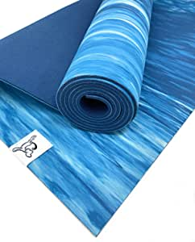

###Amazon Basics 1/2-Inch Extra Thick Exercise Yoga Mat

- Exercise mat for yoga, pilates, and other workout routines
- Textured surface for enhanced traction
- 1/2-inch, extra-thick yoga mat for comfortable, cushioning support
- Made of lightweight, durable foam
- Measures approximately 74 x 24 x 0.5 inches (LxWxH)

[<button class="button">$21.49 on Amazon</button>](https://www.amazon.com/gp/slredirect/picassoRedirect.html/ref=pa_sp_atf_aps_sr_pg1_1?ie=UTF8&adId=A04713513DWZJVQHJX3PB&url=%2FAmazonBasics-Extra-Thick-Exercise-Carrying%2Fdp%2FB01LP0UX9G%2Fref%3Dsr_1_1_sspa%3Fdchild%3D1%26keywords%3Dyoga%2Bmats%26qid%3D1614636732%26sr%3D8-1-spons%26psc%3D1&qualifier=1614636732&id=175369134025320&widgetName=sp_atf)
###Tiggar Yoga mat - Natural Tree Rubber yoga Mat, Eco Friendly ,Non Slip, Dense Cushioning for Support and Stability in Yoga, Pilates, and General Fitness

- Made from biodegradable, 100% natural tree rubber with non-toxic foaming agents and non-AZO dyes.
- Premium 4 mm thick, 72” x 24”
- Superior quality , Comfort and Support
- Excellent grip & slip resistance
- 100% Eco Friendly , Zero waste manufacturing proce

[<button class="button">$58.98 on Amazon</button>](https://www.amazon.com/gp/slredirect/picassoRedirect.html/ref=pa_sp_atf_aps_sr_pg1_1?ie=UTF8&adId=A10066353H2SXA25DJN5G&url=%2FTiggar-Yoga-mat-excellent-stability%2Fdp%2FB089T5Y4P5%2Fref%3Dsr_1_4_sspa%3Fdchild%3D1%26keywords%3Dyoga%2Bmats%26qid%3D1614636732%26sr%3D8-4-spons%26psc%3D1&qualifier=1614636732&id=175369134025320&widgetName=sp_atf)
###Gaiam Essentials Premium Yoga Mat with Yoga Mat Carrier Sling (72"L x 24"W x 1/4 Inch Thick)

- CLASSIC YOGA MAT: These durable, yet lightweight exercise yoga mats are extra thick (1/4 Inch) for the additional cushioning your joints need during any yoga or fitness routine
- STICKY NONSLIP TEXTURE: Yoga mat is featured in classic colors with a textured non slip surface for excellent traction and superior grip in all types of yoga, even heated practices and hot yoga
- NON-TOXIC & 6P FREE PVC yoga mat is a healthier choice for you and the planet and free of DEHP, DBP, BBP, DINP, DIDP and DNOP (For best results unroll and air out your mat for 2 to 3 days before use)
- INCLUDES YOGA MAT CARRIER SLING: Included with your yoga mat is a carrying sling/strap so you can strap up your mat and go
- DIMENSIONS: 72 inches L x 24 inches W x 1/4 Inch Thick (3.5 pounds)

[<button class="button">$19.96 on Amazon</button>](https://www.amazon.com/Gaiam-Essentials-Premium-Carrier-Purple/dp/B07HB1JL16/ref=sr_1_5?dchild=1&keywords=yoga+mats&qid=1614636732&sr=8-5)
###LEVEIS Yoga Mat Flower Elephant Thick Non Slip Exercise Workout Mats for Home Gym Floor Travel

- Dimension: 61x183x0.6cm/ 80x183x0.8cm
- Lightweight feature are easy to carry when you go to gym or travel
- Lightweight feature are easy to carry when you go to gym or travel
- Our Advanced Printing Technology makes these mats colorful and eye-catching which can eventually add more motivation and enthusiasm to your yoga exercise
- Use it safety with PVC and EVA free mat

[<button class="button">$41.99 - $59.99 on Amazon</button>](https://www.amazon.com/LEVEIS-Flower-Elephant-Exercise-Workout/dp/B08WPQW819/ref=sr_1_6?dchild=1&keywords=yoga+mats&qid=1614636732&sr=8-6)
